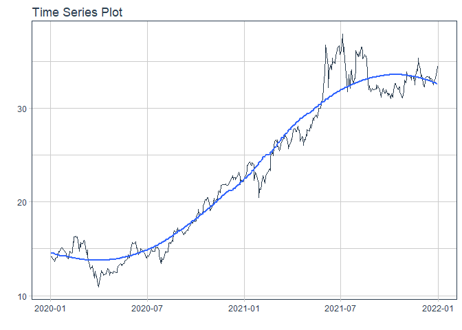
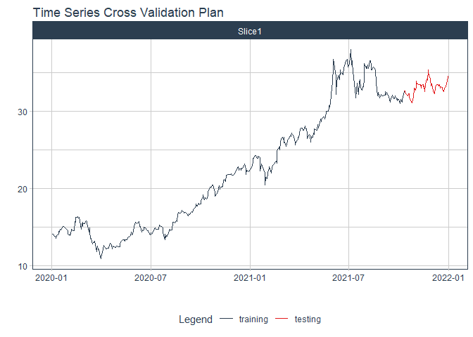
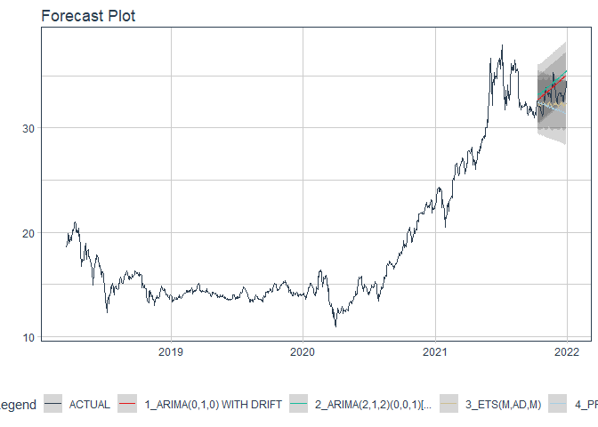

<!-- README.md is generated from README.Rmd. Please edit that file -->

# Dự báo giá cổ phiếu ACB

### Dữ liệu giá theo thời gian

``` r
readd(input_data) %>%
  plot_time_series(date, value, .interactive = interactive)
```

<!-- -->

### Chia dữ liệu thành 2 tập train/ test

``` r
readd(splits) %>%
  tk_time_series_cv_plan() %>%
  plot_time_series_cv_plan(date, value, .interactive = FALSE)
```

<!-- -->

### Modeltime Table

``` r
readd(models_tbl)
#> # Modeltime Table
#> # A tibble: 7 x 3
#>   .model_id .model     .model_desc                                        
#>       <int> <list>     <chr>                                              
#> 1         1 <fit[+]>   ARIMA(3,1,2)(2,0,2)[5]                             
#> 2         2 <fit[+]>   ARIMA(4,1,3)(2,0,2)[5] WITH DRIFT W/ XGBOOST ERRORS
#> 3         3 <fit[+]>   ETS(M,N,N)                                         
#> 4         4 <fit[+]>   PROPHET                                            
#> 5         5 <fit[+]>   LM                                                 
#> 6         6 <workflow> EARTH                                              
#> 7         7 <workflow> RANGER
```

### Calibration

``` r
readd(calibration_tbl)
#> # Modeltime Table
#> # A tibble: 7 x 5
#>   .model_id .model     .model_desc                                         .type .calibration_data
#>       <int> <list>     <chr>                                               <chr> <list>           
#> 1         1 <fit[+]>   ARIMA(3,1,2)(2,0,2)[5]                              Test  <tibble [61 x 4]>
#> 2         2 <fit[+]>   ARIMA(4,1,3)(2,0,2)[5] WITH DRIFT W/ XGBOOST ERRORS Test  <tibble [61 x 4]>
#> 3         3 <fit[+]>   ETS(M,N,N)                                          Test  <tibble [61 x 4]>
#> 4         4 <fit[+]>   PROPHET                                             Test  <tibble [61 x 4]>
#> 5         5 <fit[+]>   LM                                                  Test  <tibble [61 x 4]>
#> 6         6 <workflow> EARTH                                               Test  <tibble [61 x 4]>
#> 7         7 <workflow> RANGER                                              Test  <tibble [61 x 4]>
```

### Forecast (Testing Set)

``` r
readd(forecast_tbl) %>% 
  plot_modeltime_forecast(.legend_max_width = 25, # For mobile screens
                          .interactive      = interactive)
#> Warning in max(ids, na.rm = TRUE): no non-missing arguments to max; returning -Inf
```

<!-- -->

### Accuracy table

``` r
readd(accuracy_tbl)$`_data`
#> # A tibble: 7 x 9
#>   .model_id .model_desc                                         .type   mae  mape  mase smape  rmse   rsq
#>       <int> <chr>                                               <chr> <dbl> <dbl> <dbl> <dbl> <dbl> <dbl>
#> 1         1 ARIMA(3,1,2)(2,0,2)[5]                              Test   3.87 11.7   7.6  13.0   5.11  0.42
#> 2         2 ARIMA(4,1,3)(2,0,2)[5] WITH DRIFT W/ XGBOOST ERRORS Test   3.42 10.3   6.7  11.3   4.7   0.68
#> 3         3 ETS(M,N,N)                                          Test   3.98 12.1   7.81 13.4   5.22 NA   
#> 4         4 PROPHET                                             Test  11.7  37.8  22.9  47    12.2   0.03
#> 5         5 LM                                                  Test  17.4  56.9  34.2  79.8  17.8   0.32
#> 6         6 EARTH                                               Test   1.99  5.98  3.91  6.32  2.86  0.82
#> 7         7 RANGER                                              Test  10.9  35.2  21.4  43.2  11.5   0.01
```

### Next week forecast

``` r
readd(one_week_fc)
#> # A tibble: 8 x 7
#>   .model_id .model_desc .key       .index     .value .conf_lo .conf_hi
#>       <int> <chr>       <fct>      <date>      <dbl>    <dbl>    <dbl>
#> 1         6 EARTH       prediction 2021-06-28   32.8     28.1     37.6
#> 2         6 EARTH       prediction 2021-06-29   32.9     28.2     37.6
#> 3         6 EARTH       prediction 2021-06-30   33.0     28.2     37.7
#> 4         6 EARTH       prediction 2021-07-01   33.0     28.3     37.7
#> 5         6 EARTH       prediction 2021-07-02   33.1     28.3     37.8
#> 6         6 EARTH       prediction 2021-07-03   33.1     28.4     37.9
#> 7         6 EARTH       prediction 2021-07-04   33.2     28.5     37.9
#> 8         6 EARTH       prediction 2021-07-05   33.2     28.5     38.0
```
