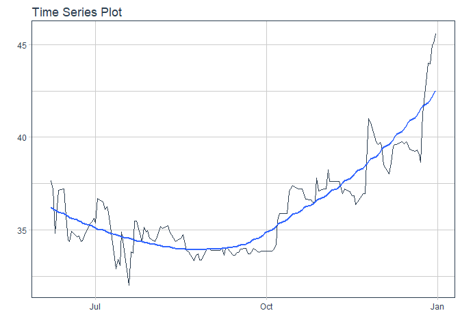
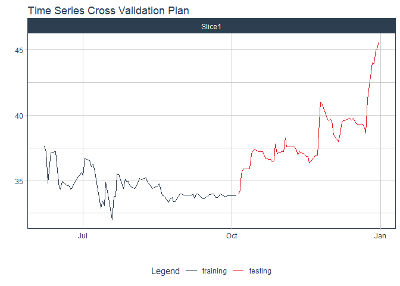
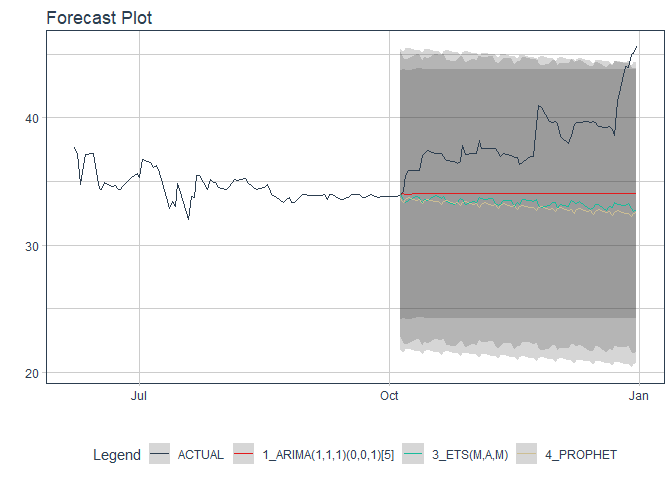

# Forecast SSB price

### Plot

``` r
readd(data_SSB) %>%
  plot_time_series(date, value, .interactive = interactive)
```

<!-- -->

### Divide data to train/ test

``` r
readd(splits_SSB) %>%
  tk_time_series_cv_plan() %>%
  plot_time_series_cv_plan(date, value, .interactive = FALSE)
```

<!-- -->

### Modeltime Table

``` r
readd(models_tbl_SSB)
#> # Modeltime Table
#> # A tibble: 4 x 3
#>   .model_id .model   .model_desc                             
#>       <int> <list>   <chr>                                   
#> 1         1 <fit[+]> ARIMA(1,1,1)(0,0,1)[5]                  
#> 2         2 <fit[+]> ARIMA(1,1,1)(0,0,1)[5] W/ XGBOOST ERRORS
#> 3         3 <fit[+]> ETS(M,A,M)                              
#> 4         4 <fit[+]> PROPHET
```

### Calibration

``` r
readd(calibration_tbl_SSB)
#> # Modeltime Table
#> # A tibble: 4 x 5
#>   .model_id .model   .model_desc                              .type .calibration_data
#>       <int> <list>   <chr>                                    <chr> <list>           
#> 1         1 <fit[+]> ARIMA(1,1,1)(0,0,1)[5]                   Test  <tibble [64 x 4]>
#> 2         2 <fit[+]> ARIMA(1,1,1)(0,0,1)[5] W/ XGBOOST ERRORS <NA>  <lgl [1]>        
#> 3         3 <fit[+]> ETS(M,A,M)                               Test  <tibble [64 x 4]>
#> 4         4 <fit[+]> PROPHET                                  Test  <tibble [64 x 4]>
```

### Forecast (Testing Set)

``` r
readd(forecast_tbl_SSB) %>% 
  plot_modeltime_forecast(.legend_max_width = 25, 
                           .interactive      = interactive)
#> Warning in max(ids, na.rm = TRUE): no non-missing arguments to max; returning -Inf
```

<!-- -->

### Accuracy table

``` r
readd(accuracy_tbl_SSB)$`_data`
#> # A tibble: 4 x 9
#>   .model_id .model_desc                              .type   mae  mape  mase smape  rmse   rsq
#>       <int> <chr>                                    <chr> <dbl> <dbl> <dbl> <dbl> <dbl> <dbl>
#> 1         1 ARIMA(1,1,1)(0,0,1)[5]                   Test   4.36  11.0   9.8  11.9  4.97  0   
#> 2         2 ARIMA(1,1,1)(0,0,1)[5] W/ XGBOOST ERRORS <NA>  NA     NA    NA    NA   NA    NA   
#> 3         3 ETS(M,A,M)                               Test   5.07  12.9  11.4  13.9  5.69  0.4 
#> 4         4 PROPHET                                  Test   5.39  13.7  12.1  14.9  6.02  0.58
```

### Next week forecast

``` r
readd(two_week_fc_SSB)
#> # A tibble: 5 x 6
#>   .ticker .index     .value  .low .high .model_desc           
#>   <chr>   <date>      <dbl> <dbl> <dbl> <chr>                 
#> 1 SSB     2022-01-03   46.6  38.4  54.8 ARIMA(1,1,1)(0,0,1)[5]
#> 2 SSB     2022-01-04   46.6  38.4  54.8 ARIMA(1,1,1)(0,0,1)[5]
#> 3 SSB     2022-01-05   46.7  38.5  55.0 ARIMA(1,1,1)(0,0,1)[5]
#> 4 SSB     2022-01-06   46.9  38.7  55.1 ARIMA(1,1,1)(0,0,1)[5]
#> 5 SSB     2022-01-07   46.9  38.7  55.1 ARIMA(1,1,1)(0,0,1)[5]
```
