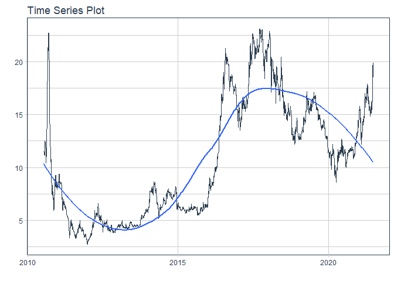
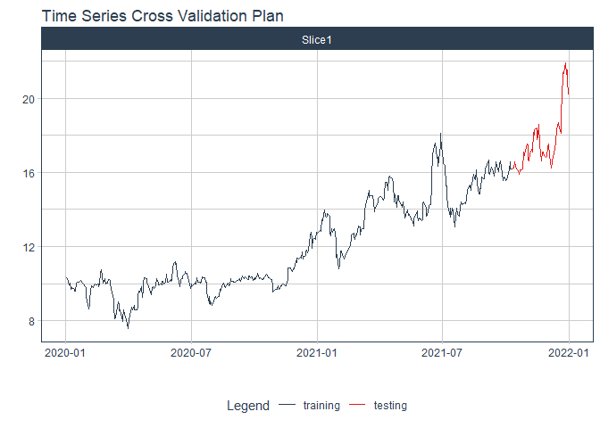

# Forecast aaa price

### Plot

``` r
readd(data_aaa) %>%
  plot_time_series(date, value, .interactive = interactive)
```

<!-- -->

### Divide data to train/ test

``` r
readd(splits_data_aaa) %>%
  tk_time_series_cv_plan() %>%
  plot_time_series_cv_plan(date, value, .interactive = FALSE)
```

<!-- -->

``` r
### Modeltime Table
# readd(models_tbl)
```

``` r
### Calibration
# readd(calibration_tbl)
```

``` r
### Forecast (Testing Set)
# readd(forecast_tbl) %>% 
#   plot_modeltime_forecast(.legend_max_width = 25, # For mobile screens
#                           .interactive      = interactive)
```

``` r
### Accuracy table
# readd(accuracy_tbl)$`_data`
```

``` r
### Next week forecast
# readd(one_week_fc)
```
