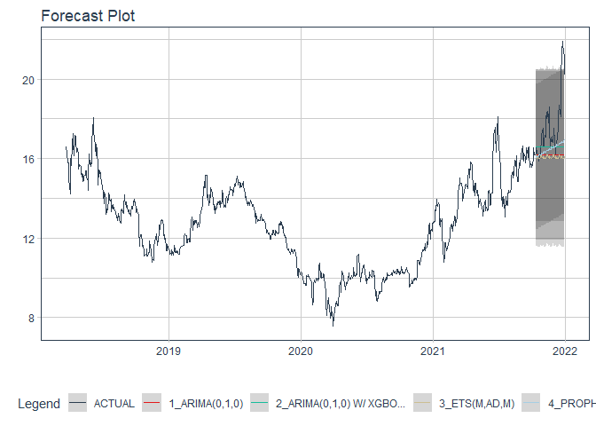

# Forecast aaa price

### Plot

``` r
readd(data_aaa) %>%
  plot_time_series(date, value, .interactive = interactive)
```

<!-- -->

### Divide data to train/ test

``` r
readd(splits_aaa) %>%
  tk_time_series_cv_plan() %>%
  plot_time_series_cv_plan(date, value, .interactive = FALSE)
```

<!-- -->

### Modeltime Table

``` r
readd(models_tbl_aaa)
#> # Modeltime Table
#> # A tibble: 5 x 3
#>   .model_id .model   .model_desc                   
#>       <int> <list>   <chr>                         
#> 1         1 <fit[+]> ARIMA(3,1,2)(2,0,2)[5]        
#> 2         2 <fit[+]> ARIMA(1,1,1) W/ XGBOOST ERRORS
#> 3         3 <fit[+]> ETS(M,A,M)                    
#> 4         4 <fit[+]> PROPHET                       
#> 5         5 <fit[+]> LM
```

### Calibration

``` r
readd(calibration_tbl_aaa)
#> # Modeltime Table
#> # A tibble: 5 x 5
#>   .model_id .model   .model_desc                    .type .calibration_data 
#>       <int> <list>   <chr>                          <chr> <list>            
#> 1         1 <fit[+]> ARIMA(3,1,2)(2,0,2)[5]         Test  <tibble [127 x 4]>
#> 2         2 <fit[+]> ARIMA(1,1,1) W/ XGBOOST ERRORS Test  <tibble [127 x 4]>
#> 3         3 <fit[+]> ETS(M,A,M)                     Test  <tibble [127 x 4]>
#> 4         4 <fit[+]> PROPHET                        Test  <tibble [127 x 4]>
#> 5         5 <fit[+]> LM                             Test  <tibble [127 x 4]>
```

### Forecast (Testing Set)

``` r
readd(forecast_tbl_aaa) %>% 
  plot_modeltime_forecast(.legend_max_width = 25, 
                           .interactive      = interactive)
#> Warning in max(ids, na.rm = TRUE): no non-missing arguments to max; returning -Inf
```

<!-- -->

### Accuracy table

``` r
readd(accuracy_tbl_aaa)$`_data`
#> # A tibble: 5 x 9
#>   .model_id .model_desc                    .type   mae  mape  mase smape  rmse   rsq
#>       <int> <chr>                          <chr> <dbl> <dbl> <dbl> <dbl> <dbl> <dbl>
#> 1         1 ARIMA(3,1,2)(2,0,2)[5]         Test   2.37  14.5  7.41  15.9  2.76  0.28
#> 2         2 ARIMA(1,1,1) W/ XGBOOST ERRORS Test   2.06  12.6  6.46  13.7  2.47  0.08
#> 3         3 ETS(M,A,M)                     Test   2.21  13.6  6.93  14.8  2.58  0.37
#> 4         4 PROPHET                        Test   5.68  35.9 17.8   44.0  5.87  0.05
#> 5         5 LM                             Test   1.45   9.8  4.54   9.2  1.71  0.31
```

### Next week forecast

``` r
readd(two_week_fc_aaa)
#> # A tibble: 16 x 6
#>    .ticker .index     .value  .low .high .model_desc
#>    <chr>   <date>      <dbl> <dbl> <dbl> <chr>      
#>  1 aaa     2021-07-03   17.6  14.8  20.4 LM         
#>  2 aaa     2021-07-04   17.6  14.8  20.4 LM         
#>  3 aaa     2021-07-05   17.6  14.8  20.4 LM         
#>  4 aaa     2021-07-06   17.6  14.8  20.4 LM         
#>  5 aaa     2021-07-07   17.6  14.8  20.4 LM         
#>  6 aaa     2021-07-08   17.6  14.8  20.4 LM         
#>  7 aaa     2021-07-09   17.6  14.8  20.4 LM         
#>  8 aaa     2021-07-10   17.6  14.8  20.5 LM         
#>  9 aaa     2021-07-11   17.6  14.8  20.5 LM         
#> 10 aaa     2021-07-12   17.6  14.8  20.5 LM         
#> 11 aaa     2021-07-13   17.6  14.8  20.5 LM         
#> 12 aaa     2021-07-14   17.6  14.8  20.5 LM         
#> 13 aaa     2021-07-15   17.7  14.8  20.5 LM         
#> 14 aaa     2021-07-16   17.7  14.8  20.5 LM         
#> 15 aaa     2021-07-17   17.7  14.8  20.5 LM         
#> 16 aaa     2021-07-18   17.7  14.8  20.5 LM
```
