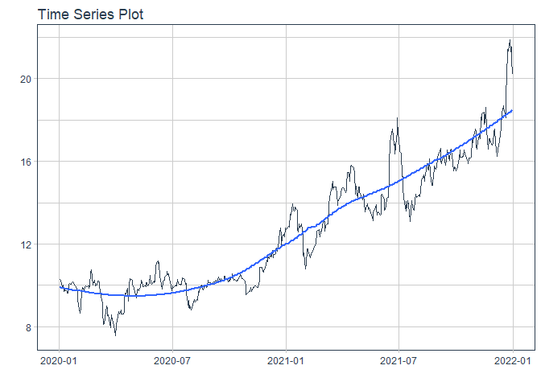

# Forecast AAA price

### Plot

``` r
readd(data_AAA) %>%
  plot_time_series(date, value, .interactive = interactive)
```

<!-- -->

### Divide data to train/ test

``` r
readd(splits_AAA) %>%
  tk_time_series_cv_plan() %>%
  plot_time_series_cv_plan(date, value, .interactive = FALSE)
```

<!-- -->

### Modeltime Table

``` r
readd(models_tbl_AAA)
#> # Modeltime Table
#> # A tibble: 4 x 3
#>   .model_id .model   .model_desc                   
#>       <int> <list>   <chr>                         
#> 1         1 <fit[+]> ARIMA(0,1,0)                  
#> 2         2 <fit[+]> ARIMA(0,1,0) W/ XGBOOST ERRORS
#> 3         3 <fit[+]> ETS(M,AD,M)                   
#> 4         4 <fit[+]> PROPHET
```

### Calibration

``` r
readd(calibration_tbl_AAA)
#> # Modeltime Table
#> # A tibble: 4 x 5
#>   .model_id .model   .model_desc                    .type .calibration_data
#>       <int> <list>   <chr>                          <chr> <list>           
#> 1         1 <fit[+]> ARIMA(0,1,0)                   Test  <tibble [59 x 4]>
#> 2         2 <fit[+]> ARIMA(0,1,0) W/ XGBOOST ERRORS Test  <tibble [59 x 4]>
#> 3         3 <fit[+]> ETS(M,AD,M)                    Test  <tibble [59 x 4]>
#> 4         4 <fit[+]> PROPHET                        Test  <tibble [59 x 4]>
```

### Forecast (Testing Set)

``` r
readd(forecast_tbl_AAA) %>% 
  plot_modeltime_forecast(.legend_max_width = 25, 
                           .interactive      = interactive)
#> Warning in max(ids, na.rm = TRUE): no non-missing arguments to max; returning -Inf
```

<!-- -->

### Accuracy table

``` r
readd(accuracy_tbl_AAA)$`_data`
#> # A tibble: 4 x 9
#>   .model_id .model_desc                    .type   mae  mape  mase smape  rmse   rsq
#>       <int> <chr>                          <chr> <dbl> <dbl> <dbl> <dbl> <dbl> <dbl>
#> 1         1 ARIMA(0,1,0)                   Test   1.54  8.04  4.06  8.69  2.17 NA   
#> 2         2 ARIMA(0,1,0) W/ XGBOOST ERRORS Test   1.27  6.63  3.37  7.1   1.91 NA   
#> 3         3 ETS(M,AD,M)                    Test   1.64  8.62  4.34  9.33  2.27  0   
#> 4         4 PROPHET                        Test   1.26  6.58  3.34  7.04  1.85  0.55
```

### Next week forecast

``` r
readd(two_week_fc_AAA)
#> # A tibble: 5 x 6
#>   .ticker .index     .value  .low .high .model_desc
#>   <chr>   <date>      <dbl> <dbl> <dbl> <chr>      
#> 1 AAA     2022-01-03   18.7  15.7  21.8 PROPHET    
#> 2 AAA     2022-01-04   18.7  15.7  21.8 PROPHET    
#> 3 AAA     2022-01-05   18.8  15.7  21.9 PROPHET    
#> 4 AAA     2022-01-06   18.9  15.8  22.0 PROPHET    
#> 5 AAA     2022-01-07   18.9  15.8  21.9 PROPHET
```
