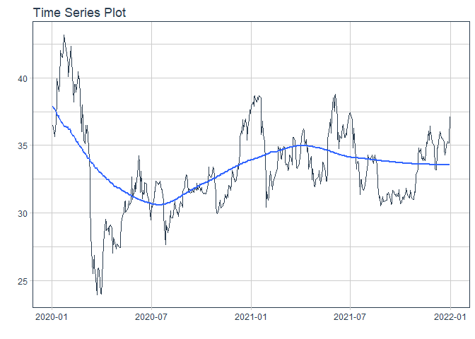
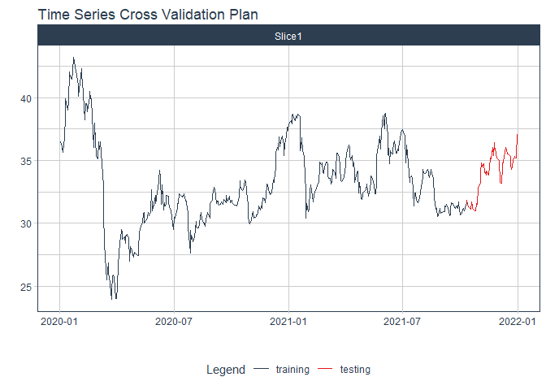

# Forecast bid price

### Plot

``` r
readd(data_bid) %>%
  plot_time_series(date, value, .interactive = interactive)
```

<!-- -->

### Divide data to train/ test

``` r
readd(splits_bid) %>%
  tk_time_series_cv_plan() %>%
  plot_time_series_cv_plan(date, value, .interactive = FALSE)
```

<!-- -->

### Modeltime Table

``` r
readd(models_tbl_bid)
#> # Modeltime Table
#> # A tibble: 4 x 3
#>   .model_id .model   .model_desc                   
#>       <int> <list>   <chr>                         
#> 1         1 <fit[+]> ARIMA(0,1,0)                  
#> 2         2 <fit[+]> ARIMA(2,1,2) W/ XGBOOST ERRORS
#> 3         3 <fit[+]> ETS(M,AD,M)                   
#> 4         4 <fit[+]> PROPHET
```

### Calibration

``` r
readd(calibration_tbl_bid)
#> # Modeltime Table
#> # A tibble: 4 x 5
#>   .model_id .model   .model_desc                    .type .calibration_data
#>       <int> <list>   <chr>                          <chr> <list>           
#> 1         1 <fit[+]> ARIMA(0,1,0)                   Test  <tibble [65 x 4]>
#> 2         2 <fit[+]> ARIMA(2,1,2) W/ XGBOOST ERRORS Test  <tibble [65 x 4]>
#> 3         3 <fit[+]> ETS(M,AD,M)                    Test  <tibble [65 x 4]>
#> 4         4 <fit[+]> PROPHET                        Test  <tibble [65 x 4]>
```

### Forecast (Testing Set)

``` r
readd(forecast_tbl_bid) %>% 
  plot_modeltime_forecast(.legend_max_width = 25, 
                           .interactive      = interactive)
#> Warning in max(ids, na.rm = TRUE): no non-missing arguments to max; returning -Inf
```

<!-- -->

### Accuracy table

``` r
readd(accuracy_tbl_bid)$`_data`
#> # A tibble: 4 x 9
#>   .model_id .model_desc                    .type   mae  mape  mase smape  rmse   rsq
#>       <int> <chr>                          <chr> <dbl> <dbl> <dbl> <dbl> <dbl> <dbl>
#> 1         1 ARIMA(0,1,0)                   Test   2.4   5.28  3.25  5.46  2.88 NA   
#> 2         2 ARIMA(2,1,2) W/ XGBOOST ERRORS Test   2.27  5.01  3.07  5.14  2.69  0   
#> 3         3 ETS(M,AD,M)                    Test   2.53  5.56  3.43  5.76  3.05  0.01
#> 4         4 PROPHET                        Test   2.06  4.8   2.79  4.65  2.55  0.23
```

### Next week forecast

``` r
readd(two_week_fc_bid)
#> # A tibble: 6 x 6
#>   .ticker .index     .value  .low .high .model_desc
#>   <chr>   <date>      <dbl> <dbl> <dbl> <chr>      
#> 1 bid     2021-07-23   45.6  41.4  49.8 PROPHET    
#> 2 bid     2021-07-26   45.5  41.3  49.7 PROPHET    
#> 3 bid     2021-07-27   45.5  41.3  49.7 PROPHET    
#> 4 bid     2021-07-28   45.6  41.4  49.8 PROPHET    
#> 5 bid     2021-07-29   45.7  41.5  49.9 PROPHET    
#> 6 bid     2021-07-30   45.7  41.5  49.9 PROPHET
```
