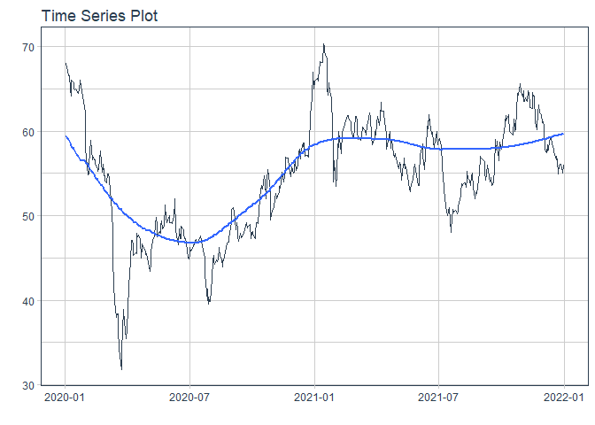
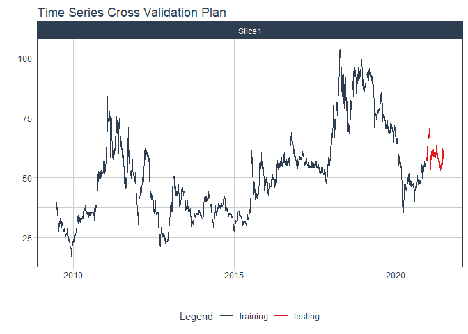
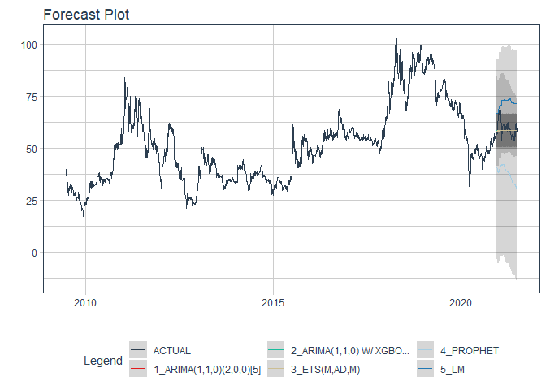

# Forecast bvh price

### Plot

``` r
readd(data_bvh) %>%
  plot_time_series(date, value, .interactive = interactive)
```

<!-- -->

### Divide data to train/ test

``` r
readd(splits_bvh) %>%
  tk_time_series_cv_plan() %>%
  plot_time_series_cv_plan(date, value, .interactive = FALSE)
```

<!-- -->

### Modeltime Table

``` r
readd(models_tbl_bvh)
#> # Modeltime Table
#> # A tibble: 5 x 3
#>   .model_id .model   .model_desc                   
#>       <int> <list>   <chr>                         
#> 1         1 <fit[+]> ARIMA(1,1,0)(2,0,0)[5]        
#> 2         2 <fit[+]> ARIMA(1,1,0) W/ XGBOOST ERRORS
#> 3         3 <fit[+]> ETS(M,AD,M)                   
#> 4         4 <fit[+]> PROPHET                       
#> 5         5 <fit[+]> LM
```

### Calibration

``` r
readd(calibration_tbl_bvh)
#> # Modeltime Table
#> # A tibble: 5 x 5
#>   .model_id .model   .model_desc                    .type .calibration_data 
#>       <int> <list>   <chr>                          <chr> <list>            
#> 1         1 <fit[+]> ARIMA(1,1,0)(2,0,0)[5]         Test  <tibble [129 x 4]>
#> 2         2 <fit[+]> ARIMA(1,1,0) W/ XGBOOST ERRORS Test  <tibble [129 x 4]>
#> 3         3 <fit[+]> ETS(M,AD,M)                    Test  <tibble [129 x 4]>
#> 4         4 <fit[+]> PROPHET                        Test  <tibble [129 x 4]>
#> 5         5 <fit[+]> LM                             Test  <tibble [129 x 4]>
```

### Forecast (Testing Set)

``` r
readd(forecast_tbl_bvh) %>% 
  plot_modeltime_forecast(.legend_max_width = 25, 
                           .interactive      = interactive)
#> Warning in max(ids, na.rm = TRUE): no non-missing arguments to max; returning -Inf
```

<!-- -->

### Accuracy table

``` r
readd(accuracy_tbl_bvh)$`_data`
#> # A tibble: 5 x 9
#>   .model_id .model_desc                    .type   mae  mape  mase smape  rmse   rsq
#>       <int> <chr>                          <chr> <dbl> <dbl> <dbl> <dbl> <dbl> <dbl>
#> 1         1 ARIMA(1,1,0)(2,0,0)[5]         Test   3.24  5.25  3.02  5.4   4.25  0.02
#> 2         2 ARIMA(1,1,0) W/ XGBOOST ERRORS Test   3.1   5.06  2.89  5.16  4.07  0   
#> 3         3 ETS(M,AD,M)                    Test   3.09  5.05  2.88  5.15  4.07  0.01
#> 4         4 PROPHET                        Test  22.0  36.8  20.6  45.4  22.4   0.22
#> 5         5 LM                             Test  12.1  20.9  11.3  18.6  13     0.04
```

### Next week forecast

``` r
readd(two_week_fc_bvh)
#> # A tibble: 16 x 6
#>    .ticker .index     .value  .low .high .model_desc
#>    <chr>   <date>      <dbl> <dbl> <dbl> <chr>      
#>  1 bvh     2021-07-03   58.0  51.3  64.7 ETS(M,AD,M)
#>  2 bvh     2021-07-04   58.0  51.3  64.7 ETS(M,AD,M)
#>  3 bvh     2021-07-05   58.0  51.3  64.7 ETS(M,AD,M)
#>  4 bvh     2021-07-06   58.2  51.5  64.9 ETS(M,AD,M)
#>  5 bvh     2021-07-07   58.1  51.4  64.8 ETS(M,AD,M)
#>  6 bvh     2021-07-08   58.1  51.4  64.8 ETS(M,AD,M)
#>  7 bvh     2021-07-09   58.3  51.6  65.0 ETS(M,AD,M)
#>  8 bvh     2021-07-10   58.3  51.6  65.0 ETS(M,AD,M)
#>  9 bvh     2021-07-11   58.2  51.5  65.0 ETS(M,AD,M)
#> 10 bvh     2021-07-12   58.3  51.6  65.0 ETS(M,AD,M)
#> 11 bvh     2021-07-13   58.3  51.6  65.0 ETS(M,AD,M)
#> 12 bvh     2021-07-14   58.1  51.4  64.8 ETS(M,AD,M)
#> 13 bvh     2021-07-15   57.9  51.2  64.6 ETS(M,AD,M)
#> 14 bvh     2021-07-16   58.0  51.3  64.7 ETS(M,AD,M)
#> 15 bvh     2021-07-17   58.0  51.3  64.7 ETS(M,AD,M)
#> 16 bvh     2021-07-18   58.1  51.4  64.8 ETS(M,AD,M)
```
