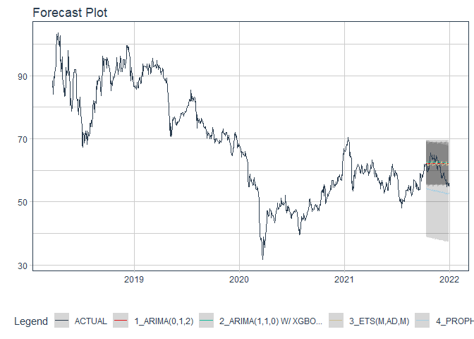

# Forecast bvh price

### Plot

``` r
readd(data_bvh) %>%
  plot_time_series(date, value, .interactive = interactive)
```

<!-- -->

### Divide data to train/ test

``` r
readd(splits_bvh) %>%
  tk_time_series_cv_plan() %>%
  plot_time_series_cv_plan(date, value, .interactive = FALSE)
```

<!-- -->

### Modeltime Table

``` r
readd(models_tbl_bvh)
#> # Modeltime Table
#> # A tibble: 4 x 3
#>   .model_id .model   .model_desc                   
#>       <int> <list>   <chr>                         
#> 1         1 <fit[+]> ARIMA(0,1,3)(0,0,2)[5]        
#> 2         2 <fit[+]> ARIMA(2,1,2) W/ XGBOOST ERRORS
#> 3         3 <fit[+]> ETS(M,AD,M)                   
#> 4         4 <fit[+]> PROPHET
```

### Calibration

``` r
readd(calibration_tbl_bvh)
#> # Modeltime Table
#> # A tibble: 4 x 5
#>   .model_id .model   .model_desc                    .type .calibration_data
#>       <int> <list>   <chr>                          <chr> <list>           
#> 1         1 <fit[+]> ARIMA(0,1,3)(0,0,2)[5]         Test  <tibble [65 x 4]>
#> 2         2 <fit[+]> ARIMA(2,1,2) W/ XGBOOST ERRORS Test  <tibble [65 x 4]>
#> 3         3 <fit[+]> ETS(M,AD,M)                    Test  <tibble [65 x 4]>
#> 4         4 <fit[+]> PROPHET                        Test  <tibble [65 x 4]>
```

### Forecast (Testing Set)

``` r
readd(forecast_tbl_bvh) %>% 
  plot_modeltime_forecast(.legend_max_width = 25, 
                           .interactive      = interactive)
#> Warning in max(ids, na.rm = TRUE): no non-missing arguments to max; returning -Inf
```

<!-- -->

### Accuracy table

``` r
readd(accuracy_tbl_bvh)$`_data`
#> # A tibble: 4 x 9
#>   .model_id .model_desc                    .type   mae  mape  mase smape  rmse   rsq
#>       <int> <chr>                          <chr> <dbl> <dbl> <dbl> <dbl> <dbl> <dbl>
#> 1         1 ARIMA(0,1,3)(0,0,2)[5]         Test   2.52  4.45  2.6   4.35  3.01  0.07
#> 2         2 ARIMA(2,1,2) W/ XGBOOST ERRORS Test   2.63  4.68  2.72  4.54  3.21  0   
#> 3         3 ETS(M,AD,M)                    Test   2.53  4.49  2.62  4.38  3.05  0.01
#> 4         4 PROPHET                        Test   9.73 17.1  10.0  15.6  10.4   0.07
```

### Next week forecast

``` r
readd(two_week_fc_bvh)
#> # A tibble: 6 x 6
#>   .ticker .index     .value  .low .high .model_desc           
#>   <chr>   <date>      <dbl> <dbl> <dbl> <chr>                 
#> 1 bvh     2021-07-23   59.1  54.1  64.1 ARIMA(0,1,3)(0,0,2)[5]
#> 2 bvh     2021-07-26   59.1  54.1  64.1 ARIMA(0,1,3)(0,0,2)[5]
#> 3 bvh     2021-07-27   59.1  54.1  64.1 ARIMA(0,1,3)(0,0,2)[5]
#> 4 bvh     2021-07-28   59.1  54.1  64.1 ARIMA(0,1,3)(0,0,2)[5]
#> 5 bvh     2021-07-29   59.1  54.1  64.1 ARIMA(0,1,3)(0,0,2)[5]
#> 6 bvh     2021-07-30   59.1  54.1  64.1 ARIMA(0,1,3)(0,0,2)[5]
```
