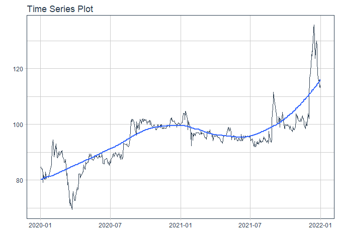

# Forecast dhg price

### Plot

``` r
readd(data_dhg) %>%
  plot_time_series(date, value, .interactive = interactive)
```

<!-- -->

### Divide data to train/ test

``` r
readd(splits_dhg) %>%
  tk_time_series_cv_plan() %>%
  plot_time_series_cv_plan(date, value, .interactive = FALSE)
```

<!-- -->

### Modeltime Table

``` r
readd(models_tbl_dhg)
#> # Modeltime Table
#> # A tibble: 5 x 3
#>   .model_id .model   .model_desc                             
#>       <int> <list>   <chr>                                   
#> 1         1 <fit[+]> ARIMA(0,1,1)(0,0,1)[5]                  
#> 2         2 <fit[+]> ARIMA(4,1,2)(1,0,0)[5] W/ XGBOOST ERRORS
#> 3         3 <fit[+]> ETS(M,AD,M)                             
#> 4         4 <fit[+]> PROPHET                                 
#> 5         5 <fit[+]> LM
```

### Calibration

``` r
readd(calibration_tbl_dhg)
#> # Modeltime Table
#> # A tibble: 5 x 5
#>   .model_id .model   .model_desc                              .type .calibration_data 
#>       <int> <list>   <chr>                                    <chr> <list>            
#> 1         1 <fit[+]> ARIMA(0,1,1)(0,0,1)[5]                   Test  <tibble [119 x 4]>
#> 2         2 <fit[+]> ARIMA(4,1,2)(1,0,0)[5] W/ XGBOOST ERRORS Test  <tibble [119 x 4]>
#> 3         3 <fit[+]> ETS(M,AD,M)                              Test  <tibble [119 x 4]>
#> 4         4 <fit[+]> PROPHET                                  Test  <tibble [119 x 4]>
#> 5         5 <fit[+]> LM                                       Test  <tibble [119 x 4]>
```

### Forecast (Testing Set)

``` r
readd(forecast_tbl_dhg) %>% 
  plot_modeltime_forecast(.legend_max_width = 25, 
                           .interactive      = interactive)
#> Warning in max(ids, na.rm = TRUE): no non-missing arguments to max; returning -Inf
```

<!-- -->

### Accuracy table

``` r
readd(accuracy_tbl_dhg)$`_data`
#> # A tibble: 5 x 9
#>   .model_id .model_desc                              .type   mae  mape  mase smape  rmse   rsq
#>       <int> <chr>                                    <chr> <dbl> <dbl> <dbl> <dbl> <dbl> <dbl>
#> 1         1 ARIMA(0,1,1)(0,0,1)[5]                   Test   3.52  3.66  4.34  3.59  3.79  0.07
#> 2         2 ARIMA(4,1,2)(1,0,0)[5] W/ XGBOOST ERRORS Test   3.9   4.06  4.81  3.97  4.18  0.01
#> 3         3 ETS(M,AD,M)                              Test   3.71  3.86  4.58  3.79  3.99  0   
#> 4         4 PROPHET                                  Test   5.35  5.45  6.6   5.67  6.53  0.52
#> 5         5 LM                                       Test   3.27  3.34  4.03  3.37  4.28  0.47
```

### Next week forecast

``` r
readd(two_week_fc_dhg)
#> # A tibble: 16 x 6
#>    .ticker .index     .value  .low .high .model_desc
#>    <chr>   <date>      <dbl> <dbl> <dbl> <chr>      
#>  1 dhg     2021-07-03   99.4  92.3  106. LM         
#>  2 dhg     2021-07-04   99.4  92.4  106. LM         
#>  3 dhg     2021-07-05   99.4  92.4  106. LM         
#>  4 dhg     2021-07-06   99.5  92.4  107. LM         
#>  5 dhg     2021-07-07   99.5  92.4  107. LM         
#>  6 dhg     2021-07-08   99.5  92.4  107. LM         
#>  7 dhg     2021-07-09   99.5  92.5  107. LM         
#>  8 dhg     2021-07-10   99.5  92.5  107. LM         
#>  9 dhg     2021-07-11   99.5  92.5  107. LM         
#> 10 dhg     2021-07-12   99.6  92.5  107. LM         
#> 11 dhg     2021-07-13   99.6  92.5  107. LM         
#> 12 dhg     2021-07-14   99.6  92.6  107. LM         
#> 13 dhg     2021-07-15   99.6  92.6  107. LM         
#> 14 dhg     2021-07-16   99.6  92.6  107. LM         
#> 15 dhg     2021-07-17   99.7  92.6  107. LM         
#> 16 dhg     2021-07-18   99.7  92.6  107. LM
```
