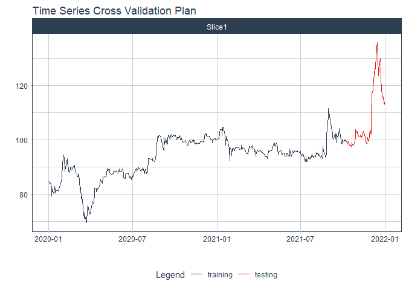

# Forecast DHG price

### Plot

``` r
readd(data_DHG) %>%
  plot_time_series(date, value, .interactive = interactive)
```

<!-- -->

### Divide data to train/ test

``` r
readd(splits_DHG) %>%
  tk_time_series_cv_plan() %>%
  plot_time_series_cv_plan(date, value, .interactive = FALSE)
```

<!-- -->

### Modeltime Table

``` r
readd(models_tbl_DHG)
#> # Modeltime Table
#> # A tibble: 4 x 3
#>   .model_id .model   .model_desc                   
#>       <int> <list>   <chr>                         
#> 1         1 <fit[+]> ARIMA(0,1,0)(1,0,0)[5]        
#> 2         2 <fit[+]> ARIMA(0,1,0) W/ XGBOOST ERRORS
#> 3         3 <fit[+]> ETS(M,AD,M)                   
#> 4         4 <fit[+]> PROPHET
```

### Calibration

``` r
readd(calibration_tbl_DHG)
#> # Modeltime Table
#> # A tibble: 4 x 5
#>   .model_id .model   .model_desc                    .type .calibration_data
#>       <int> <list>   <chr>                          <chr> <list>           
#> 1         1 <fit[+]> ARIMA(0,1,0)(1,0,0)[5]         Test  <tibble [59 x 4]>
#> 2         2 <fit[+]> ARIMA(0,1,0) W/ XGBOOST ERRORS Test  <tibble [59 x 4]>
#> 3         3 <fit[+]> ETS(M,AD,M)                    Test  <tibble [59 x 4]>
#> 4         4 <fit[+]> PROPHET                        Test  <tibble [59 x 4]>
```

### Forecast (Testing Set)

``` r
readd(forecast_tbl_DHG) %>% 
  plot_modeltime_forecast(.legend_max_width = 25, 
                           .interactive      = interactive)
#> Warning in max(ids, na.rm = TRUE): no non-missing arguments to max; returning -Inf
```

<!-- -->

### Accuracy table

``` r
readd(accuracy_tbl_DHG)$`_data`
#> # A tibble: 4 x 9
#>   .model_id .model_desc                    .type   mae  mape  mase smape  rmse   rsq
#>       <int> <chr>                          <chr> <dbl> <dbl> <dbl> <dbl> <dbl> <dbl>
#> 1         1 ARIMA(0,1,0)(1,0,0)[5]         Test  10.0   8.26  5.27  9.08  15.2  0.06
#> 2         2 ARIMA(0,1,0) W/ XGBOOST ERRORS Test   9.78  8.06  5.14  8.84  15.0 NA   
#> 3         3 ETS(M,AD,M)                    Test  10.1   8.37  5.33  9.2   15.4  0   
#> 4         4 PROPHET                        Test   8.15  6.7   4.29  7.25  12.8  0.61
```

### Next week forecast

``` r
readd(two_week_fc_DHG)
#> # A tibble: 5 x 6
#>   .ticker .index     .value  .low .high .model_desc
#>   <chr>   <date>      <dbl> <dbl> <dbl> <chr>      
#> 1 DHG     2022-01-03   116.  94.9  137. PROPHET    
#> 2 DHG     2022-01-04   116.  95.2  137. PROPHET    
#> 3 DHG     2022-01-05   116.  95.2  137. PROPHET    
#> 4 DHG     2022-01-06   116.  95.4  138. PROPHET    
#> 5 DHG     2022-01-07   116.  95.3  138. PROPHET
```
