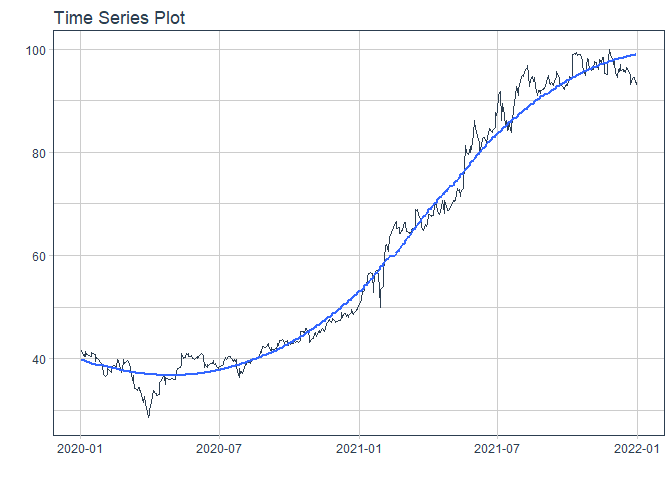
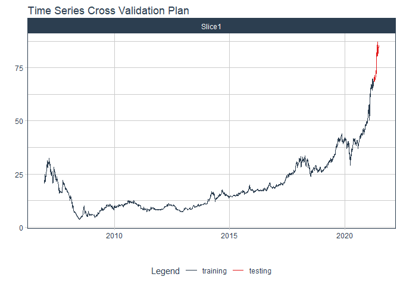
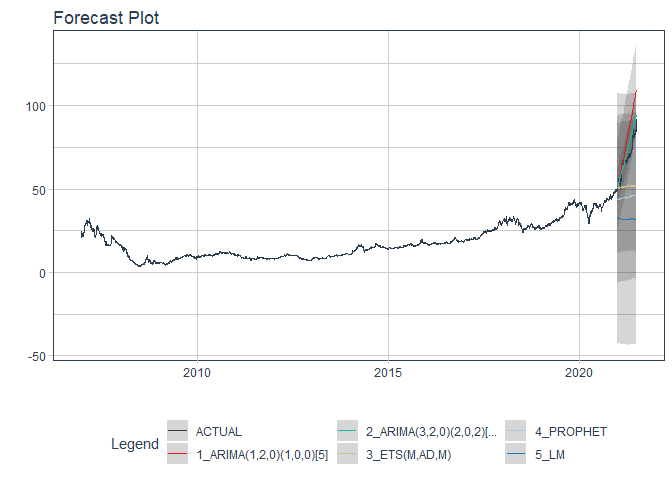

# Forecast FPT price

### Plot

``` r
readd(data_FPT) %>%
  plot_time_series(date, value, .interactive = interactive)
```

<!-- -->

### Divide data to train/ test

``` r
readd(splits_FPT) %>%
  tk_time_series_cv_plan() %>%
  plot_time_series_cv_plan(date, value, .interactive = FALSE)
```

<!-- -->

### Modeltime Table

``` r
readd(models_tbl_FPT)
#> # Modeltime Table
#> # A tibble: 4 x 3
#>   .model_id .model   .model_desc                             
#>       <int> <list>   <chr>                                   
#> 1         1 <fit[+]> ARIMA(1,2,2)(0,0,2)[5]                  
#> 2         2 <fit[+]> ARIMA(0,2,1)(2,0,0)[5] W/ XGBOOST ERRORS
#> 3         3 <fit[+]> ETS(M,AD,M)                             
#> 4         4 <fit[+]> PROPHET
```

### Calibration

``` r
readd(calibration_tbl_FPT)
#> # Modeltime Table
#> # A tibble: 4 x 5
#>   .model_id .model   .model_desc                              .type .calibration_data
#>       <int> <list>   <chr>                                    <chr> <list>           
#> 1         1 <fit[+]> ARIMA(1,2,2)(0,0,2)[5]                   Test  <tibble [59 x 4]>
#> 2         2 <fit[+]> ARIMA(0,2,1)(2,0,0)[5] W/ XGBOOST ERRORS Test  <tibble [59 x 4]>
#> 3         3 <fit[+]> ETS(M,AD,M)                              Test  <tibble [59 x 4]>
#> 4         4 <fit[+]> PROPHET                                  Test  <tibble [59 x 4]>
```

### Forecast (Testing Set)

``` r
readd(forecast_tbl_FPT) %>% 
  plot_modeltime_forecast(.legend_max_width = 25, 
                           .interactive      = interactive)
#> Warning in max(ids, na.rm = TRUE): no non-missing arguments to max; returning -Inf
```

<!-- -->

### Accuracy table

``` r
readd(accuracy_tbl_FPT)$`_data`
#> # A tibble: 4 x 9
#>   .model_id .model_desc                              .type   mae  mape  mase smape  rmse   rsq
#>       <int> <chr>                                    <chr> <dbl> <dbl> <dbl> <dbl> <dbl> <dbl>
#> 1         1 ARIMA(1,2,2)(0,0,2)[5]                   Test   7.71  8.06  9.32  7.64  8.97  0.43
#> 2         2 ARIMA(0,2,1)(2,0,0)[5] W/ XGBOOST ERRORS Test   8.69  9.07 10.5   8.57  9.85  0.43
#> 3         3 ETS(M,AD,M)                              Test   5.36  5.6   6.48  5.41  5.97  0.32
#> 4         4 PROPHET                                  Test   7.16  7.48  8.65  7.12  8.33  0.45
```

### Next week forecast

``` r
readd(two_week_fc_FPT)
#> # A tibble: 5 x 6
#>   .ticker .index     .value  .low .high .model_desc
#>   <chr>   <date>      <dbl> <dbl> <dbl> <chr>      
#> 1 FPT     2022-01-03   93.2  83.4  103. ETS(M,AD,M)
#> 2 FPT     2022-01-04   93.3  83.4  103. ETS(M,AD,M)
#> 3 FPT     2022-01-05   93.2  83.3  103. ETS(M,AD,M)
#> 4 FPT     2022-01-06   93.0  83.1  103. ETS(M,AD,M)
#> 5 FPT     2022-01-07   92.8  82.9  103. ETS(M,AD,M)
```
