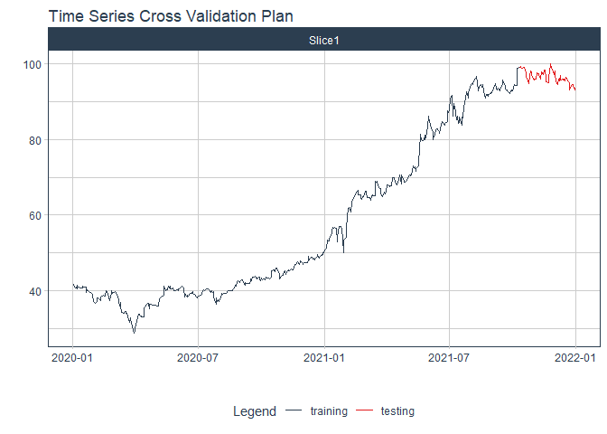

# Forecast fpt price

### Plot

``` r
readd(data_fpt) %>%
  plot_time_series(date, value, .interactive = interactive)
```

<!-- -->

### Divide data to train/ test

``` r
readd(splits_fpt) %>%
  tk_time_series_cv_plan() %>%
  plot_time_series_cv_plan(date, value, .interactive = FALSE)
```

<!-- -->

### Modeltime Table

``` r
readd(models_tbl_fpt)
#> # Modeltime Table
#> # A tibble: 5 x 3
#>   .model_id .model   .model_desc                             
#>       <int> <list>   <chr>                                   
#> 1         1 <fit[+]> ARIMA(1,2,0)(1,0,0)[5]                  
#> 2         2 <fit[+]> ARIMA(3,2,0)(2,0,2)[5] W/ XGBOOST ERRORS
#> 3         3 <fit[+]> ETS(M,AD,M)                             
#> 4         4 <fit[+]> PROPHET                                 
#> 5         5 <fit[+]> LM
```

### Calibration

``` r
readd(calibration_tbl_fpt)
#> # Modeltime Table
#> # A tibble: 5 x 5
#>   .model_id .model   .model_desc                              .type .calibration_data 
#>       <int> <list>   <chr>                                    <chr> <list>            
#> 1         1 <fit[+]> ARIMA(1,2,0)(1,0,0)[5]                   Test  <tibble [119 x 4]>
#> 2         2 <fit[+]> ARIMA(3,2,0)(2,0,2)[5] W/ XGBOOST ERRORS Test  <tibble [119 x 4]>
#> 3         3 <fit[+]> ETS(M,AD,M)                              Test  <tibble [119 x 4]>
#> 4         4 <fit[+]> PROPHET                                  Test  <tibble [119 x 4]>
#> 5         5 <fit[+]> LM                                       Test  <tibble [119 x 4]>
```

### Forecast (Testing Set)

``` r
readd(forecast_tbl_fpt) %>% 
  plot_modeltime_forecast(.legend_max_width = 25, 
                           .interactive      = interactive)
#> Warning in max(ids, na.rm = TRUE): no non-missing arguments to max; returning -Inf
```

<!-- -->

### Accuracy table

``` r
readd(accuracy_tbl_fpt)$`_data`
#> # A tibble: 5 x 9
#>   .model_id .model_desc                              .type   mae  mape  mase smape  rmse   rsq
#>       <int> <chr>                                    <chr> <dbl> <dbl> <dbl> <dbl> <dbl> <dbl>
#> 1         1 ARIMA(1,2,0)(1,0,0)[5]                   Test  11.3  15.4  10.9  13.9  13.7   0.92
#> 2         2 ARIMA(3,2,0)(2,0,2)[5] W/ XGBOOST ERRORS Test   4.64  6.52  4.48  6.26  5.58  0.92
#> 3         3 ETS(M,AD,M)                              Test  17.5  23.9  16.9  27.9  19.8   0.69
#> 4         4 PROPHET                                  Test  23.8  33.4  23.0  40.7  25.5   0.91
#> 5         5 LM                                       Test  37.0  52.7  35.7  72.1  38.3   0.03
```

### Next week forecast

``` r
readd(two_week_fc_fpt)
#> # A tibble: 16 x 6
#>    .ticker .index     .value  .low .high .model_desc                             
#>    <chr>   <date>      <dbl> <dbl> <dbl> <chr>                                   
#>  1 fpt     2021-07-03   87.6  78.4  96.8 ARIMA(3,2,0)(2,0,2)[5] W/ XGBOOST ERRORS
#>  2 fpt     2021-07-04   87.9  78.7  97.1 ARIMA(3,2,0)(2,0,2)[5] W/ XGBOOST ERRORS
#>  3 fpt     2021-07-05   88.1  78.9  97.3 ARIMA(3,2,0)(2,0,2)[5] W/ XGBOOST ERRORS
#>  4 fpt     2021-07-06   88.3  79.1  97.5 ARIMA(3,2,0)(2,0,2)[5] W/ XGBOOST ERRORS
#>  5 fpt     2021-07-07   88.5  79.3  97.7 ARIMA(3,2,0)(2,0,2)[5] W/ XGBOOST ERRORS
#>  6 fpt     2021-07-08   88.7  79.5  97.9 ARIMA(3,2,0)(2,0,2)[5] W/ XGBOOST ERRORS
#>  7 fpt     2021-07-09   89.0  79.8  98.2 ARIMA(3,2,0)(2,0,2)[5] W/ XGBOOST ERRORS
#>  8 fpt     2021-07-10   89.2  80.0  98.4 ARIMA(3,2,0)(2,0,2)[5] W/ XGBOOST ERRORS
#>  9 fpt     2021-07-11   89.4  80.2  98.6 ARIMA(3,2,0)(2,0,2)[5] W/ XGBOOST ERRORS
#> 10 fpt     2021-07-12   89.7  80.5  98.9 ARIMA(3,2,0)(2,0,2)[5] W/ XGBOOST ERRORS
#> 11 fpt     2021-07-13   89.9  80.7  99.1 ARIMA(3,2,0)(2,0,2)[5] W/ XGBOOST ERRORS
#> 12 fpt     2021-07-14   90.1  80.9  99.3 ARIMA(3,2,0)(2,0,2)[5] W/ XGBOOST ERRORS
#> 13 fpt     2021-07-15   90.4  81.2  99.6 ARIMA(3,2,0)(2,0,2)[5] W/ XGBOOST ERRORS
#> 14 fpt     2021-07-16   90.6  81.4  99.8 ARIMA(3,2,0)(2,0,2)[5] W/ XGBOOST ERRORS
#> 15 fpt     2021-07-17   90.8  81.6 100.  ARIMA(3,2,0)(2,0,2)[5] W/ XGBOOST ERRORS
#> 16 fpt     2021-07-18   91.1  81.9 100.  ARIMA(3,2,0)(2,0,2)[5] W/ XGBOOST ERRORS
```
