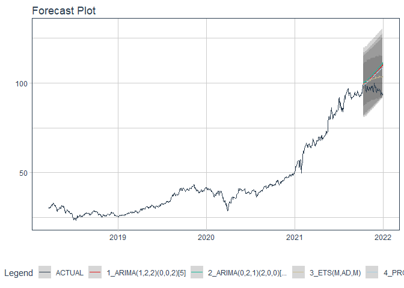

# Forecast fpt price

### Plot

``` r
readd(data_fpt) %>%
  plot_time_series(date, value, .interactive = interactive)
```

<!-- -->

### Divide data to train/ test

``` r
readd(splits_fpt) %>%
  tk_time_series_cv_plan() %>%
  plot_time_series_cv_plan(date, value, .interactive = FALSE)
```

<!-- -->

### Modeltime Table

``` r
readd(models_tbl_fpt)
#> # Modeltime Table
#> # A tibble: 4 x 3
#>   .model_id .model   .model_desc                              
#>       <int> <list>   <chr>                                    
#> 1         1 <fit[+]> ARIMA(2,1,2) WITH DRIFT                  
#> 2         2 <fit[+]> ARIMA(3,1,3) WITH DRIFT W/ XGBOOST ERRORS
#> 3         3 <fit[+]> ETS(M,AD,M)                              
#> 4         4 <fit[+]> PROPHET
```

### Calibration

``` r
readd(calibration_tbl_fpt)
#> # Modeltime Table
#> # A tibble: 4 x 5
#>   .model_id .model   .model_desc                               .type .calibration_data
#>       <int> <list>   <chr>                                     <chr> <list>           
#> 1         1 <fit[+]> ARIMA(2,1,2) WITH DRIFT                   Test  <tibble [65 x 4]>
#> 2         2 <fit[+]> ARIMA(3,1,3) WITH DRIFT W/ XGBOOST ERRORS Test  <tibble [65 x 4]>
#> 3         3 <fit[+]> ETS(M,AD,M)                               Test  <tibble [65 x 4]>
#> 4         4 <fit[+]> PROPHET                                   Test  <tibble [65 x 4]>
```

### Forecast (Testing Set)

``` r
readd(forecast_tbl_fpt) %>% 
  plot_modeltime_forecast(.legend_max_width = 25, 
                           .interactive      = interactive)
#> Warning in max(ids, na.rm = TRUE): no non-missing arguments to max; returning -Inf
```

<!-- -->

### Accuracy table

``` r
readd(accuracy_tbl_fpt)$`_data`
#> # A tibble: 4 x 9
#>   .model_id .model_desc                               .type   mae  mape  mase smape  rmse   rsq
#>       <int> <chr>                                     <chr> <dbl> <dbl> <dbl> <dbl> <dbl> <dbl>
#> 1         1 ARIMA(2,1,2) WITH DRIFT                   Test   7.6   9.3   7.53  9.99  9.47  0.9 
#> 2         2 ARIMA(3,1,3) WITH DRIFT W/ XGBOOST ERRORS Test   7.1   8.64  7.03  9.27  9.05  0.9 
#> 3         3 ETS(M,AD,M)                               Test   8.61 10.5   8.53 11.4  10.8   0.69
#> 4         4 PROPHET                                   Test   2.46  3.29  2.44  3.25  2.95  0.9
```

### Next week forecast

``` r
readd(two_week_fc_fpt)
#> # A tibble: 6 x 6
#>   .ticker .index     .value  .low .high .model_desc
#>   <chr>   <date>      <dbl> <dbl> <dbl> <chr>      
#> 1 fpt     2021-07-23   90.0  85.2  94.9 PROPHET    
#> 2 fpt     2021-07-26   90.3  85.5  95.2 PROPHET    
#> 3 fpt     2021-07-27   90.6  85.8  95.5 PROPHET    
#> 4 fpt     2021-07-28   90.9  86.0  95.7 PROPHET    
#> 5 fpt     2021-07-29   91.1  86.2  95.9 PROPHET    
#> 6 fpt     2021-07-30   91.3  86.4  96.2 PROPHET
```
