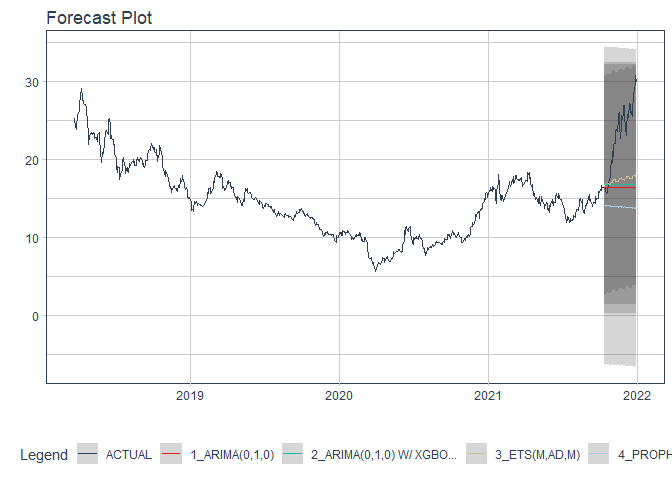

# Forecast hbc price

### Plot

``` r
readd(data_hbc) %>%
  plot_time_series(date, value, .interactive = interactive)
```

<!-- -->

### Divide data to train/ test

``` r
readd(splits_hbc) %>%
  tk_time_series_cv_plan() %>%
  plot_time_series_cv_plan(date, value, .interactive = FALSE)
```

<!-- -->

### Modeltime Table

``` r
readd(models_tbl_hbc)
#> # Modeltime Table
#> # A tibble: 5 x 3
#>   .model_id .model   .model_desc                   
#>       <int> <list>   <chr>                         
#> 1         1 <fit[+]> ARIMA(0,1,1)                  
#> 2         2 <fit[+]> ARIMA(0,1,1) W/ XGBOOST ERRORS
#> 3         3 <fit[+]> ETS(M,A,M)                    
#> 4         4 <fit[+]> PROPHET                       
#> 5         5 <fit[+]> LM
```

### Calibration

``` r
readd(calibration_tbl_hbc)
#> # Modeltime Table
#> # A tibble: 5 x 5
#>   .model_id .model   .model_desc                    .type .calibration_data 
#>       <int> <list>   <chr>                          <chr> <list>            
#> 1         1 <fit[+]> ARIMA(0,1,1)                   Test  <tibble [119 x 4]>
#> 2         2 <fit[+]> ARIMA(0,1,1) W/ XGBOOST ERRORS Test  <tibble [119 x 4]>
#> 3         3 <fit[+]> ETS(M,A,M)                     Test  <tibble [119 x 4]>
#> 4         4 <fit[+]> PROPHET                        Test  <tibble [119 x 4]>
#> 5         5 <fit[+]> LM                             Test  <tibble [119 x 4]>
```

### Forecast (Testing Set)

``` r
readd(forecast_tbl_hbc) %>% 
  plot_modeltime_forecast(.legend_max_width = 25, 
                           .interactive      = interactive)
#> Warning in max(ids, na.rm = TRUE): no non-missing arguments to max; returning -Inf
```

<!-- -->

### Accuracy table

``` r
readd(accuracy_tbl_hbc)$`_data`
#> # A tibble: 5 x 9
#>   .model_id .model_desc                    .type   mae  mape  mase smape  rmse   rsq
#>       <int> <chr>                          <chr> <dbl> <dbl> <dbl> <dbl> <dbl> <dbl>
#> 1         1 ARIMA(0,1,1)                   Test   1.21  7.18  2.95  7.28  1.4  NA   
#> 2         2 ARIMA(0,1,1) W/ XGBOOST ERRORS Test   1.2   7.28  2.91  7.18  1.37 NA   
#> 3         3 ETS(M,A,M)                     Test   6.87 43.0  16.7  32.5   8.4   0.21
#> 4         4 PROPHET                        Test  11.1  66.2  26.9  99.1  11.1   0.44
#> 5         5 LM                             Test   1.27  7.98  3.1   7.61  1.56  0.01
```

### Next week forecast

``` r
readd(two_week_fc_hbc)
#> # A tibble: 16 x 6
#>    .ticker .index     .value  .low .high .model_desc                   
#>    <chr>   <date>      <dbl> <dbl> <dbl> <chr>                         
#>  1 hbc     2021-07-03   16.2  13.9  18.4 ARIMA(0,1,1) W/ XGBOOST ERRORS
#>  2 hbc     2021-07-04   16.2  13.9  18.4 ARIMA(0,1,1) W/ XGBOOST ERRORS
#>  3 hbc     2021-07-05   16.2  13.9  18.4 ARIMA(0,1,1) W/ XGBOOST ERRORS
#>  4 hbc     2021-07-06   16.2  13.9  18.5 ARIMA(0,1,1) W/ XGBOOST ERRORS
#>  5 hbc     2021-07-07   16.2  13.9  18.5 ARIMA(0,1,1) W/ XGBOOST ERRORS
#>  6 hbc     2021-07-08   16.2  13.9  18.4 ARIMA(0,1,1) W/ XGBOOST ERRORS
#>  7 hbc     2021-07-09   16.2  13.9  18.5 ARIMA(0,1,1) W/ XGBOOST ERRORS
#>  8 hbc     2021-07-10   16.2  14.0  18.5 ARIMA(0,1,1) W/ XGBOOST ERRORS
#>  9 hbc     2021-07-11   16.2  14.0  18.5 ARIMA(0,1,1) W/ XGBOOST ERRORS
#> 10 hbc     2021-07-12   16.2  14.0  18.5 ARIMA(0,1,1) W/ XGBOOST ERRORS
#> 11 hbc     2021-07-13   16.2  14.0  18.5 ARIMA(0,1,1) W/ XGBOOST ERRORS
#> 12 hbc     2021-07-14   16.2  14.0  18.5 ARIMA(0,1,1) W/ XGBOOST ERRORS
#> 13 hbc     2021-07-15   16.2  14.0  18.5 ARIMA(0,1,1) W/ XGBOOST ERRORS
#> 14 hbc     2021-07-16   16.2  14.0  18.5 ARIMA(0,1,1) W/ XGBOOST ERRORS
#> 15 hbc     2021-07-17   16.2  14.0  18.5 ARIMA(0,1,1) W/ XGBOOST ERRORS
#> 16 hbc     2021-07-18   16.2  14.0  18.5 ARIMA(0,1,1) W/ XGBOOST ERRORS
```
