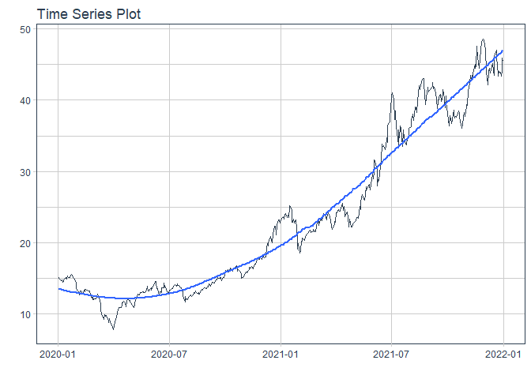
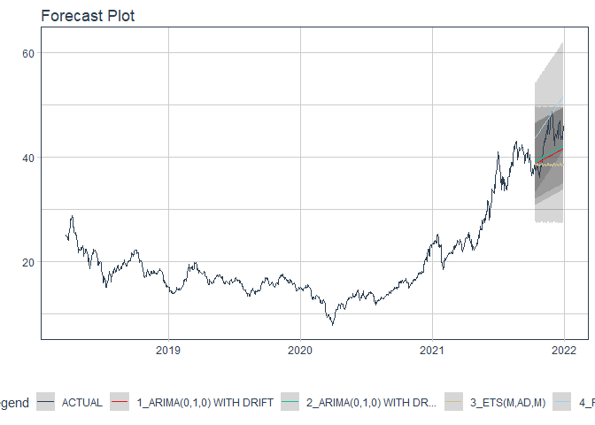

# Forecast hcm price

### Plot

``` r
readd(data_hcm) %>%
  plot_time_series(date, value, .interactive = interactive)
```

<!-- -->

### Divide data to train/ test

``` r
readd(splits_hcm) %>%
  tk_time_series_cv_plan() %>%
  plot_time_series_cv_plan(date, value, .interactive = FALSE)
```

<!-- -->

### Modeltime Table

``` r
readd(models_tbl_hcm)
#> # Modeltime Table
#> # A tibble: 4 x 3
#>   .model_id .model   .model_desc                   
#>       <int> <list>   <chr>                         
#> 1         1 <fit[+]> ARIMA(0,1,0)                  
#> 2         2 <fit[+]> ARIMA(0,1,0) W/ XGBOOST ERRORS
#> 3         3 <fit[+]> ETS(M,AD,M)                   
#> 4         4 <fit[+]> PROPHET
```

### Calibration

``` r
readd(calibration_tbl_hcm)
#> # Modeltime Table
#> # A tibble: 4 x 5
#>   .model_id .model   .model_desc                    .type .calibration_data
#>       <int> <list>   <chr>                          <chr> <list>           
#> 1         1 <fit[+]> ARIMA(0,1,0)                   Test  <tibble [65 x 4]>
#> 2         2 <fit[+]> ARIMA(0,1,0) W/ XGBOOST ERRORS Test  <tibble [65 x 4]>
#> 3         3 <fit[+]> ETS(M,AD,M)                    Test  <tibble [65 x 4]>
#> 4         4 <fit[+]> PROPHET                        Test  <tibble [65 x 4]>
```

### Forecast (Testing Set)

``` r
readd(forecast_tbl_hcm) %>% 
  plot_modeltime_forecast(.legend_max_width = 25, 
                           .interactive      = interactive)
#> Warning in max(ids, na.rm = TRUE): no non-missing arguments to max; returning -Inf
```

<!-- -->

### Accuracy table

``` r
readd(accuracy_tbl_hcm)$`_data`
#> # A tibble: 4 x 9
#>   .model_id .model_desc                    .type   mae  mape  mase smape  rmse   rsq
#>       <int> <chr>                          <chr> <dbl> <dbl> <dbl> <dbl> <dbl> <dbl>
#> 1         1 ARIMA(0,1,0)                   Test   7.11 17.2   7.24  19.9  9.35 NA   
#> 2         2 ARIMA(0,1,0) W/ XGBOOST ERRORS Test   6.74 16.3   6.87  18.7  9.04 NA   
#> 3         3 ETS(M,AD,M)                    Test   7.56 18.5   7.71  21.4  9.76  0.09
#> 4         4 PROPHET                        Test   3.39  8.49  3.45   8.8  4.8   0.78
```

### Next week forecast

``` r
readd(two_week_fc_hcm)
#> # A tibble: 6 x 6
#>   .ticker .index     .value  .low .high .model_desc
#>   <chr>   <date>      <dbl> <dbl> <dbl> <chr>      
#> 1 hcm     2021-07-23   42.9  35.0  50.9 PROPHET    
#> 2 hcm     2021-07-26   43.2  35.2  51.1 PROPHET    
#> 3 hcm     2021-07-27   43.2  35.3  51.1 PROPHET    
#> 4 hcm     2021-07-28   43.4  35.4  51.3 PROPHET    
#> 5 hcm     2021-07-29   43.5  35.6  51.4 PROPHET    
#> 6 hcm     2021-07-30   43.5  35.6  51.4 PROPHET
```
