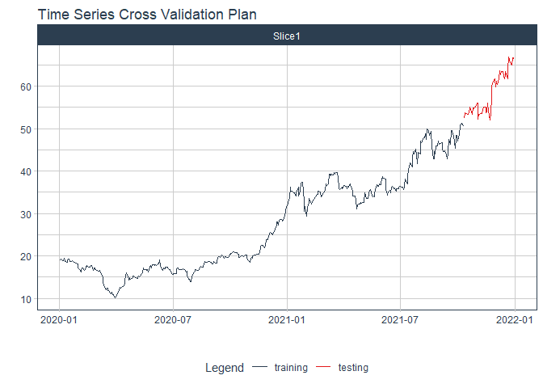
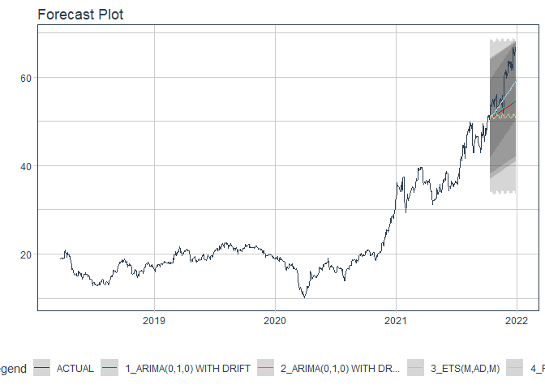

# Forecast hdg price

### Plot

``` r
readd(data_hdg) %>%
  plot_time_series(date, value, .interactive = interactive)
```

<!-- -->

### Divide data to train/ test

``` r
readd(splits_hdg) %>%
  tk_time_series_cv_plan() %>%
  plot_time_series_cv_plan(date, value, .interactive = FALSE)
```

<!-- -->

### Modeltime Table

``` r
readd(models_tbl_hdg)
#> # Modeltime Table
#> # A tibble: 5 x 3
#>   .model_id .model   .model_desc                                        
#>       <int> <list>   <chr>                                              
#> 1         1 <fit[+]> ARIMA(2,1,2)(1,0,2)[5] WITH DRIFT                  
#> 2         2 <fit[+]> ARIMA(2,1,2)(2,0,1)[5] WITH DRIFT W/ XGBOOST ERRORS
#> 3         3 <fit[+]> ETS(M,AD,M)                                        
#> 4         4 <fit[+]> PROPHET                                            
#> 5         5 <fit[+]> LM
```

### Calibration

``` r
readd(calibration_tbl_hdg)
#> # Modeltime Table
#> # A tibble: 5 x 5
#>   .model_id .model   .model_desc                                         .type .calibration_data 
#>       <int> <list>   <chr>                                               <chr> <list>            
#> 1         1 <fit[+]> ARIMA(2,1,2)(1,0,2)[5] WITH DRIFT                   Test  <tibble [121 x 4]>
#> 2         2 <fit[+]> ARIMA(2,1,2)(2,0,1)[5] WITH DRIFT W/ XGBOOST ERRORS Test  <tibble [121 x 4]>
#> 3         3 <fit[+]> ETS(M,AD,M)                                         Test  <tibble [121 x 4]>
#> 4         4 <fit[+]> PROPHET                                             Test  <tibble [121 x 4]>
#> 5         5 <fit[+]> LM                                                  Test  <tibble [121 x 4]>
```

### Forecast (Testing Set)

``` r
readd(forecast_tbl_hdg) %>% 
  plot_modeltime_forecast(.legend_max_width = 25, 
                           .interactive      = interactive)
#> Warning in max(ids, na.rm = TRUE): no non-missing arguments to max; returning -Inf
```

<!-- -->

### Accuracy table

``` r
readd(accuracy_tbl_hdg)$`_data`
#> # A tibble: 5 x 9
#>   .model_id .model_desc                                         .type   mae  mape  mase smape  rmse   rsq
#>       <int> <chr>                                               <chr> <dbl> <dbl> <dbl> <dbl> <dbl> <dbl>
#> 1         1 ARIMA(2,1,2)(1,0,2)[5] WITH DRIFT                   Test   7.23  16.8  8.57  18.5  7.67  0.08
#> 2         2 ARIMA(2,1,2)(2,0,1)[5] WITH DRIFT W/ XGBOOST ERRORS Test   6.75  15.6  8.01  17.1  7.22  0.08
#> 3         3 ETS(M,AD,M)                                         Test   8.1   18.8  9.61  21.0  8.51  0.08
#> 4         4 PROPHET                                             Test  18.4   43.3 21.8   55.4 18.6   0.08
#> 5         5 LM                                                  Test  19.2   45.2 22.8   58.6 19.4   0.05
```

### Next week forecast

``` r
readd(two_week_fc_hdg)
#> # A tibble: 16 x 6
#>    .ticker .index     .value  .low .high .model_desc                                        
#>    <chr>   <date>      <dbl> <dbl> <dbl> <chr>                                              
#>  1 hdg     2021-07-03   43.4  31.5  55.3 ARIMA(2,1,2)(2,0,1)[5] WITH DRIFT W/ XGBOOST ERRORS
#>  2 hdg     2021-07-04   43.4  31.6  55.3 ARIMA(2,1,2)(2,0,1)[5] WITH DRIFT W/ XGBOOST ERRORS
#>  3 hdg     2021-07-05   43.5  31.6  55.4 ARIMA(2,1,2)(2,0,1)[5] WITH DRIFT W/ XGBOOST ERRORS
#>  4 hdg     2021-07-06   43.5  31.6  55.4 ARIMA(2,1,2)(2,0,1)[5] WITH DRIFT W/ XGBOOST ERRORS
#>  5 hdg     2021-07-07   43.5  31.6  55.4 ARIMA(2,1,2)(2,0,1)[5] WITH DRIFT W/ XGBOOST ERRORS
#>  6 hdg     2021-07-08   43.5  31.6  55.4 ARIMA(2,1,2)(2,0,1)[5] WITH DRIFT W/ XGBOOST ERRORS
#>  7 hdg     2021-07-09   43.5  31.6  55.4 ARIMA(2,1,2)(2,0,1)[5] WITH DRIFT W/ XGBOOST ERRORS
#>  8 hdg     2021-07-10   43.5  31.6  55.4 ARIMA(2,1,2)(2,0,1)[5] WITH DRIFT W/ XGBOOST ERRORS
#>  9 hdg     2021-07-11   43.5  31.6  55.4 ARIMA(2,1,2)(2,0,1)[5] WITH DRIFT W/ XGBOOST ERRORS
#> 10 hdg     2021-07-12   43.5  31.6  55.4 ARIMA(2,1,2)(2,0,1)[5] WITH DRIFT W/ XGBOOST ERRORS
#> 11 hdg     2021-07-13   43.5  31.6  55.4 ARIMA(2,1,2)(2,0,1)[5] WITH DRIFT W/ XGBOOST ERRORS
#> 12 hdg     2021-07-14   43.6  31.7  55.5 ARIMA(2,1,2)(2,0,1)[5] WITH DRIFT W/ XGBOOST ERRORS
#> 13 hdg     2021-07-15   43.6  31.7  55.5 ARIMA(2,1,2)(2,0,1)[5] WITH DRIFT W/ XGBOOST ERRORS
#> 14 hdg     2021-07-16   43.6  31.7  55.5 ARIMA(2,1,2)(2,0,1)[5] WITH DRIFT W/ XGBOOST ERRORS
#> 15 hdg     2021-07-17   43.6  31.7  55.5 ARIMA(2,1,2)(2,0,1)[5] WITH DRIFT W/ XGBOOST ERRORS
#> 16 hdg     2021-07-18   43.6  31.7  55.5 ARIMA(2,1,2)(2,0,1)[5] WITH DRIFT W/ XGBOOST ERRORS
```
