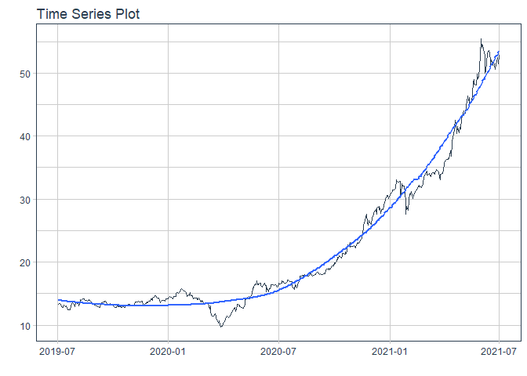
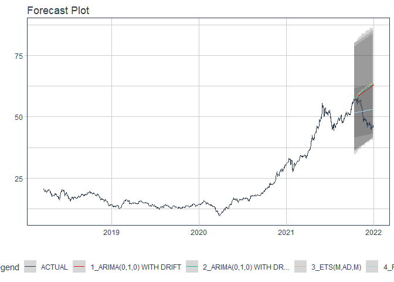

# Forecast hpg price

### Plot

``` r
readd(data_hpg) %>%
  plot_time_series(date, value, .interactive = interactive)
```

<!-- -->

### Divide data to train/ test

``` r
readd(splits_hpg) %>%
  tk_time_series_cv_plan() %>%
  plot_time_series_cv_plan(date, value, .interactive = FALSE)
```

<!-- -->

### Modeltime Table

``` r
readd(models_tbl_hpg)
#> # Modeltime Table
#> # A tibble: 4 x 3
#>   .model_id .model   .model_desc                             
#>       <int> <list>   <chr>                                   
#> 1         1 <fit[+]> ARIMA(0,2,1)(0,0,1)[5]                  
#> 2         2 <fit[+]> ARIMA(0,2,1)(0,0,1)[5] W/ XGBOOST ERRORS
#> 3         3 <fit[+]> ETS(M,AD,M)                             
#> 4         4 <fit[+]> PROPHET
```

### Calibration

``` r
readd(calibration_tbl_hpg)
#> # Modeltime Table
#> # A tibble: 4 x 5
#>   .model_id .model   .model_desc                              .type .calibration_data
#>       <int> <list>   <chr>                                    <chr> <list>           
#> 1         1 <fit[+]> ARIMA(0,2,1)(0,0,1)[5]                   Test  <tibble [65 x 4]>
#> 2         2 <fit[+]> ARIMA(0,2,1)(0,0,1)[5] W/ XGBOOST ERRORS Test  <tibble [65 x 4]>
#> 3         3 <fit[+]> ETS(M,AD,M)                              Test  <tibble [65 x 4]>
#> 4         4 <fit[+]> PROPHET                                  Test  <tibble [65 x 4]>
```

### Forecast (Testing Set)

``` r
readd(forecast_tbl_hpg) %>% 
  plot_modeltime_forecast(.legend_max_width = 25, 
                           .interactive      = interactive)
#> Warning in max(ids, na.rm = TRUE): no non-missing arguments to max; returning -Inf
```

<!-- -->

### Accuracy table

``` r
readd(accuracy_tbl_hpg)$`_data`
#> # A tibble: 4 x 9
#>   .model_id .model_desc                              .type   mae  mape  mase smape  rmse   rsq
#>       <int> <chr>                                    <chr> <dbl> <dbl> <dbl> <dbl> <dbl> <dbl>
#> 1         1 ARIMA(0,2,1)(0,0,1)[5]                   Test   8.99  18.4 10.2   20.8 10.1   0.88
#> 2         2 ARIMA(0,2,1)(0,0,1)[5] W/ XGBOOST ERRORS Test   8.52  17.4  9.66  19.5  9.68  0.88
#> 3         3 ETS(M,AD,M)                              Test  10.9   22.3 12.3   25.8 12.3   0.88
#> 4         4 PROPHET                                  Test   6.6   13.4  7.48  14.7  7.69  0.89
```

### Next week forecast

``` r
readd(two_week_fc_hpg)
#> # A tibble: 6 x 6
#>   .ticker .index     .value  .low .high .model_desc
#>   <chr>   <date>      <dbl> <dbl> <dbl> <chr>      
#> 1 hpg     2021-07-23   56.2  43.5  69.0 PROPHET    
#> 2 hpg     2021-07-26   56.7  44.0  69.4 PROPHET    
#> 3 hpg     2021-07-27   56.8  44.1  69.5 PROPHET    
#> 4 hpg     2021-07-28   56.9  44.2  69.6 PROPHET    
#> 5 hpg     2021-07-29   57.1  44.4  69.8 PROPHET    
#> 6 hpg     2021-07-30   57.3  44.6  70.0 PROPHET
```
