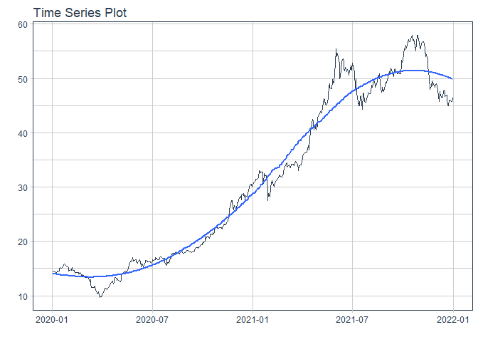
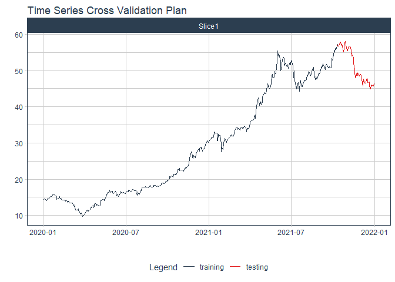

# Forecast hpg price

### Plot

``` r
readd(data_hpg) %>%
  plot_time_series(date, value, .interactive = interactive)
```

<!-- -->

### Divide data to train/ test

``` r
readd(splits_hpg) %>%
  tk_time_series_cv_plan() %>%
  plot_time_series_cv_plan(date, value, .interactive = FALSE)
```

<!-- -->

### Modeltime Table

``` r
readd(models_tbl_hpg)
#> # Modeltime Table
#> # A tibble: 5 x 3
#>   .model_id .model   .model_desc                   
#>       <int> <list>   <chr>                         
#> 1         1 <fit[+]> ARIMA(4,2,3)                  
#> 2         2 <fit[+]> ARIMA(4,2,1) W/ XGBOOST ERRORS
#> 3         3 <fit[+]> ETS(M,AD,M)                   
#> 4         4 <fit[+]> PROPHET                       
#> 5         5 <fit[+]> LM
```

### Calibration

``` r
readd(calibration_tbl_hpg)
#> # Modeltime Table
#> # A tibble: 5 x 5
#>   .model_id .model   .model_desc                    .type .calibration_data 
#>       <int> <list>   <chr>                          <chr> <list>            
#> 1         1 <fit[+]> ARIMA(4,2,3)                   Test  <tibble [117 x 4]>
#> 2         2 <fit[+]> ARIMA(4,2,1) W/ XGBOOST ERRORS Test  <tibble [117 x 4]>
#> 3         3 <fit[+]> ETS(M,AD,M)                    Test  <tibble [117 x 4]>
#> 4         4 <fit[+]> PROPHET                        Test  <tibble [117 x 4]>
#> 5         5 <fit[+]> LM                             Test  <tibble [117 x 4]>
```

### Forecast (Testing Set)

``` r
readd(forecast_tbl_hpg) %>% 
  plot_modeltime_forecast(.legend_max_width = 25, 
                           .interactive      = interactive)
#> Warning in max(ids, na.rm = TRUE): no non-missing arguments to max; returning -Inf
```

<!-- -->

### Accuracy table

``` r
readd(accuracy_tbl_hpg)$`_data`
#> # A tibble: 5 x 9
#>   .model_id .model_desc                    .type   mae  mape  mase smape  rmse   rsq
#>       <int> <chr>                          <chr> <dbl> <dbl> <dbl> <dbl> <dbl> <dbl>
#> 1         1 ARIMA(4,2,3)                   Test   4.04  9.09  5.76  9.64  5.56  0.88
#> 2         2 ARIMA(4,2,1) W/ XGBOOST ERRORS Test   4.06  9.23  5.79  9.72  5.49  0.88
#> 3         3 ETS(M,AD,M)                    Test   8.76 19.3  12.5  22.9  11.8   0.01
#> 4         4 PROPHET                        Test  22    54.3  31.4  75.5  23.4   0.15
#> 5         5 LM                             Test  23.0  57.0  32.8  80.6  24.3   0.83
```

### Next week forecast

``` r
readd(two_week_fc_hpg)
#> # A tibble: 16 x 6
#>    .ticker .index     .value  .low .high .model_desc 
#>    <chr>   <date>      <dbl> <dbl> <dbl> <chr>       
#>  1 hpg     2021-07-03   52.3  43.1  61.5 ARIMA(4,2,3)
#>  2 hpg     2021-07-04   52.4  43.3  61.6 ARIMA(4,2,3)
#>  3 hpg     2021-07-05   52.4  43.3  61.6 ARIMA(4,2,3)
#>  4 hpg     2021-07-06   52.7  43.5  61.8 ARIMA(4,2,3)
#>  5 hpg     2021-07-07   53.0  43.8  62.1 ARIMA(4,2,3)
#>  6 hpg     2021-07-08   53.0  43.9  62.2 ARIMA(4,2,3)
#>  7 hpg     2021-07-09   53.1  43.9  62.2 ARIMA(4,2,3)
#>  8 hpg     2021-07-10   53.3  44.2  62.5 ARIMA(4,2,3)
#>  9 hpg     2021-07-11   53.6  44.4  62.8 ARIMA(4,2,3)
#> 10 hpg     2021-07-12   53.6  44.5  62.8 ARIMA(4,2,3)
#> 11 hpg     2021-07-13   53.7  44.6  62.9 ARIMA(4,2,3)
#> 12 hpg     2021-07-14   54.0  44.9  63.2 ARIMA(4,2,3)
#> 13 hpg     2021-07-15   54.2  45.1  63.4 ARIMA(4,2,3)
#> 14 hpg     2021-07-16   54.2  45.1  63.4 ARIMA(4,2,3)
#> 15 hpg     2021-07-17   54.4  45.2  63.6 ARIMA(4,2,3)
#> 16 hpg     2021-07-18   54.7  45.5  63.9 ARIMA(4,2,3)
```
