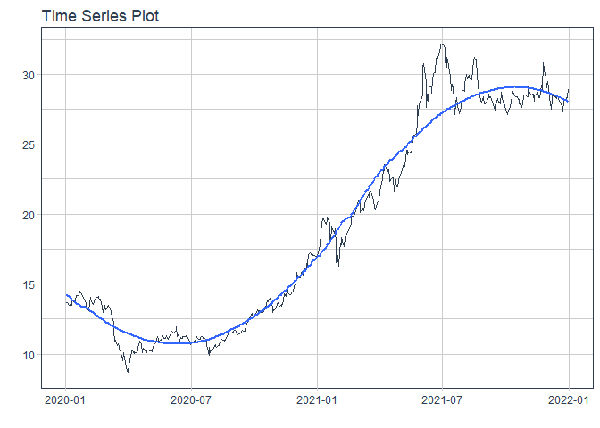
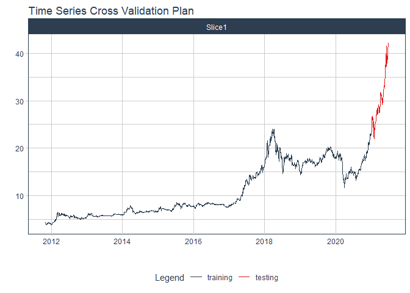
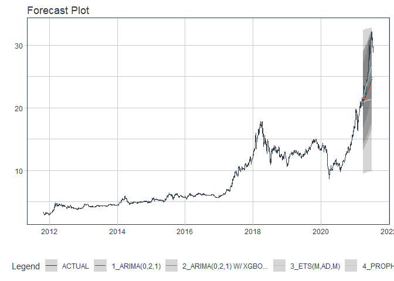

# Forecast mbb price

### Plot

``` r
readd(data_mbb) %>%
  plot_time_series(date, value, .interactive = interactive)
```

<!-- -->

### Divide data to train/ test

``` r
readd(splits_mbb) %>%
  tk_time_series_cv_plan() %>%
  plot_time_series_cv_plan(date, value, .interactive = FALSE)
```

<!-- -->

### Modeltime Table

``` r
readd(models_tbl_mbb)
#> # Modeltime Table
#> # A tibble: 5 x 3
#>   .model_id .model   .model_desc                                        
#>       <int> <list>   <chr>                                              
#> 1         1 <fit[+]> ARIMA(0,1,2)(2,0,0)[5] WITH DRIFT                  
#> 2         2 <fit[+]> ARIMA(0,1,2)(2,0,0)[5] WITH DRIFT W/ XGBOOST ERRORS
#> 3         3 <fit[+]> ETS(M,A,M)                                         
#> 4         4 <fit[+]> PROPHET                                            
#> 5         5 <fit[+]> LM
```

### Calibration

``` r
readd(calibration_tbl_mbb)
#> # Modeltime Table
#> # A tibble: 5 x 5
#>   .model_id .model   .model_desc                                         .type .calibration_data 
#>       <int> <list>   <chr>                                               <chr> <list>            
#> 1         1 <fit[+]> ARIMA(0,1,2)(2,0,0)[5] WITH DRIFT                   Test  <tibble [121 x 4]>
#> 2         2 <fit[+]> ARIMA(0,1,2)(2,0,0)[5] WITH DRIFT W/ XGBOOST ERRORS Test  <tibble [121 x 4]>
#> 3         3 <fit[+]> ETS(M,A,M)                                          Test  <tibble [121 x 4]>
#> 4         4 <fit[+]> PROPHET                                             Test  <tibble [121 x 4]>
#> 5         5 <fit[+]> LM                                                  Test  <tibble [121 x 4]>
```

### Forecast (Testing Set)

``` r
readd(forecast_tbl_mbb) %>% 
  plot_modeltime_forecast(.legend_max_width = 25, 
                           .interactive      = interactive)
#> Warning in max(ids, na.rm = TRUE): no non-missing arguments to max; returning -Inf
```

<!-- -->

### Accuracy table

``` r
readd(accuracy_tbl_mbb)$`_data`
#> # A tibble: 5 x 9
#>   .model_id .model_desc                                         .type   mae  mape  mase smape  rmse   rsq
#>       <int> <chr>                                               <chr> <dbl> <dbl> <dbl> <dbl> <dbl> <dbl>
#> 1         1 ARIMA(0,1,2)(2,0,0)[5] WITH DRIFT                   Test   6.9   20.6 11.8   24.0  8.52  0.87
#> 2         2 ARIMA(0,1,2)(2,0,0)[5] WITH DRIFT W/ XGBOOST ERRORS Test   6.53  19.4 11.2   22.5  8.19  0.87
#> 3         3 ETS(M,A,M)                                          Test   5.82  17.4  9.95  19.7  7.25  0.88
#> 4         4 PROPHET                                             Test  13.4   42.4 22.9   54.8 14.5   0.25
#> 5         5 LM                                                  Test  10.9   33.9 18.6   41.8 12.1   0.14
```

### Next week forecast

``` r
readd(two_week_fc_mbb)
#> # A tibble: 16 x 6
#>    .ticker .index     .value  .low .high .model_desc
#>    <chr>   <date>      <dbl> <dbl> <dbl> <chr>      
#>  1 mbb     2021-07-03   43.0  31.0  54.9 ETS(M,A,M) 
#>  2 mbb     2021-07-04   43.1  31.1  55.0 ETS(M,A,M) 
#>  3 mbb     2021-07-05   43.1  31.2  55.1 ETS(M,A,M) 
#>  4 mbb     2021-07-06   43.2  31.3  55.2 ETS(M,A,M) 
#>  5 mbb     2021-07-07   43.2  31.2  55.1 ETS(M,A,M) 
#>  6 mbb     2021-07-08   43.3  31.4  55.3 ETS(M,A,M) 
#>  7 mbb     2021-07-09   43.6  31.6  55.5 ETS(M,A,M) 
#>  8 mbb     2021-07-10   43.5  31.6  55.5 ETS(M,A,M) 
#>  9 mbb     2021-07-11   43.8  31.8  55.7 ETS(M,A,M) 
#> 10 mbb     2021-07-12   44.0  32.1  56.0 ETS(M,A,M) 
#> 11 mbb     2021-07-13   44.0  32.0  56.0 ETS(M,A,M) 
#> 12 mbb     2021-07-14   44.0  32.1  56.0 ETS(M,A,M) 
#> 13 mbb     2021-07-15   44.1  32.1  56.0 ETS(M,A,M) 
#> 14 mbb     2021-07-16   44.2  32.2  56.1 ETS(M,A,M) 
#> 15 mbb     2021-07-17   44.2  32.3  56.2 ETS(M,A,M) 
#> 16 mbb     2021-07-18   44.3  32.4  56.3 ETS(M,A,M)
```
