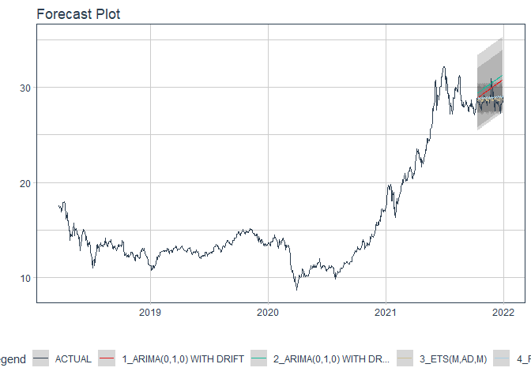

# Forecast MBB price

### Plot

``` r
readd(data_MBB) %>%
  plot_time_series(date, value, .interactive = interactive)
```

<!-- -->

### Divide data to train/ test

``` r
readd(splits_MBB) %>%
  tk_time_series_cv_plan() %>%
  plot_time_series_cv_plan(date, value, .interactive = FALSE)
```

<!-- -->

### Modeltime Table

``` r
readd(models_tbl_MBB)
#> # Modeltime Table
#> # A tibble: 4 x 3
#>   .model_id .model   .model_desc                              
#>       <int> <list>   <chr>                                    
#> 1         1 <fit[+]> ARIMA(0,1,0) WITH DRIFT                  
#> 2         2 <fit[+]> ARIMA(0,1,0) WITH DRIFT W/ XGBOOST ERRORS
#> 3         3 <fit[+]> ETS(M,AD,M)                              
#> 4         4 <fit[+]> PROPHET
```

### Calibration

``` r
readd(calibration_tbl_MBB)
#> # Modeltime Table
#> # A tibble: 4 x 5
#>   .model_id .model   .model_desc                               .type .calibration_data
#>       <int> <list>   <chr>                                     <chr> <list>           
#> 1         1 <fit[+]> ARIMA(0,1,0) WITH DRIFT                   Test  <tibble [59 x 4]>
#> 2         2 <fit[+]> ARIMA(0,1,0) WITH DRIFT W/ XGBOOST ERRORS Test  <tibble [59 x 4]>
#> 3         3 <fit[+]> ETS(M,AD,M)                               Test  <tibble [59 x 4]>
#> 4         4 <fit[+]> PROPHET                                   Test  <tibble [59 x 4]>
```

### Forecast (Testing Set)

``` r
readd(forecast_tbl_MBB) %>% 
  plot_modeltime_forecast(.legend_max_width = 25, 
                           .interactive      = interactive)
#> Warning in max(ids, na.rm = TRUE): no non-missing arguments to max; returning -Inf
```

<!-- -->

### Accuracy table

``` r
readd(accuracy_tbl_MBB)$`_data`
#> # A tibble: 4 x 9
#>   .model_id .model_desc                               .type   mae  mape  mase smape  rmse   rsq
#>       <int> <chr>                                     <chr> <dbl> <dbl> <dbl> <dbl> <dbl> <dbl>
#> 1         1 ARIMA(0,1,0) WITH DRIFT                   Test   1.37  4.83  4.58  4.69  1.58  0   
#> 2         2 ARIMA(0,1,0) WITH DRIFT W/ XGBOOST ERRORS Test   1.83  6.46  6.11  6.22  2.01  0   
#> 3         3 ETS(M,AD,M)                               Test   0.53  1.84  1.76  1.84  0.72  0.01
#> 4         4 PROPHET                                   Test   0.64  2.23  2.13  2.21  0.77  0
```

### Next week forecast

``` r
readd(two_week_fc_MBB)
#> # A tibble: 5 x 6
#>   .ticker .index     .value  .low .high .model_desc
#>   <chr>   <date>      <dbl> <dbl> <dbl> <chr>      
#> 1 MBB     2022-01-03   28.9  27.7  30.1 ETS(M,AD,M)
#> 2 MBB     2022-01-04   29.1  27.9  30.3 ETS(M,AD,M)
#> 3 MBB     2022-01-05   29.1  27.9  30.3 ETS(M,AD,M)
#> 4 MBB     2022-01-06   29.1  27.9  30.3 ETS(M,AD,M)
#> 5 MBB     2022-01-07   29.1  27.9  30.3 ETS(M,AD,M)
```
