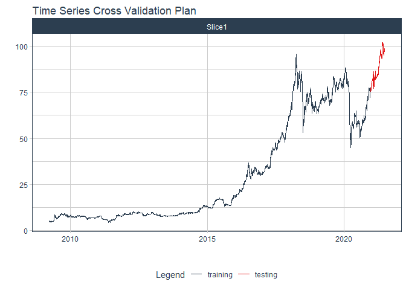
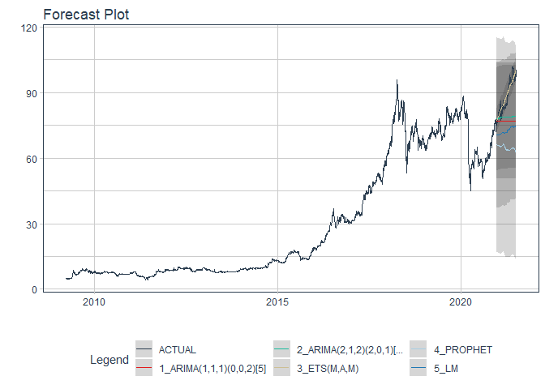

# Forecast pnj price

### Plot

``` r
readd(data_pnj) %>%
  plot_time_series(date, value, .interactive = interactive)
```

<!-- -->

### Divide data to train/ test

``` r
readd(splits_pnj) %>%
  tk_time_series_cv_plan() %>%
  plot_time_series_cv_plan(date, value, .interactive = FALSE)
```

<!-- -->

### Modeltime Table

``` r
readd(models_tbl_pnj)
#> # Modeltime Table
#> # A tibble: 5 x 3
#>   .model_id .model   .model_desc                             
#>       <int> <list>   <chr>                                   
#> 1         1 <fit[+]> ARIMA(1,1,1)(0,0,2)[5]                  
#> 2         2 <fit[+]> ARIMA(2,1,2)(2,0,1)[5] W/ XGBOOST ERRORS
#> 3         3 <fit[+]> ETS(M,A,M)                              
#> 4         4 <fit[+]> PROPHET                                 
#> 5         5 <fit[+]> LM
```

### Calibration

``` r
readd(calibration_tbl_pnj)
#> # Modeltime Table
#> # A tibble: 5 x 5
#>   .model_id .model   .model_desc                              .type .calibration_data 
#>       <int> <list>   <chr>                                    <chr> <list>            
#> 1         1 <fit[+]> ARIMA(1,1,1)(0,0,2)[5]                   Test  <tibble [128 x 4]>
#> 2         2 <fit[+]> ARIMA(2,1,2)(2,0,1)[5] W/ XGBOOST ERRORS Test  <tibble [128 x 4]>
#> 3         3 <fit[+]> ETS(M,A,M)                               Test  <tibble [128 x 4]>
#> 4         4 <fit[+]> PROPHET                                  Test  <tibble [128 x 4]>
#> 5         5 <fit[+]> LM                                       Test  <tibble [128 x 4]>
```

### Forecast (Testing Set)

``` r
readd(forecast_tbl_pnj) %>% 
  plot_modeltime_forecast(.legend_max_width = 25, 
                           .interactive      = interactive)
#> Warning in max(ids, na.rm = TRUE): no non-missing arguments to max; returning -Inf
```

<!-- -->

### Accuracy table

``` r
readd(accuracy_tbl_pnj)$`_data`
#> # A tibble: 5 x 9
#>   .model_id .model_desc                              .type   mae  mape  mase smape  rmse   rsq
#>       <int> <chr>                                    <chr> <dbl> <dbl> <dbl> <dbl> <dbl> <dbl>
#> 1         1 ARIMA(1,1,1)(0,0,2)[5]                   Test  11.3  12.1  10.6   13.2 13.6   0.04
#> 2         2 ARIMA(2,1,2)(2,0,1)[5] W/ XGBOOST ERRORS Test   9.73 10.4   9.18  11.3 12.1   0.54
#> 3         3 ETS(M,A,M)                               Test   2.32  2.61  2.19   2.6  2.75  0.87
#> 4         4 PROPHET                                  Test  23.6  26.1  22.2   30.4 25.0   0.4 
#> 5         5 LM                                       Test  15.8  17.4  14.9   19.3 17     0.91
```

### Next week forecast

``` r
readd(two_week_fc_pnj)
#> # A tibble: 16 x 6
#>    .ticker .index     .value  .low .high .model_desc
#>    <chr>   <date>      <dbl> <dbl> <dbl> <chr>      
#>  1 pnj     2021-07-03   99.8  95.3  104. ETS(M,A,M) 
#>  2 pnj     2021-07-04   99.8  95.3  104. ETS(M,A,M) 
#>  3 pnj     2021-07-05   99.5  94.9  104. ETS(M,A,M) 
#>  4 pnj     2021-07-06   99.6  95.1  104. ETS(M,A,M) 
#>  5 pnj     2021-07-07   99.2  94.7  104. ETS(M,A,M) 
#>  6 pnj     2021-07-08   99.7  95.2  104. ETS(M,A,M) 
#>  7 pnj     2021-07-09  100.   95.6  105. ETS(M,A,M) 
#>  8 pnj     2021-07-10  100.   95.9  105. ETS(M,A,M) 
#>  9 pnj     2021-07-11  101.   96.6  106. ETS(M,A,M) 
#> 10 pnj     2021-07-12  101.   96.9  106. ETS(M,A,M) 
#> 11 pnj     2021-07-13  102.   97.1  106. ETS(M,A,M) 
#> 12 pnj     2021-07-14  102.   97.3  106. ETS(M,A,M) 
#> 13 pnj     2021-07-15  102.   97.1  106. ETS(M,A,M) 
#> 14 pnj     2021-07-16  102.   97.1  106. ETS(M,A,M) 
#> 15 pnj     2021-07-17  101.   96.7  106. ETS(M,A,M) 
#> 16 pnj     2021-07-18  101.   96.8  106. ETS(M,A,M)
```
