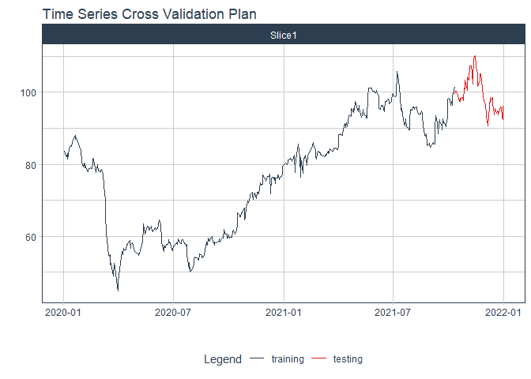

# Forecast pnj price

### Plot

``` r
readd(data_pnj) %>%
  plot_time_series(date, value, .interactive = interactive)
```

<!-- -->

### Divide data to train/ test

``` r
readd(splits_pnj) %>%
  tk_time_series_cv_plan() %>%
  plot_time_series_cv_plan(date, value, .interactive = FALSE)
```

<!-- -->

### Modeltime Table

``` r
readd(models_tbl_pnj)
#> # Modeltime Table
#> # A tibble: 4 x 3
#>   .model_id .model   .model_desc                             
#>       <int> <list>   <chr>                                   
#> 1         1 <fit[+]> ARIMA(0,1,0)(0,0,1)[5]                  
#> 2         2 <fit[+]> ARIMA(0,1,0)(1,0,0)[5] W/ XGBOOST ERRORS
#> 3         3 <fit[+]> ETS(M,AD,M)                             
#> 4         4 <fit[+]> PROPHET
```

### Calibration

``` r
readd(calibration_tbl_pnj)
#> # Modeltime Table
#> # A tibble: 4 x 5
#>   .model_id .model   .model_desc                              .type .calibration_data
#>       <int> <list>   <chr>                                    <chr> <list>           
#> 1         1 <fit[+]> ARIMA(0,1,0)(0,0,1)[5]                   Test  <tibble [65 x 4]>
#> 2         2 <fit[+]> ARIMA(0,1,0)(1,0,0)[5] W/ XGBOOST ERRORS Test  <tibble [65 x 4]>
#> 3         3 <fit[+]> ETS(M,AD,M)                              Test  <tibble [65 x 4]>
#> 4         4 <fit[+]> PROPHET                                  Test  <tibble [65 x 4]>
```

### Forecast (Testing Set)

``` r
readd(forecast_tbl_pnj) %>% 
  plot_modeltime_forecast(.legend_max_width = 25, 
                           .interactive      = interactive)
#> Warning in max(ids, na.rm = TRUE): no non-missing arguments to max; returning -Inf
```

<!-- -->

### Accuracy table

``` r
readd(accuracy_tbl_pnj)$`_data`
#> # A tibble: 4 x 9
#>   .model_id .model_desc                              .type   mae  mape  mase smape  rmse   rsq
#>       <int> <chr>                                    <chr> <dbl> <dbl> <dbl> <dbl> <dbl> <dbl>
#> 1         1 ARIMA(0,1,0)(0,0,1)[5]                   Test  10.5  10.8  10.9  11.5   11.4  0.25
#> 2         2 ARIMA(0,1,0)(1,0,0)[5] W/ XGBOOST ERRORS Test  10.1  10.4  10.4  11.1   10.9  0.57
#> 3         3 ETS(M,AD,M)                              Test  10.5  10.8  10.8  11.5   11.3  0.17
#> 4         4 PROPHET                                  Test   2.43  2.51  2.51  2.53   2.9  0.58
```

### Next week forecast

``` r
readd(two_week_fc_pnj)
#> # A tibble: 6 x 6
#>   .ticker .index     .value  .low .high .model_desc
#>   <chr>   <date>      <dbl> <dbl> <dbl> <chr>      
#> 1 pnj     2021-07-23   104.  99.4  109. PROPHET    
#> 2 pnj     2021-07-26   104.  99.5  109. PROPHET    
#> 3 pnj     2021-07-27   104.  99.7  109. PROPHET    
#> 4 pnj     2021-07-28   105.  99.8  109. PROPHET    
#> 5 pnj     2021-07-29   105. 100.   110. PROPHET    
#> 6 pnj     2021-07-30   105. 100.   110. PROPHET
```
