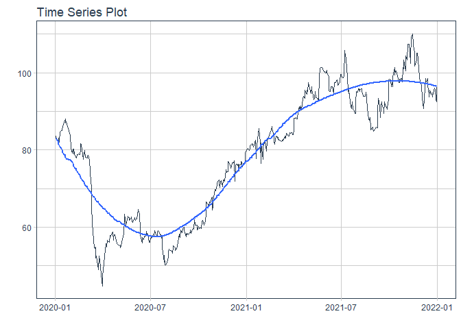
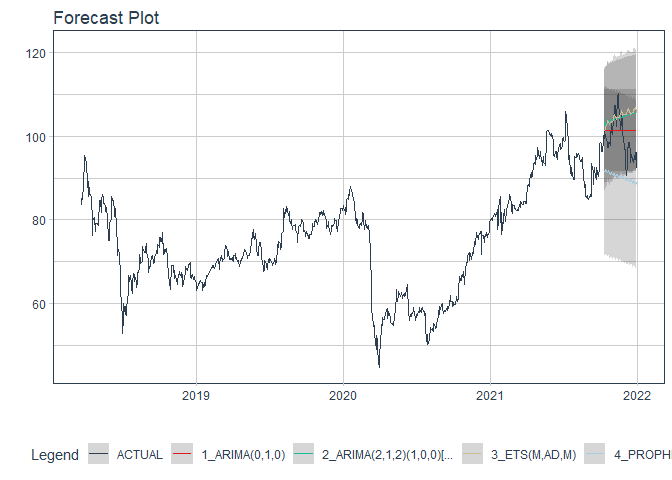

# Forecast PNJ price

### Plot

``` r
readd(data_PNJ) %>%
  plot_time_series(date, value, .interactive = interactive)
```

<!-- -->

### Divide data to train/ test

``` r
readd(splits_PNJ) %>%
  tk_time_series_cv_plan() %>%
  plot_time_series_cv_plan(date, value, .interactive = FALSE)
```

<!-- -->

### Modeltime Table

``` r
readd(models_tbl_PNJ)
#> # Modeltime Table
#> # A tibble: 4 x 3
#>   .model_id .model   .model_desc                                        
#>       <int> <list>   <chr>                                              
#> 1         1 <fit[+]> ARIMA(0,1,0)                                       
#> 2         2 <fit[+]> ARIMA(2,1,2)(1,0,0)[5] WITH DRIFT W/ XGBOOST ERRORS
#> 3         3 <fit[+]> ETS(M,AD,M)                                        
#> 4         4 <fit[+]> PROPHET
```

### Calibration

``` r
readd(calibration_tbl_PNJ)
#> # Modeltime Table
#> # A tibble: 4 x 5
#>   .model_id .model   .model_desc                                         .type .calibration_data
#>       <int> <list>   <chr>                                               <chr> <list>           
#> 1         1 <fit[+]> ARIMA(0,1,0)                                        Test  <tibble [59 x 4]>
#> 2         2 <fit[+]> ARIMA(2,1,2)(1,0,0)[5] WITH DRIFT W/ XGBOOST ERRORS Test  <tibble [59 x 4]>
#> 3         3 <fit[+]> ETS(M,AD,M)                                         Test  <tibble [59 x 4]>
#> 4         4 <fit[+]> PROPHET                                             Test  <tibble [59 x 4]>
```

### Forecast (Testing Set)

``` r
readd(forecast_tbl_PNJ) %>% 
  plot_modeltime_forecast(.legend_max_width = 25, 
                           .interactive      = interactive)
#> Warning in max(ids, na.rm = TRUE): no non-missing arguments to max; returning -Inf
```

<!-- -->

### Accuracy table

``` r
readd(accuracy_tbl_PNJ)$`_data`
#> # A tibble: 4 x 9
#>   .model_id .model_desc                                         .type   mae  mape  mase smape  rmse   rsq
#>       <int> <chr>                                               <chr> <dbl> <dbl> <dbl> <dbl> <dbl> <dbl>
#> 1         1 ARIMA(0,1,0)                                        Test   4.3   4.38  2.65  4.31  4.98 NA   
#> 2         2 ARIMA(2,1,2)(1,0,0)[5] WITH DRIFT W/ XGBOOST ERRORS Test   5.81  6.02  3.57  5.77  7.06  0.23
#> 3         3 ETS(M,AD,M)                                         Test   5.97  6.18  3.67  5.91  7.35  0.08
#> 4         4 PROPHET                                             Test   9.27  9.15  5.7   9.67 10.2   0.27
```

### Next week forecast

``` r
readd(two_week_fc_PNJ)
#> # A tibble: 5 x 6
#>   .ticker .index     .value  .low .high .model_desc 
#>   <chr>   <date>      <dbl> <dbl> <dbl> <chr>       
#> 1 PNJ     2022-01-03   96.2  88.0  104. ARIMA(0,1,0)
#> 2 PNJ     2022-01-04   96.2  88.0  104. ARIMA(0,1,0)
#> 3 PNJ     2022-01-05   96.2  88.0  104. ARIMA(0,1,0)
#> 4 PNJ     2022-01-06   96.2  88.0  104. ARIMA(0,1,0)
#> 5 PNJ     2022-01-07   96.2  88.0  104. ARIMA(0,1,0)
```
