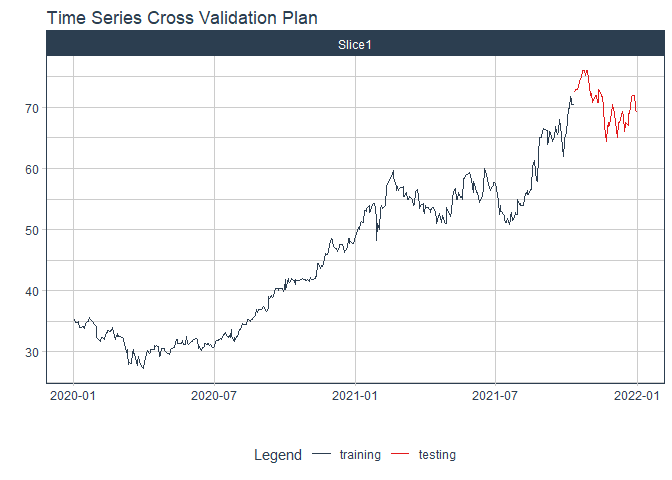

# Forecast ree price

### Plot

``` r
readd(data_ree) %>%
  plot_time_series(date, value, .interactive = interactive)
```

<!-- -->

### Divide data to train/ test

``` r
readd(splits_ree) %>%
  tk_time_series_cv_plan() %>%
  plot_time_series_cv_plan(date, value, .interactive = FALSE)
```

<!-- -->

### Modeltime Table

``` r
readd(models_tbl_ree)
#> # Modeltime Table
#> # A tibble: 5 x 3
#>   .model_id .model   .model_desc                                        
#>       <int> <list>   <chr>                                              
#> 1         1 <fit[+]> ARIMA(0,1,1)(1,0,1)[5] WITH DRIFT                  
#> 2         2 <fit[+]> ARIMA(1,1,0)(1,0,1)[5] WITH DRIFT W/ XGBOOST ERRORS
#> 3         3 <fit[+]> ETS(M,A,M)                                         
#> 4         4 <fit[+]> PROPHET                                            
#> 5         5 <fit[+]> LM
```

### Calibration

``` r
readd(calibration_tbl_ree)
#> # Modeltime Table
#> # A tibble: 5 x 5
#>   .model_id .model   .model_desc                                         .type .calibration_data
#>       <int> <list>   <chr>                                               <chr> <list>           
#> 1         1 <fit[+]> ARIMA(0,1,1)(1,0,1)[5] WITH DRIFT                   Test  <tibble [74 x 4]>
#> 2         2 <fit[+]> ARIMA(1,1,0)(1,0,1)[5] WITH DRIFT W/ XGBOOST ERRORS Test  <tibble [74 x 4]>
#> 3         3 <fit[+]> ETS(M,A,M)                                          Test  <tibble [74 x 4]>
#> 4         4 <fit[+]> PROPHET                                             Test  <tibble [74 x 4]>
#> 5         5 <fit[+]> LM                                                  Test  <tibble [74 x 4]>
```

### Forecast (Testing Set)

``` r
readd(forecast_tbl_ree) %>% 
  plot_modeltime_forecast(.legend_max_width = 25, 
                           .interactive      = interactive)
#> Warning in max(ids, na.rm = TRUE): no non-missing arguments to max; returning -Inf
```

<!-- -->

### Accuracy table

``` r
readd(accuracy_tbl_ree)$`_data`
#> # A tibble: 5 x 9
#>   .model_id .model_desc                                         .type   mae  mape  mase smape  rmse   rsq
#>       <int> <chr>                                               <chr> <dbl> <dbl> <dbl> <dbl> <dbl> <dbl>
#> 1         1 ARIMA(0,1,1)(1,0,1)[5] WITH DRIFT                   Test   1.78  3.24  2.23  3.22  2.18  0.31
#> 2         2 ARIMA(1,1,0)(1,0,1)[5] WITH DRIFT W/ XGBOOST ERRORS Test   1.84  3.37  2.3   3.33  2.25  0.31
#> 3         3 ETS(M,A,M)                                          Test   2.17  4.02  2.72  3.92  2.63  0.24
#> 4         4 PROPHET                                             Test  13.6  24.5  17.0  28.0  13.7   0.64
#> 5         5 LM                                                  Test  23.6  42.7  29.6  54.4  23.7   0.1
```

### Next week forecast

``` r
readd(two_week_fc_ree)
#> # A tibble: 16 x 6
#>    .ticker .index     .value  .low .high .model_desc                      
#>    <chr>   <date>      <dbl> <dbl> <dbl> <chr>                            
#>  1 ree     2021-07-03   56.6  53.0  60.2 ARIMA(0,1,1)(1,0,1)[5] WITH DRIFT
#>  2 ree     2021-07-04   56.7  53.1  60.3 ARIMA(0,1,1)(1,0,1)[5] WITH DRIFT
#>  3 ree     2021-07-05   56.7  53.1  60.3 ARIMA(0,1,1)(1,0,1)[5] WITH DRIFT
#>  4 ree     2021-07-06   56.7  53.0  60.3 ARIMA(0,1,1)(1,0,1)[5] WITH DRIFT
#>  5 ree     2021-07-07   56.7  53.1  60.3 ARIMA(0,1,1)(1,0,1)[5] WITH DRIFT
#>  6 ree     2021-07-08   56.6  53.0  60.2 ARIMA(0,1,1)(1,0,1)[5] WITH DRIFT
#>  7 ree     2021-07-09   56.7  53.1  60.3 ARIMA(0,1,1)(1,0,1)[5] WITH DRIFT
#>  8 ree     2021-07-10   56.7  53.1  60.3 ARIMA(0,1,1)(1,0,1)[5] WITH DRIFT
#>  9 ree     2021-07-11   56.7  53.1  60.3 ARIMA(0,1,1)(1,0,1)[5] WITH DRIFT
#> 10 ree     2021-07-12   56.7  53.1  60.3 ARIMA(0,1,1)(1,0,1)[5] WITH DRIFT
#> 11 ree     2021-07-13   56.7  53.1  60.3 ARIMA(0,1,1)(1,0,1)[5] WITH DRIFT
#> 12 ree     2021-07-14   56.7  53.1  60.3 ARIMA(0,1,1)(1,0,1)[5] WITH DRIFT
#> 13 ree     2021-07-15   56.7  53.1  60.3 ARIMA(0,1,1)(1,0,1)[5] WITH DRIFT
#> 14 ree     2021-07-16   56.7  53.1  60.3 ARIMA(0,1,1)(1,0,1)[5] WITH DRIFT
#> 15 ree     2021-07-17   56.7  53.1  60.3 ARIMA(0,1,1)(1,0,1)[5] WITH DRIFT
#> 16 ree     2021-07-18   56.7  53.1  60.3 ARIMA(0,1,1)(1,0,1)[5] WITH DRIFT
```
