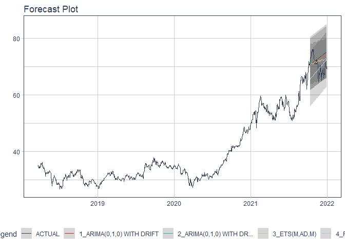

# Forecast REE price

### Plot

``` r
readd(data_REE) %>%
  plot_time_series(date, value, .interactive = interactive)
```

<!-- -->

### Divide data to train/ test

``` r
readd(splits_REE) %>%
  tk_time_series_cv_plan() %>%
  plot_time_series_cv_plan(date, value, .interactive = FALSE)
```

<!-- -->

### Modeltime Table

``` r
readd(models_tbl_REE)
#> # Modeltime Table
#> # A tibble: 4 x 3
#>   .model_id .model   .model_desc                              
#>       <int> <list>   <chr>                                    
#> 1         1 <fit[+]> ARIMA(0,1,0) WITH DRIFT                  
#> 2         2 <fit[+]> ARIMA(0,1,0) WITH DRIFT W/ XGBOOST ERRORS
#> 3         3 <fit[+]> ETS(M,AD,M)                              
#> 4         4 <fit[+]> PROPHET
```

### Calibration

``` r
readd(calibration_tbl_REE)
#> # Modeltime Table
#> # A tibble: 4 x 5
#>   .model_id .model   .model_desc                               .type .calibration_data
#>       <int> <list>   <chr>                                     <chr> <list>           
#> 1         1 <fit[+]> ARIMA(0,1,0) WITH DRIFT                   Test  <tibble [59 x 4]>
#> 2         2 <fit[+]> ARIMA(0,1,0) WITH DRIFT W/ XGBOOST ERRORS Test  <tibble [59 x 4]>
#> 3         3 <fit[+]> ETS(M,AD,M)                               Test  <tibble [59 x 4]>
#> 4         4 <fit[+]> PROPHET                                   Test  <tibble [59 x 4]>
```

### Forecast (Testing Set)

``` r
readd(forecast_tbl_REE) %>% 
  plot_modeltime_forecast(.legend_max_width = 25, 
                           .interactive      = interactive)
#> Warning in max(ids, na.rm = TRUE): no non-missing arguments to max; returning -Inf
```

<!-- -->

### Accuracy table

``` r
readd(accuracy_tbl_REE)$`_data`
#> # A tibble: 4 x 9
#>   .model_id .model_desc                               .type   mae  mape  mase smape  rmse   rsq
#>       <int> <chr>                                     <chr> <dbl> <dbl> <dbl> <dbl> <dbl> <dbl>
#> 1         1 ARIMA(0,1,0) WITH DRIFT                   Test   3.98  5.74  4.21  5.58  4.61  0.44
#> 2         2 ARIMA(0,1,0) WITH DRIFT W/ XGBOOST ERRORS Test   4.12  5.94  4.35  5.75  4.78  0.44
#> 3         3 ETS(M,AD,M)                               Test   3.06  4.39  3.24  4.32  3.6   0.51
#> 4         4 PROPHET                                   Test   4.1   5.71  4.33  5.86  4.92  0.44
```

### Next week forecast

``` r
readd(two_week_fc_REE)
#> # A tibble: 5 x 6
#>   .ticker .index     .value  .low .high .model_desc
#>   <chr>   <date>      <dbl> <dbl> <dbl> <chr>      
#> 1 REE     2022-01-03   69.3  63.3  75.2 ETS(M,AD,M)
#> 2 REE     2022-01-04   69.2  63.2  75.1 ETS(M,AD,M)
#> 3 REE     2022-01-05   69.1  63.1  75.0 ETS(M,AD,M)
#> 4 REE     2022-01-06   69.2  63.3  75.2 ETS(M,AD,M)
#> 5 REE     2022-01-07   69.2  63.2  75.1 ETS(M,AD,M)
```
