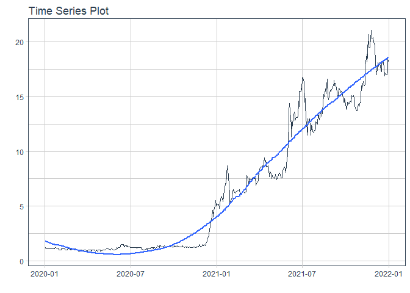

# Forecast SBS price

### Plot

``` r
readd(data_SBS) %>%
  plot_time_series(date, value, .interactive = interactive)
```

<!-- -->

### Divide data to train/ test

``` r
readd(splits_SBS) %>%
  tk_time_series_cv_plan() %>%
  plot_time_series_cv_plan(date, value, .interactive = FALSE)
```

<!-- -->

### Modeltime Table

``` r
readd(models_tbl_SBS)
#> # Modeltime Table
#> # A tibble: 4 x 3
#>   .model_id .model   .model_desc                              
#>       <int> <list>   <chr>                                    
#> 1         1 <fit[+]> ARIMA(0,1,0) WITH DRIFT                  
#> 2         2 <fit[+]> ARIMA(0,1,0) WITH DRIFT W/ XGBOOST ERRORS
#> 3         3 <fit[+]> ETS(M,AD,M)                              
#> 4         4 <fit[+]> PROPHET
```

### Calibration

``` r
readd(calibration_tbl_SBS)
#> # Modeltime Table
#> # A tibble: 4 x 5
#>   .model_id .model   .model_desc                               .type .calibration_data
#>       <int> <list>   <chr>                                     <chr> <list>           
#> 1         1 <fit[+]> ARIMA(0,1,0) WITH DRIFT                   Test  <tibble [59 x 4]>
#> 2         2 <fit[+]> ARIMA(0,1,0) WITH DRIFT W/ XGBOOST ERRORS Test  <tibble [59 x 4]>
#> 3         3 <fit[+]> ETS(M,AD,M)                               Test  <tibble [59 x 4]>
#> 4         4 <fit[+]> PROPHET                                   Test  <tibble [59 x 4]>
```

### Forecast (Testing Set)

``` r
readd(forecast_tbl_SBS) %>% 
  plot_modeltime_forecast(.legend_max_width = 25, 
                           .interactive      = interactive)
#> Warning in max(ids, na.rm = TRUE): no non-missing arguments to max; returning -Inf
```

<!-- -->

### Accuracy table

``` r
readd(accuracy_tbl_SBS)$`_data`
#> # A tibble: 4 x 9
#>   .model_id .model_desc                               .type   mae  mape  mase smape  rmse   rsq
#>       <int> <chr>                                     <chr> <dbl> <dbl> <dbl> <dbl> <dbl> <dbl>
#> 1         1 ARIMA(0,1,0) WITH DRIFT                   Test   1.87  10.2  3.99 11.0   2.42  0.37
#> 2         2 ARIMA(0,1,0) WITH DRIFT W/ XGBOOST ERRORS Test   1.66   9.1  3.54  9.66  2.17  0.37
#> 3         3 ETS(M,AD,M)                               Test   2.59  14.1  5.53 15.6   3.2   0.01
#> 4         4 PROPHET                                   Test   1.95  11.9  4.16 11.2   2.11  0.37
```

### Next week forecast

``` r
readd(two_week_fc_SBS)
#> # A tibble: 5 x 6
#>   .ticker .index     .value  .low .high .model_desc                              
#>   <chr>   <date>      <dbl> <dbl> <dbl> <chr>                                    
#> 1 SBS     2022-01-03   18.8  15.2  22.4 ARIMA(0,1,0) WITH DRIFT W/ XGBOOST ERRORS
#> 2 SBS     2022-01-04   18.8  15.2  22.4 ARIMA(0,1,0) WITH DRIFT W/ XGBOOST ERRORS
#> 3 SBS     2022-01-05   18.8  15.3  22.4 ARIMA(0,1,0) WITH DRIFT W/ XGBOOST ERRORS
#> 4 SBS     2022-01-06   18.9  15.3  22.5 ARIMA(0,1,0) WITH DRIFT W/ XGBOOST ERRORS
#> 5 SBS     2022-01-07   18.9  15.3  22.5 ARIMA(0,1,0) WITH DRIFT W/ XGBOOST ERRORS
```
