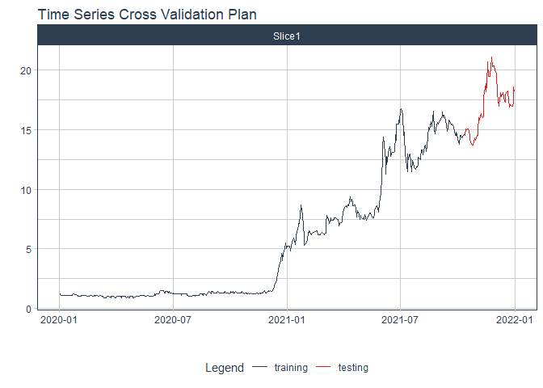

# Forecast sbs price

### Plot

``` r
readd(data_sbs) %>%
  plot_time_series(date, value, .interactive = interactive)
```

<!-- -->

### Divide data to train/ test

``` r
readd(splits_sbs) %>%
  tk_time_series_cv_plan() %>%
  plot_time_series_cv_plan(date, value, .interactive = FALSE)
```

<!-- -->

### Modeltime Table

``` r
readd(models_tbl_sbs)
#> # Modeltime Table
#> # A tibble: 5 x 3
#>   .model_id .model   .model_desc                             
#>       <int> <list>   <chr>                                   
#> 1         1 <fit[+]> ARIMA(0,2,1)(2,0,0)[5]                  
#> 2         2 <fit[+]> ARIMA(0,2,1)(1,0,1)[5] W/ XGBOOST ERRORS
#> 3         3 <fit[+]> ETS(M,AD,M)                             
#> 4         4 <fit[+]> PROPHET                                 
#> 5         5 <fit[+]> LM
```

### Calibration

``` r
readd(calibration_tbl_sbs)
#> # Modeltime Table
#> # A tibble: 5 x 5
#>   .model_id .model   .model_desc                              .type .calibration_data 
#>       <int> <list>   <chr>                                    <chr> <list>            
#> 1         1 <fit[+]> ARIMA(0,2,1)(2,0,0)[5]                   Test  <tibble [129 x 4]>
#> 2         2 <fit[+]> ARIMA(0,2,1)(1,0,1)[5] W/ XGBOOST ERRORS Test  <tibble [129 x 4]>
#> 3         3 <fit[+]> ETS(M,AD,M)                              Test  <tibble [129 x 4]>
#> 4         4 <fit[+]> PROPHET                                  Test  <tibble [129 x 4]>
#> 5         5 <fit[+]> LM                                       Test  <tibble [129 x 4]>
```

### Forecast (Testing Set)

``` r
readd(forecast_tbl_sbs) %>% 
  plot_modeltime_forecast(.legend_max_width = 25, 
                           .interactive      = interactive)
#> Warning in max(ids, na.rm = TRUE): no non-missing arguments to max; returning -Inf
```

<!-- -->

### Accuracy table

``` r
readd(accuracy_tbl_sbs)$`_data`
#> # A tibble: 5 x 9
#>   .model_id .model_desc                              .type   mae  mape  mase smape  rmse   rsq
#>       <int> <chr>                                    <chr> <dbl> <dbl> <dbl> <dbl> <dbl> <dbl>
#> 1         1 ARIMA(0,2,1)(2,0,0)[5]                   Test   1.47  19.1  3.96  21.6  1.73  0.74
#> 2         2 ARIMA(0,2,1)(1,0,1)[5] W/ XGBOOST ERRORS Test   1.21  15.4  3.27  16.6  1.48  0.74
#> 3         3 ETS(M,AD,M)                              Test   4.92  58.7 13.3   85.2  5.55  0.17
#> 4         4 PROPHET                                  Test   6.83  84.2 18.4  148.   7.38  0.23
#> 5         5 LM                                       Test  10.8  139.  29.1  200   11.3   0.51
```

### Next week forecast

``` r
readd(two_week_fc_sbs)
#> # A tibble: 16 x 6
#>    .ticker .index     .value  .low .high .model_desc                             
#>    <chr>   <date>      <dbl> <dbl> <dbl> <chr>                                   
#>  1 sbs     2021-07-03   17.0  14.5  19.4 ARIMA(0,2,1)(1,0,1)[5] W/ XGBOOST ERRORS
#>  2 sbs     2021-07-04   17.1  14.6  19.5 ARIMA(0,2,1)(1,0,1)[5] W/ XGBOOST ERRORS
#>  3 sbs     2021-07-05   17.1  14.7  19.6 ARIMA(0,2,1)(1,0,1)[5] W/ XGBOOST ERRORS
#>  4 sbs     2021-07-06   17.2  14.8  19.7 ARIMA(0,2,1)(1,0,1)[5] W/ XGBOOST ERRORS
#>  5 sbs     2021-07-07   17.3  14.9  19.8 ARIMA(0,2,1)(1,0,1)[5] W/ XGBOOST ERRORS
#>  6 sbs     2021-07-08   17.4  15.0  19.9 ARIMA(0,2,1)(1,0,1)[5] W/ XGBOOST ERRORS
#>  7 sbs     2021-07-09   17.5  15.1  19.9 ARIMA(0,2,1)(1,0,1)[5] W/ XGBOOST ERRORS
#>  8 sbs     2021-07-10   17.6  15.2  20.0 ARIMA(0,2,1)(1,0,1)[5] W/ XGBOOST ERRORS
#>  9 sbs     2021-07-11   17.7  15.3  20.1 ARIMA(0,2,1)(1,0,1)[5] W/ XGBOOST ERRORS
#> 10 sbs     2021-07-12   17.8  15.3  20.2 ARIMA(0,2,1)(1,0,1)[5] W/ XGBOOST ERRORS
#> 11 sbs     2021-07-13   17.9  15.4  20.3 ARIMA(0,2,1)(1,0,1)[5] W/ XGBOOST ERRORS
#> 12 sbs     2021-07-14   18.0  15.5  20.4 ARIMA(0,2,1)(1,0,1)[5] W/ XGBOOST ERRORS
#> 13 sbs     2021-07-15   18.1  15.6  20.5 ARIMA(0,2,1)(1,0,1)[5] W/ XGBOOST ERRORS
#> 14 sbs     2021-07-16   18.1  15.7  20.6 ARIMA(0,2,1)(1,0,1)[5] W/ XGBOOST ERRORS
#> 15 sbs     2021-07-17   18.2  15.8  20.7 ARIMA(0,2,1)(1,0,1)[5] W/ XGBOOST ERRORS
#> 16 sbs     2021-07-18   18.3  15.9  20.8 ARIMA(0,2,1)(1,0,1)[5] W/ XGBOOST ERRORS
```
