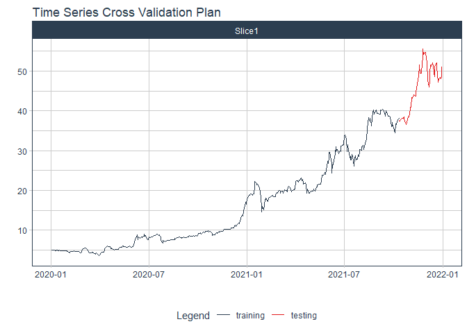

# Forecast shs price

### Plot

``` r
readd(data_shs) %>%
  plot_time_series(date, value, .interactive = interactive)
```

<!-- -->

### Divide data to train/ test

``` r
readd(splits_shs) %>%
  tk_time_series_cv_plan() %>%
  plot_time_series_cv_plan(date, value, .interactive = FALSE)
```

<!-- -->

### Modeltime Table

``` r
readd(models_tbl_shs)
#> # Modeltime Table
#> # A tibble: 5 x 3
#>   .model_id .model   .model_desc                             
#>       <int> <list>   <chr>                                   
#> 1         1 <fit[+]> ARIMA(1,2,0)(1,0,0)[5]                  
#> 2         2 <fit[+]> ARIMA(4,2,0)(2,0,0)[5] W/ XGBOOST ERRORS
#> 3         3 <fit[+]> ETS(M,AD,M)                             
#> 4         4 <fit[+]> PROPHET                                 
#> 5         5 <fit[+]> LM
```

### Calibration

``` r
readd(calibration_tbl_shs)
#> # Modeltime Table
#> # A tibble: 5 x 5
#>   .model_id .model   .model_desc                              .type .calibration_data 
#>       <int> <list>   <chr>                                    <chr> <list>            
#> 1         1 <fit[+]> ARIMA(1,2,0)(1,0,0)[5]                   Test  <tibble [129 x 4]>
#> 2         2 <fit[+]> ARIMA(4,2,0)(2,0,0)[5] W/ XGBOOST ERRORS Test  <tibble [129 x 4]>
#> 3         3 <fit[+]> ETS(M,AD,M)                              Test  <tibble [129 x 4]>
#> 4         4 <fit[+]> PROPHET                                  Test  <tibble [129 x 4]>
#> 5         5 <fit[+]> LM                                       Test  <tibble [129 x 4]>
```

### Forecast (Testing Set)

``` r
readd(forecast_tbl_shs) %>% 
  plot_modeltime_forecast(.legend_max_width = 25, 
                           .interactive      = interactive)
#> Warning in max(ids, na.rm = TRUE): no non-missing arguments to max; returning -Inf
```

<!-- -->

### Accuracy table

``` r
readd(accuracy_tbl_shs)$`_data`
#> # A tibble: 5 x 9
#>   .model_id .model_desc                              .type   mae  mape  mase smape  rmse   rsq
#>       <int> <chr>                                    <chr> <dbl> <dbl> <dbl> <dbl> <dbl> <dbl>
#> 1         1 ARIMA(1,2,0)(1,0,0)[5]                   Test  12.2   39.2 13.9   31.7 14.3   0.71
#> 2         2 ARIMA(4,2,0)(2,0,0)[5] W/ XGBOOST ERRORS Test   2.87  10.0  3.29  10.5  3.76  0.71
#> 3         3 ETS(M,AD,M)                              Test  12.7   41.2 14.6   53.2 14.0   0.55
#> 4         4 PROPHET                                  Test  19.5   65.1 22.3   97.1 20.2   0.42
#> 5         5 LM                                       Test  21.2   70.9 24.2  111.  21.9   0.12
```

### Next week forecast

``` r
readd(two_week_fc_shs)
#> # A tibble: 16 x 6
#>    .ticker .index     .value  .low .high .model_desc                             
#>    <chr>   <date>      <dbl> <dbl> <dbl> <chr>                                   
#>  1 shs     2021-07-03   45.3  39.1  51.5 ARIMA(4,2,0)(2,0,0)[5] W/ XGBOOST ERRORS
#>  2 shs     2021-07-04   45.5  39.3  51.7 ARIMA(4,2,0)(2,0,0)[5] W/ XGBOOST ERRORS
#>  3 shs     2021-07-05   45.7  39.5  51.9 ARIMA(4,2,0)(2,0,0)[5] W/ XGBOOST ERRORS
#>  4 shs     2021-07-06   45.9  39.7  52.1 ARIMA(4,2,0)(2,0,0)[5] W/ XGBOOST ERRORS
#>  5 shs     2021-07-07   46.1  39.9  52.3 ARIMA(4,2,0)(2,0,0)[5] W/ XGBOOST ERRORS
#>  6 shs     2021-07-08   46.2  40.0  52.4 ARIMA(4,2,0)(2,0,0)[5] W/ XGBOOST ERRORS
#>  7 shs     2021-07-09   46.4  40.2  52.6 ARIMA(4,2,0)(2,0,0)[5] W/ XGBOOST ERRORS
#>  8 shs     2021-07-10   46.6  40.4  52.8 ARIMA(4,2,0)(2,0,0)[5] W/ XGBOOST ERRORS
#>  9 shs     2021-07-11   46.8  40.6  53.0 ARIMA(4,2,0)(2,0,0)[5] W/ XGBOOST ERRORS
#> 10 shs     2021-07-12   47.0  40.8  53.2 ARIMA(4,2,0)(2,0,0)[5] W/ XGBOOST ERRORS
#> 11 shs     2021-07-13   47.1  40.9  53.3 ARIMA(4,2,0)(2,0,0)[5] W/ XGBOOST ERRORS
#> 12 shs     2021-07-14   47.3  41.1  53.5 ARIMA(4,2,0)(2,0,0)[5] W/ XGBOOST ERRORS
#> 13 shs     2021-07-15   47.5  41.3  53.7 ARIMA(4,2,0)(2,0,0)[5] W/ XGBOOST ERRORS
#> 14 shs     2021-07-16   47.7  41.5  53.9 ARIMA(4,2,0)(2,0,0)[5] W/ XGBOOST ERRORS
#> 15 shs     2021-07-17   47.9  41.7  54.1 ARIMA(4,2,0)(2,0,0)[5] W/ XGBOOST ERRORS
#> 16 shs     2021-07-18   48.0  41.8  54.2 ARIMA(4,2,0)(2,0,0)[5] W/ XGBOOST ERRORS
```
