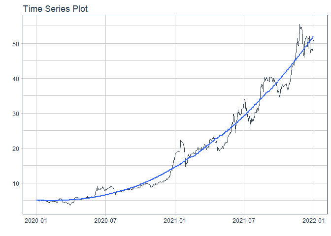
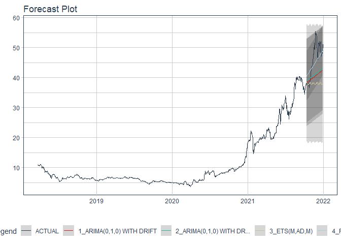

# Forecast shs price

### Plot

``` r
readd(data_shs) %>%
  plot_time_series(date, value, .interactive = interactive)
```

<!-- -->

### Divide data to train/ test

``` r
readd(splits_shs) %>%
  tk_time_series_cv_plan() %>%
  plot_time_series_cv_plan(date, value, .interactive = FALSE)
```

<!-- -->

### Modeltime Table

``` r
readd(models_tbl_shs)
#> # Modeltime Table
#> # A tibble: 4 x 3
#>   .model_id .model   .model_desc                             
#>       <int> <list>   <chr>                                   
#> 1         1 <fit[+]> ARIMA(1,1,0)(0,0,1)[5]                  
#> 2         2 <fit[+]> ARIMA(1,1,0)(0,0,1)[5] W/ XGBOOST ERRORS
#> 3         3 <fit[+]> ETS(M,A,M)                              
#> 4         4 <fit[+]> PROPHET
```

### Calibration

``` r
readd(calibration_tbl_shs)
#> # Modeltime Table
#> # A tibble: 4 x 5
#>   .model_id .model   .model_desc                              .type .calibration_data
#>       <int> <list>   <chr>                                    <chr> <list>           
#> 1         1 <fit[+]> ARIMA(1,1,0)(0,0,1)[5]                   Test  <tibble [65 x 4]>
#> 2         2 <fit[+]> ARIMA(1,1,0)(0,0,1)[5] W/ XGBOOST ERRORS Test  <tibble [65 x 4]>
#> 3         3 <fit[+]> ETS(M,A,M)                               Test  <tibble [65 x 4]>
#> 4         4 <fit[+]> PROPHET                                  Test  <tibble [65 x 4]>
```

### Forecast (Testing Set)

``` r
readd(forecast_tbl_shs) %>% 
  plot_modeltime_forecast(.legend_max_width = 25, 
                           .interactive      = interactive)
#> Warning in max(ids, na.rm = TRUE): no non-missing arguments to max; returning -Inf
```

<!-- -->

### Accuracy table

``` r
readd(accuracy_tbl_shs)$`_data`
#> # A tibble: 4 x 9
#>   .model_id .model_desc                              .type   mae  mape  mase smape  rmse   rsq
#>       <int> <chr>                                    <chr> <dbl> <dbl> <dbl> <dbl> <dbl> <dbl>
#> 1         1 ARIMA(1,1,0)(0,0,1)[5]                   Test   6.21  16.2  6.34 18.6   8.19  0.03
#> 2         2 ARIMA(1,1,0)(0,0,1)[5] W/ XGBOOST ERRORS Test   5.87  15.3  6    17.4   7.84  0.03
#> 3         3 ETS(M,A,M)                               Test   3.7   10.1  3.78 10.6   4.65  0.72
#> 4         4 PROPHET                                  Test   3.23  10.3  3.3   9.55  3.99  0.7
```

### Next week forecast

``` r
readd(two_week_fc_shs)
#> # A tibble: 6 x 6
#>   .ticker .index     .value  .low .high .model_desc
#>   <chr>   <date>      <dbl> <dbl> <dbl> <chr>      
#> 1 shs     2021-07-23   42.0  35.4  48.6 PROPHET    
#> 2 shs     2021-07-26   42.2  35.6  48.8 PROPHET    
#> 3 shs     2021-07-27   42.2  35.6  48.8 PROPHET    
#> 4 shs     2021-07-28   42.4  35.8  49.0 PROPHET    
#> 5 shs     2021-07-29   42.6  36.0  49.1 PROPHET    
#> 6 shs     2021-07-30   42.7  36.1  49.3 PROPHET
```
