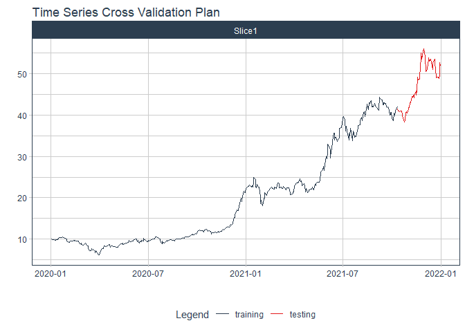
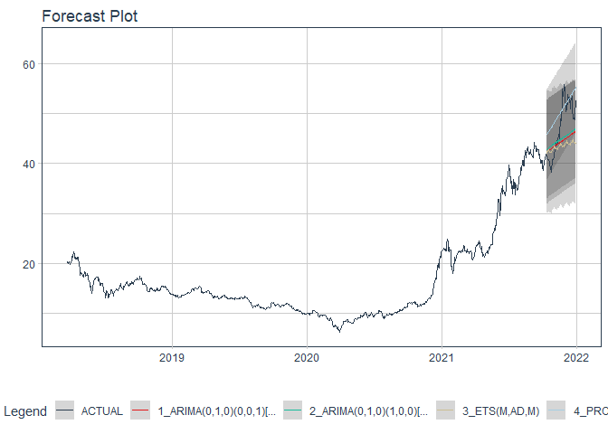

# Forecast ssi price

### Plot

``` r
readd(data_ssi) %>%
  plot_time_series(date, value, .interactive = interactive)
```

<!-- -->

### Divide data to train/ test

``` r
readd(splits_ssi) %>%
  tk_time_series_cv_plan() %>%
  plot_time_series_cv_plan(date, value, .interactive = FALSE)
```

<!-- -->

### Modeltime Table

``` r
readd(models_tbl_ssi)
#> # Modeltime Table
#> # A tibble: 5 x 3
#>   .model_id .model   .model_desc                              
#>       <int> <list>   <chr>                                    
#> 1         1 <fit[+]> ARIMA(3,1,3)(2,0,0)[5]                   
#> 2         2 <fit[+]> ARIMA(3,1,4) WITH DRIFT W/ XGBOOST ERRORS
#> 3         3 <fit[+]> ETS(M,AD,M)                              
#> 4         4 <fit[+]> PROPHET                                  
#> 5         5 <fit[+]> LM
```

### Calibration

``` r
readd(calibration_tbl_ssi)
#> # Modeltime Table
#> # A tibble: 5 x 5
#>   .model_id .model   .model_desc                               .type .calibration_data 
#>       <int> <list>   <chr>                                     <chr> <list>            
#> 1         1 <fit[+]> ARIMA(3,1,3)(2,0,0)[5]                    Test  <tibble [119 x 4]>
#> 2         2 <fit[+]> ARIMA(3,1,4) WITH DRIFT W/ XGBOOST ERRORS Test  <tibble [119 x 4]>
#> 3         3 <fit[+]> ETS(M,AD,M)                               Test  <tibble [119 x 4]>
#> 4         4 <fit[+]> PROPHET                                   Test  <tibble [119 x 4]>
#> 5         5 <fit[+]> LM                                        Test  <tibble [119 x 4]>
```

### Forecast (Testing Set)

``` r
readd(forecast_tbl_ssi) %>% 
  plot_modeltime_forecast(.legend_max_width = 25, 
                           .interactive      = interactive)
#> Warning in max(ids, na.rm = TRUE): no non-missing arguments to max; returning -Inf
```

<!-- -->

### Accuracy table

``` r
readd(accuracy_tbl_ssi)$`_data`
#> # A tibble: 5 x 9
#>   .model_id .model_desc                               .type   mae  mape  mase smape  rmse   rsq
#>       <int> <chr>                                     <chr> <dbl> <dbl> <dbl> <dbl> <dbl> <dbl>
#> 1         1 ARIMA(3,1,3)(2,0,0)[5]                    Test   4.33  10.4  4.85  11.6  7.15  0.02
#> 2         2 ARIMA(3,1,4) WITH DRIFT W/ XGBOOST ERRORS Test   4.29  11.3  4.8   11.5  5.82  0.19
#> 3         3 ETS(M,AD,M)                               Test   4.89  13.7  5.47  13.2  5.66  0.28
#> 4         4 PROPHET                                   Test  23.1   63.6 25.8   94.0 24.0   0.38
#> 5         5 LM                                        Test  18.4   50.4 20.6   68.0 19.5   0.16
```

### Next week forecast

``` r
readd(two_week_fc_ssi)
#> # A tibble: 16 x 6
#>    .ticker .index     .value  .low .high .model_desc                              
#>    <chr>   <date>      <dbl> <dbl> <dbl> <chr>                                    
#>  1 ssi     2021-07-03   56.9  47.4  66.5 ARIMA(3,1,4) WITH DRIFT W/ XGBOOST ERRORS
#>  2 ssi     2021-07-04   57.1  47.5  66.7 ARIMA(3,1,4) WITH DRIFT W/ XGBOOST ERRORS
#>  3 ssi     2021-07-05   57.3  47.7  66.9 ARIMA(3,1,4) WITH DRIFT W/ XGBOOST ERRORS
#>  4 ssi     2021-07-06   57.7  48.1  67.3 ARIMA(3,1,4) WITH DRIFT W/ XGBOOST ERRORS
#>  5 ssi     2021-07-07   57.9  48.3  67.5 ARIMA(3,1,4) WITH DRIFT W/ XGBOOST ERRORS
#>  6 ssi     2021-07-08   58.0  48.5  67.6 ARIMA(3,1,4) WITH DRIFT W/ XGBOOST ERRORS
#>  7 ssi     2021-07-09   58.4  48.8  68.0 ARIMA(3,1,4) WITH DRIFT W/ XGBOOST ERRORS
#>  8 ssi     2021-07-10   58.6  49.0  68.2 ARIMA(3,1,4) WITH DRIFT W/ XGBOOST ERRORS
#>  9 ssi     2021-07-11   58.8  49.2  68.4 ARIMA(3,1,4) WITH DRIFT W/ XGBOOST ERRORS
#> 10 ssi     2021-07-12   59.1  49.5  68.7 ARIMA(3,1,4) WITH DRIFT W/ XGBOOST ERRORS
#> 11 ssi     2021-07-13   59.4  49.8  69.0 ARIMA(3,1,4) WITH DRIFT W/ XGBOOST ERRORS
#> 12 ssi     2021-07-14   59.6  50.0  69.2 ARIMA(3,1,4) WITH DRIFT W/ XGBOOST ERRORS
#> 13 ssi     2021-07-15   59.8  50.2  69.4 ARIMA(3,1,4) WITH DRIFT W/ XGBOOST ERRORS
#> 14 ssi     2021-07-16   60.1  50.5  69.7 ARIMA(3,1,4) WITH DRIFT W/ XGBOOST ERRORS
#> 15 ssi     2021-07-17   60.4  50.8  70.0 ARIMA(3,1,4) WITH DRIFT W/ XGBOOST ERRORS
#> 16 ssi     2021-07-18   60.6  51.0  70.2 ARIMA(3,1,4) WITH DRIFT W/ XGBOOST ERRORS
```
