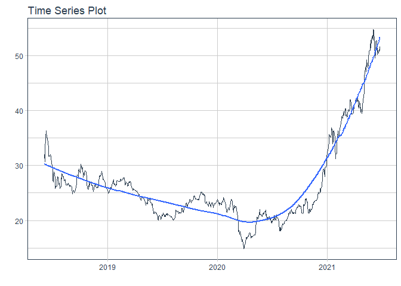
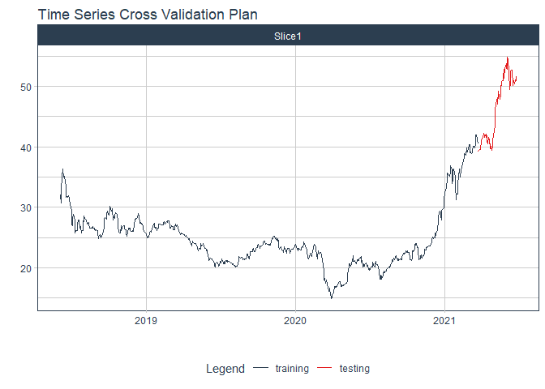
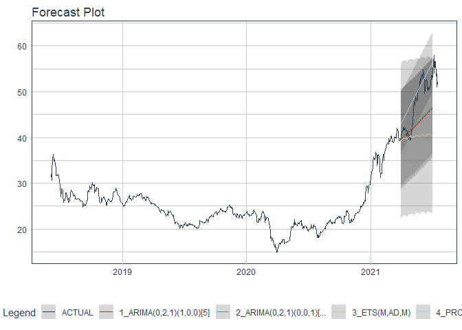

# Forecast TCB price

### Plot

``` r
readd(data_TCB) %>%
  plot_time_series(date, value, .interactive = interactive)
```

<!-- -->

### Divide data to train/ test

``` r
readd(splits_TCB) %>%
  tk_time_series_cv_plan() %>%
  plot_time_series_cv_plan(date, value, .interactive = FALSE)
```

<!-- -->

### Modeltime Table

``` r
readd(models_tbl_TCB)
#> # Modeltime Table
#> # A tibble: 4 x 3
#>   .model_id .model   .model_desc                              
#>       <int> <list>   <chr>                                    
#> 1         1 <fit[+]> ARIMA(0,1,0) WITH DRIFT                  
#> 2         2 <fit[+]> ARIMA(0,1,0) WITH DRIFT W/ XGBOOST ERRORS
#> 3         3 <fit[+]> ETS(M,AD,M)                              
#> 4         4 <fit[+]> PROPHET
```

### Calibration

``` r
readd(calibration_tbl_TCB)
#> # Modeltime Table
#> # A tibble: 4 x 5
#>   .model_id .model   .model_desc                               .type .calibration_data
#>       <int> <list>   <chr>                                     <chr> <list>           
#> 1         1 <fit[+]> ARIMA(0,1,0) WITH DRIFT                   Test  <tibble [59 x 4]>
#> 2         2 <fit[+]> ARIMA(0,1,0) WITH DRIFT W/ XGBOOST ERRORS Test  <tibble [59 x 4]>
#> 3         3 <fit[+]> ETS(M,AD,M)                               Test  <tibble [59 x 4]>
#> 4         4 <fit[+]> PROPHET                                   Test  <tibble [59 x 4]>
```

### Forecast (Testing Set)

``` r
readd(forecast_tbl_TCB) %>% 
  plot_modeltime_forecast(.legend_max_width = 25, 
                           .interactive      = interactive)
#> Warning in max(ids, na.rm = TRUE): no non-missing arguments to max; returning -Inf
```

<!-- -->

### Accuracy table

``` r
readd(accuracy_tbl_TCB)$`_data`
#> # A tibble: 4 x 9
#>   .model_id .model_desc                               .type   mae  mape  mase smape  rmse   rsq
#>       <int> <chr>                                     <chr> <dbl> <dbl> <dbl> <dbl> <dbl> <dbl>
#> 1         1 ARIMA(0,1,0) WITH DRIFT                   Test   3.58  7.12  6.43  6.75  4.39  0.48
#> 2         2 ARIMA(0,1,0) WITH DRIFT W/ XGBOOST ERRORS Test   4.2   8.33  7.54  7.87  4.92  0.48
#> 3         3 ETS(M,AD,M)                               Test   2.26  4.49  4.06  4.34  2.84  0.35
#> 4         4 PROPHET                                   Test   1.65  3.15  2.96  3.22  2.03  0.41
```

### Next week forecast

``` r
readd(two_week_fc_TCB)
#> # A tibble: 5 x 6
#>   .ticker .index     .value  .low .high .model_desc
#>   <chr>   <date>      <dbl> <dbl> <dbl> <chr>      
#> 1 TCB     2022-01-03   50.5  47.2  53.9 PROPHET    
#> 2 TCB     2022-01-04   50.5  47.1  53.9 PROPHET    
#> 3 TCB     2022-01-05   50.6  47.3  54.0 PROPHET    
#> 4 TCB     2022-01-06   50.7  47.3  54.0 PROPHET    
#> 5 TCB     2022-01-07   50.7  47.4  54.1 PROPHET
```
