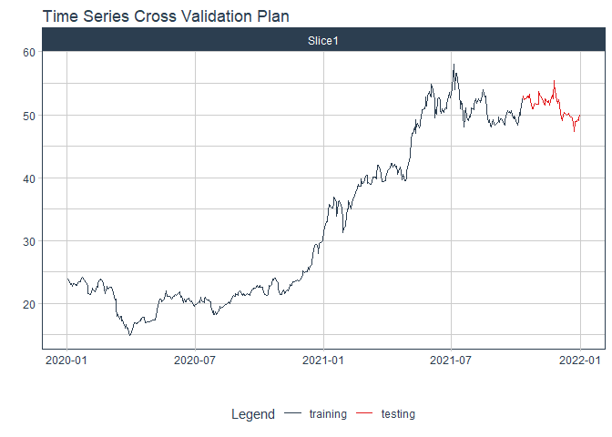
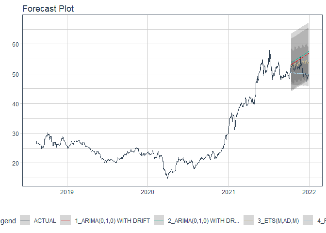

# Forecast tcb price

### Plot

``` r
readd(data_tcb) %>%
  plot_time_series(date, value, .interactive = interactive)
```

<!-- -->

### Divide data to train/ test

``` r
readd(splits_tcb) %>%
  tk_time_series_cv_plan() %>%
  plot_time_series_cv_plan(date, value, .interactive = FALSE)
```

<!-- -->

### Modeltime Table

``` r
readd(models_tbl_tcb)
#> # Modeltime Table
#> # A tibble: 4 x 3
#>   .model_id .model   .model_desc                             
#>       <int> <list>   <chr>                                   
#> 1         1 <fit[+]> ARIMA(0,2,1)(1,0,0)[5]                  
#> 2         2 <fit[+]> ARIMA(0,2,1)(0,0,1)[5] W/ XGBOOST ERRORS
#> 3         3 <fit[+]> ETS(M,AD,M)                             
#> 4         4 <fit[+]> PROPHET
```

### Calibration

``` r
readd(calibration_tbl_tcb)
#> # Modeltime Table
#> # A tibble: 4 x 5
#>   .model_id .model   .model_desc                              .type .calibration_data
#>       <int> <list>   <chr>                                    <chr> <list>           
#> 1         1 <fit[+]> ARIMA(0,2,1)(1,0,0)[5]                   Test  <tibble [65 x 4]>
#> 2         2 <fit[+]> ARIMA(0,2,1)(0,0,1)[5] W/ XGBOOST ERRORS Test  <tibble [65 x 4]>
#> 3         3 <fit[+]> ETS(M,AD,M)                              Test  <tibble [65 x 4]>
#> 4         4 <fit[+]> PROPHET                                  Test  <tibble [65 x 4]>
```

### Forecast (Testing Set)

``` r
readd(forecast_tbl_tcb) %>% 
  plot_modeltime_forecast(.legend_max_width = 25, 
                           .interactive      = interactive)
#> Warning in max(ids, na.rm = TRUE): no non-missing arguments to max; returning -Inf
```

<!-- -->

### Accuracy table

``` r
readd(accuracy_tbl_tcb)$`_data`
#> # A tibble: 4 x 9
#>   .model_id .model_desc                              .type   mae  mape  mase smape  rmse   rsq
#>       <int> <chr>                                    <chr> <dbl> <dbl> <dbl> <dbl> <dbl> <dbl>
#> 1         1 ARIMA(0,2,1)(1,0,0)[5]                   Test   4.7   9.39  5.42 10     5.54  0.78
#> 2         2 ARIMA(0,2,1)(0,0,1)[5] W/ XGBOOST ERRORS Test   4.46  8.89  5.14  9.44  5.28  0.78
#> 3         3 ETS(M,AD,M)                              Test   7.24 14.4   8.35 15.9   8.6   0.62
#> 4         4 PROPHET                                  Test   2.77  6.15  3.19  5.88  3.35  0.8
```

### Next week forecast

``` r
readd(two_week_fc_tcb)
#> # A tibble: 6 x 6
#>   .ticker .index     .value  .low .high .model_desc
#>   <chr>   <date>      <dbl> <dbl> <dbl> <chr>      
#> 1 tcb     2021-07-23   56.5  51.0  62.0 PROPHET    
#> 2 tcb     2021-07-26   56.7  51.2  62.2 PROPHET    
#> 3 tcb     2021-07-27   56.8  51.3  62.3 PROPHET    
#> 4 tcb     2021-07-28   57.0  51.5  62.6 PROPHET    
#> 5 tcb     2021-07-29   57.2  51.7  62.7 PROPHET    
#> 6 tcb     2021-07-30   57.4  51.9  62.9 PROPHET
```
