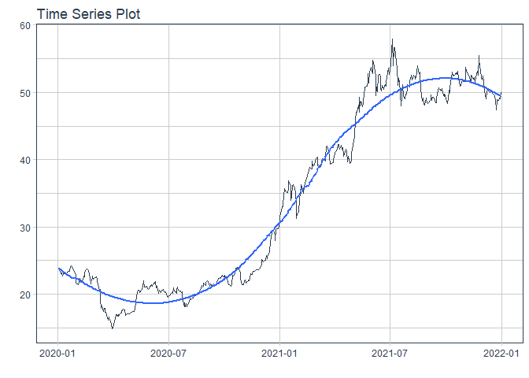

# Forecast tcb price

### Plot

``` r
readd(data_tcb) %>%
  plot_time_series(date, value, .interactive = interactive)
```

<!-- -->

### Divide data to train/ test

``` r
readd(splits_tcb) %>%
  tk_time_series_cv_plan() %>%
  plot_time_series_cv_plan(date, value, .interactive = FALSE)
```

<!-- -->

### Modeltime Table

``` r
readd(models_tbl_tcb)
#> # Modeltime Table
#> # A tibble: 5 x 3
#>   .model_id .model   .model_desc                   
#>       <int> <list>   <chr>                         
#> 1         1 <fit[+]> ARIMA(0,1,1)(2,0,0)[5]        
#> 2         2 <fit[+]> ARIMA(1,1,0) W/ XGBOOST ERRORS
#> 3         3 <fit[+]> ETS(M,AD,M)                   
#> 4         4 <fit[+]> PROPHET                       
#> 5         5 <fit[+]> LM
```

### Calibration

``` r
readd(calibration_tbl_tcb)
#> # Modeltime Table
#> # A tibble: 5 x 5
#>   .model_id .model   .model_desc                    .type .calibration_data 
#>       <int> <list>   <chr>                          <chr> <list>            
#> 1         1 <fit[+]> ARIMA(0,1,1)(2,0,0)[5]         Test  <tibble [130 x 4]>
#> 2         2 <fit[+]> ARIMA(1,1,0) W/ XGBOOST ERRORS Test  <tibble [130 x 4]>
#> 3         3 <fit[+]> ETS(M,AD,M)                    Test  <tibble [130 x 4]>
#> 4         4 <fit[+]> PROPHET                        Test  <tibble [130 x 4]>
#> 5         5 <fit[+]> LM                             Test  <tibble [130 x 4]>
```

### Forecast (Testing Set)

``` r
readd(forecast_tbl_tcb) %>% 
  plot_modeltime_forecast(.legend_max_width = 25, 
                           .interactive      = interactive)
#> Warning in max(ids, na.rm = TRUE): no non-missing arguments to max; returning -Inf
```

<!-- -->

### Accuracy table

``` r
readd(accuracy_tbl_tcb)$`_data`
#> # A tibble: 5 x 9
#>   .model_id .model_desc                    .type   mae  mape  mase smape  rmse   rsq
#>       <int> <chr>                          <chr> <dbl> <dbl> <dbl> <dbl> <dbl> <dbl>
#> 1         1 ARIMA(0,1,1)(2,0,0)[5]         Test   14.6  33.6  18.9  41.6  16.3  0.23
#> 2         2 ARIMA(1,1,0) W/ XGBOOST ERRORS Test   14.4  32.8  18.5  40.6  16.1  0.01
#> 3         3 ETS(M,AD,M)                    Test   14.8  33.9  19.0  42.0  16.4  0   
#> 4         4 PROPHET                        Test   17.0  39.4  22.0  50.6  18.7  0.12
#> 5         5 LM                             Test   23.1  54.4  29.8  76.4  24.6  0.41
```

### Next week forecast

``` r
readd(two_week_fc_tcb)
#> # A tibble: 16 x 6
#>    .ticker .index     .value  .low .high .model_desc                   
#>    <chr>   <date>      <dbl> <dbl> <dbl> <chr>                         
#>  1 tcb     2021-07-03   51.6  25.2  78.1 ARIMA(1,1,0) W/ XGBOOST ERRORS
#>  2 tcb     2021-07-04   51.6  25.1  78.1 ARIMA(1,1,0) W/ XGBOOST ERRORS
#>  3 tcb     2021-07-05   51.7  25.3  78.2 ARIMA(1,1,0) W/ XGBOOST ERRORS
#>  4 tcb     2021-07-06   51.7  25.2  78.2 ARIMA(1,1,0) W/ XGBOOST ERRORS
#>  5 tcb     2021-07-07   51.7  25.3  78.2 ARIMA(1,1,0) W/ XGBOOST ERRORS
#>  6 tcb     2021-07-08   51.7  25.3  78.2 ARIMA(1,1,0) W/ XGBOOST ERRORS
#>  7 tcb     2021-07-09   51.7  25.2  78.2 ARIMA(1,1,0) W/ XGBOOST ERRORS
#>  8 tcb     2021-07-10   51.8  25.4  78.3 ARIMA(1,1,0) W/ XGBOOST ERRORS
#>  9 tcb     2021-07-11   51.8  25.4  78.3 ARIMA(1,1,0) W/ XGBOOST ERRORS
#> 10 tcb     2021-07-12   51.8  25.3  78.3 ARIMA(1,1,0) W/ XGBOOST ERRORS
#> 11 tcb     2021-07-13   51.8  25.3  78.3 ARIMA(1,1,0) W/ XGBOOST ERRORS
#> 12 tcb     2021-07-14   51.8  25.3  78.3 ARIMA(1,1,0) W/ XGBOOST ERRORS
#> 13 tcb     2021-07-15   51.8  25.4  78.3 ARIMA(1,1,0) W/ XGBOOST ERRORS
#> 14 tcb     2021-07-16   51.9  25.4  78.3 ARIMA(1,1,0) W/ XGBOOST ERRORS
#> 15 tcb     2021-07-17   51.9  25.4  78.4 ARIMA(1,1,0) W/ XGBOOST ERRORS
#> 16 tcb     2021-07-18   51.9  25.4  78.3 ARIMA(1,1,0) W/ XGBOOST ERRORS
```
