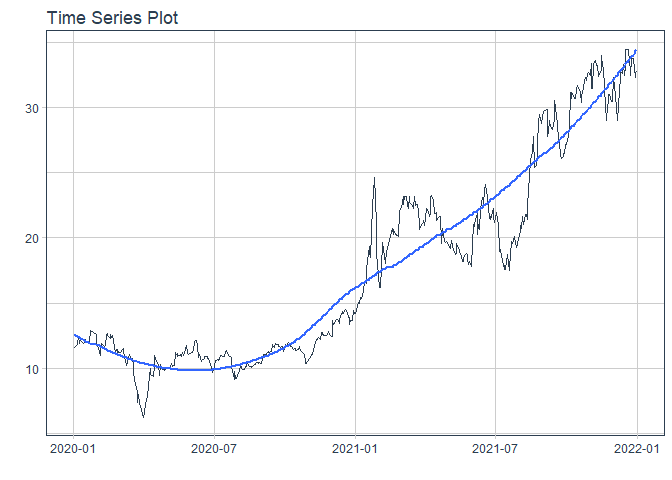
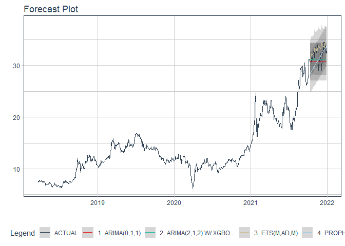

# Forecast TNG price

### Plot

``` r
readd(data_TNG) %>%
  plot_time_series(date, value, .interactive = interactive)
```

<!-- -->

### Divide data to train/ test

``` r
readd(splits_TNG) %>%
  tk_time_series_cv_plan() %>%
  plot_time_series_cv_plan(date, value, .interactive = FALSE)
```

<!-- -->

### Modeltime Table

``` r
readd(models_tbl_TNG)
#> # Modeltime Table
#> # A tibble: 4 x 3
#>   .model_id .model   .model_desc                   
#>       <int> <list>   <chr>                         
#> 1         1 <fit[+]> ARIMA(0,1,1)                  
#> 2         2 <fit[+]> ARIMA(2,1,2) W/ XGBOOST ERRORS
#> 3         3 <fit[+]> ETS(M,AD,M)                   
#> 4         4 <fit[+]> PROPHET
```

### Calibration

``` r
readd(calibration_tbl_TNG)
#> # Modeltime Table
#> # A tibble: 4 x 5
#>   .model_id .model   .model_desc                    .type .calibration_data
#>       <int> <list>   <chr>                          <chr> <list>           
#> 1         1 <fit[+]> ARIMA(0,1,1)                   Test  <tibble [59 x 4]>
#> 2         2 <fit[+]> ARIMA(2,1,2) W/ XGBOOST ERRORS Test  <tibble [59 x 4]>
#> 3         3 <fit[+]> ETS(M,AD,M)                    Test  <tibble [59 x 4]>
#> 4         4 <fit[+]> PROPHET                        Test  <tibble [59 x 4]>
```

### Forecast (Testing Set)

``` r
readd(forecast_tbl_TNG) %>% 
  plot_modeltime_forecast(.legend_max_width = 25, 
                           .interactive      = interactive)
#> Warning in max(ids, na.rm = TRUE): no non-missing arguments to max; returning -Inf
```

<!-- -->

### Accuracy table

``` r
readd(accuracy_tbl_TNG)$`_data`
#> # A tibble: 4 x 9
#>   .model_id .model_desc                    .type   mae  mape  mase smape  rmse   rsq
#>       <int> <chr>                          <chr> <dbl> <dbl> <dbl> <dbl> <dbl> <dbl>
#> 1         1 ARIMA(0,1,1)                   Test   1.54  4.7   2.34  4.85  1.86 NA   
#> 2         2 ARIMA(2,1,2) W/ XGBOOST ERRORS Test   1.3   3.98  1.96  4.06  1.55  0   
#> 3         3 ETS(M,AD,M)                    Test   1.28  4.13  1.94  3.97  1.79  0.03
#> 4         4 PROPHET                        Test   1.69  5.28  2.56  5.41  1.96  0.09
```

### Next week forecast

``` r
readd(two_week_fc_TNG)
#> # A tibble: 5 x 6
#>   .ticker .index     .value  .low .high .model_desc
#>   <chr>   <date>      <dbl> <dbl> <dbl> <chr>      
#> 1 TNG     2022-01-03   33.0  30.1  36.0 ETS(M,AD,M)
#> 2 TNG     2022-01-04   33.3  30.4  36.3 ETS(M,AD,M)
#> 3 TNG     2022-01-05   33.5  30.5  36.5 ETS(M,AD,M)
#> 4 TNG     2022-01-06   33.8  30.8  36.7 ETS(M,AD,M)
#> 5 TNG     2022-01-07   33.4  30.5  36.4 ETS(M,AD,M)
```
