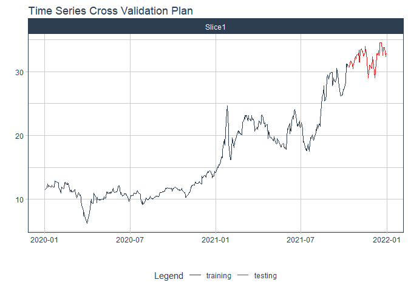

# Forecast tng price

### Plot

``` r
readd(data_tng) %>%
  plot_time_series(date, value, .interactive = interactive)
```

<!-- -->

### Divide data to train/ test

``` r
readd(splits_tng) %>%
  tk_time_series_cv_plan() %>%
  plot_time_series_cv_plan(date, value, .interactive = FALSE)
```

<!-- -->

### Modeltime Table

``` r
readd(models_tbl_tng)
#> # Modeltime Table
#> # A tibble: 5 x 3
#>   .model_id .model   .model_desc                   
#>       <int> <list>   <chr>                         
#> 1         1 <fit[+]> ARIMA(0,1,0)(2,0,0)[5]        
#> 2         2 <fit[+]> ARIMA(0,1,0) W/ XGBOOST ERRORS
#> 3         3 <fit[+]> ETS(M,A,M)                    
#> 4         4 <fit[+]> PROPHET                       
#> 5         5 <fit[+]> LM
```

### Calibration

``` r
readd(calibration_tbl_tng)
#> # Modeltime Table
#> # A tibble: 5 x 5
#>   .model_id .model   .model_desc                    .type .calibration_data 
#>       <int> <list>   <chr>                          <chr> <list>            
#> 1         1 <fit[+]> ARIMA(0,1,0)(2,0,0)[5]         Test  <tibble [117 x 4]>
#> 2         2 <fit[+]> ARIMA(0,1,0) W/ XGBOOST ERRORS Test  <tibble [117 x 4]>
#> 3         3 <fit[+]> ETS(M,A,M)                     Test  <tibble [117 x 4]>
#> 4         4 <fit[+]> PROPHET                        Test  <tibble [117 x 4]>
#> 5         5 <fit[+]> LM                             Test  <tibble [117 x 4]>
```

### Forecast (Testing Set)

``` r
readd(forecast_tbl_tng) %>% 
  plot_modeltime_forecast(.legend_max_width = 25, 
                           .interactive      = interactive)
#> Warning in max(ids, na.rm = TRUE): no non-missing arguments to max; returning -Inf
```

<!-- -->

### Accuracy table

``` r
readd(accuracy_tbl_tng)$`_data`
#> # A tibble: 5 x 9
#>   .model_id .model_desc                    .type   mae  mape  mase smape  rmse   rsq
#>       <int> <chr>                          <chr> <dbl> <dbl> <dbl> <dbl> <dbl> <dbl>
#> 1         1 ARIMA(0,1,0)(2,0,0)[5]         Test   6.7   29.6  9.82  35.2  7.11  0.09
#> 2         2 ARIMA(0,1,0) W/ XGBOOST ERRORS Test   6.28  27.6  9.2   32.6  6.72 NA   
#> 3         3 ETS(M,A,M)                     Test   6.34  27.9  9.28  33.0  6.75  0.1 
#> 4         4 PROPHET                        Test   7.63  33.9 11.2   41.2  7.95  0.35
#> 5         5 LM                             Test  10.1   45.3 14.8   59.0 10.4   0.37
```

### Next week forecast

``` r
readd(two_week_fc_tng)
#> # A tibble: 16 x 6
#>    .ticker .index     .value  .low .high .model_desc                   
#>    <chr>   <date>      <dbl> <dbl> <dbl> <chr>                         
#>  1 tng     2021-07-03   23.6  12.5  34.6 ARIMA(0,1,0) W/ XGBOOST ERRORS
#>  2 tng     2021-07-04   23.3  12.2  34.4 ARIMA(0,1,0) W/ XGBOOST ERRORS
#>  3 tng     2021-07-05   23.3  12.2  34.4 ARIMA(0,1,0) W/ XGBOOST ERRORS
#>  4 tng     2021-07-06   23.5  12.5  34.6 ARIMA(0,1,0) W/ XGBOOST ERRORS
#>  5 tng     2021-07-07   23.6  12.5  34.6 ARIMA(0,1,0) W/ XGBOOST ERRORS
#>  6 tng     2021-07-08   23.3  12.2  34.4 ARIMA(0,1,0) W/ XGBOOST ERRORS
#>  7 tng     2021-07-09   23.3  12.2  34.4 ARIMA(0,1,0) W/ XGBOOST ERRORS
#>  8 tng     2021-07-10   23.5  12.5  34.6 ARIMA(0,1,0) W/ XGBOOST ERRORS
#>  9 tng     2021-07-11   23.5  12.5  34.6 ARIMA(0,1,0) W/ XGBOOST ERRORS
#> 10 tng     2021-07-12   23.3  12.2  34.4 ARIMA(0,1,0) W/ XGBOOST ERRORS
#> 11 tng     2021-07-13   23.3  12.2  34.4 ARIMA(0,1,0) W/ XGBOOST ERRORS
#> 12 tng     2021-07-14   23.5  12.5  34.6 ARIMA(0,1,0) W/ XGBOOST ERRORS
#> 13 tng     2021-07-15   23.5  12.5  34.6 ARIMA(0,1,0) W/ XGBOOST ERRORS
#> 14 tng     2021-07-16   23.3  12.2  34.4 ARIMA(0,1,0) W/ XGBOOST ERRORS
#> 15 tng     2021-07-17   23.3  12.2  34.4 ARIMA(0,1,0) W/ XGBOOST ERRORS
#> 16 tng     2021-07-18   23.5  12.4  34.6 ARIMA(0,1,0) W/ XGBOOST ERRORS
```
