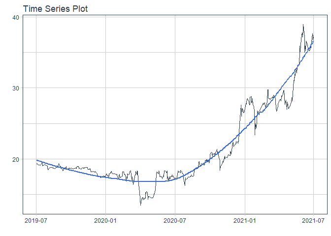
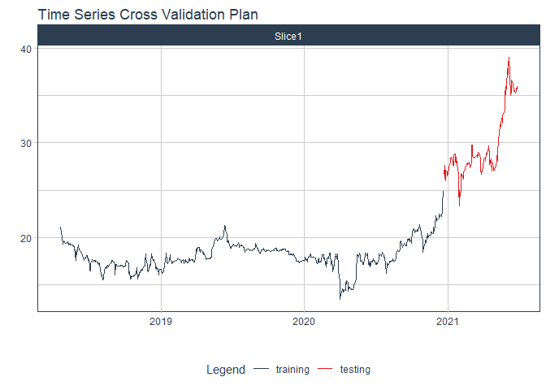
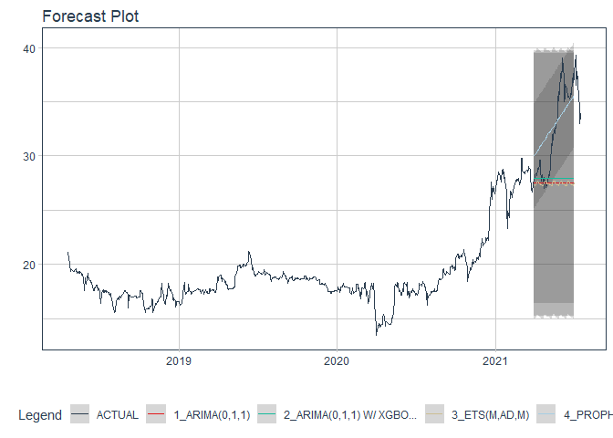

# Forecast tpb price

### Plot

``` r
readd(data_tpb) %>%
  plot_time_series(date, value, .interactive = interactive)
```

<!-- -->

### Divide data to train/ test

``` r
readd(splits_tpb) %>%
  tk_time_series_cv_plan() %>%
  plot_time_series_cv_plan(date, value, .interactive = FALSE)
```

<!-- -->

### Modeltime Table

``` r
readd(models_tbl_tpb)
#> # Modeltime Table
#> # A tibble: 5 x 3
#>   .model_id .model   .model_desc                   
#>       <int> <list>   <chr>                         
#> 1         1 <fit[+]> ARIMA(0,1,0)(1,0,0)[5]        
#> 2         2 <fit[+]> ARIMA(0,1,0) W/ XGBOOST ERRORS
#> 3         3 <fit[+]> ETS(M,AD,M)                   
#> 4         4 <fit[+]> PROPHET                       
#> 5         5 <fit[+]> LM
```

### Calibration

``` r
readd(calibration_tbl_tpb)
#> # Modeltime Table
#> # A tibble: 5 x 5
#>   .model_id .model   .model_desc                    .type .calibration_data 
#>       <int> <list>   <chr>                          <chr> <list>            
#> 1         1 <fit[+]> ARIMA(0,1,0)(1,0,0)[5]         Test  <tibble [126 x 4]>
#> 2         2 <fit[+]> ARIMA(0,1,0) W/ XGBOOST ERRORS Test  <tibble [126 x 4]>
#> 3         3 <fit[+]> ETS(M,AD,M)                    Test  <tibble [126 x 4]>
#> 4         4 <fit[+]> PROPHET                        Test  <tibble [126 x 4]>
#> 5         5 <fit[+]> LM                             Test  <tibble [126 x 4]>
```

### Forecast (Testing Set)

``` r
readd(forecast_tbl_tpb) %>% 
  plot_modeltime_forecast(.legend_max_width = 25, 
                           .interactive      = interactive)
#> Warning in max(ids, na.rm = TRUE): no non-missing arguments to max; returning -Inf
```

<!-- -->

### Accuracy table

``` r
readd(accuracy_tbl_tpb)$`_data`
#> # A tibble: 5 x 9
#>   .model_id .model_desc                    .type   mae  mape  mase smape  rmse   rsq
#>       <int> <chr>                          <chr> <dbl> <dbl> <dbl> <dbl> <dbl> <dbl>
#> 1         1 ARIMA(0,1,0)(1,0,0)[5]         Test   4.97  15.6  9.24  17.5  6.08  0.02
#> 2         2 ARIMA(0,1,0) W/ XGBOOST ERRORS Test   4.34  13.5  8.07  15.0  5.55 NA   
#> 3         3 ETS(M,AD,M)                    Test   5.09  16.1  9.47  18.0  6.18  0.01
#> 4         4 PROPHET                        Test   5.36  17.4  9.97  19.3  5.89  0.75
#> 5         5 LM                             Test  11     36.4 20.5   44.7 11.4   0.5
```

### Next week forecast

``` r
readd(two_week_fc_tpb)
#> # A tibble: 16 x 6
#>    .ticker .index     .value  .low .high .model_desc                   
#>    <chr>   <date>      <dbl> <dbl> <dbl> <chr>                         
#>  1 tpb     2021-07-03   35.5  26.3  44.6 ARIMA(0,1,0) W/ XGBOOST ERRORS
#>  2 tpb     2021-07-04   35.4  26.3  44.6 ARIMA(0,1,0) W/ XGBOOST ERRORS
#>  3 tpb     2021-07-05   35.4  26.2  44.5 ARIMA(0,1,0) W/ XGBOOST ERRORS
#>  4 tpb     2021-07-06   35.3  26.1  44.4 ARIMA(0,1,0) W/ XGBOOST ERRORS
#>  5 tpb     2021-07-07   35.3  26.1  44.4 ARIMA(0,1,0) W/ XGBOOST ERRORS
#>  6 tpb     2021-07-08   35.3  26.1  44.4 ARIMA(0,1,0) W/ XGBOOST ERRORS
#>  7 tpb     2021-07-09   35.2  26.1  44.4 ARIMA(0,1,0) W/ XGBOOST ERRORS
#>  8 tpb     2021-07-10   35.2  26.1  44.4 ARIMA(0,1,0) W/ XGBOOST ERRORS
#>  9 tpb     2021-07-11   35.1  26.0  44.3 ARIMA(0,1,0) W/ XGBOOST ERRORS
#> 10 tpb     2021-07-12   35.0  25.9  44.2 ARIMA(0,1,0) W/ XGBOOST ERRORS
#> 11 tpb     2021-07-13   35.0  25.9  44.2 ARIMA(0,1,0) W/ XGBOOST ERRORS
#> 12 tpb     2021-07-14   34.9  25.8  44.1 ARIMA(0,1,0) W/ XGBOOST ERRORS
#> 13 tpb     2021-07-15   34.9  25.8  44.1 ARIMA(0,1,0) W/ XGBOOST ERRORS
#> 14 tpb     2021-07-16   34.9  25.7  44.0 ARIMA(0,1,0) W/ XGBOOST ERRORS
#> 15 tpb     2021-07-17   34.8  25.7  44.0 ARIMA(0,1,0) W/ XGBOOST ERRORS
#> 16 tpb     2021-07-18   34.8  25.6  43.9 ARIMA(0,1,0) W/ XGBOOST ERRORS
```
