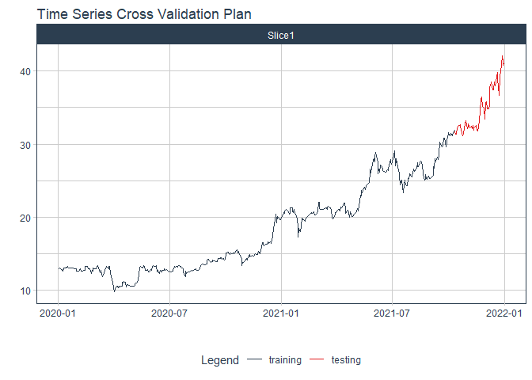
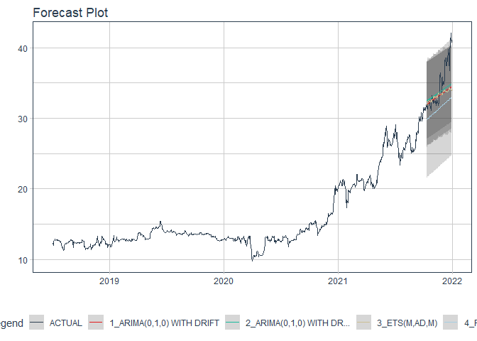

# Forecast TPB price

### Plot

``` r
readd(data_TPB) %>%
  plot_time_series(date, value, .interactive = interactive)
```

<!-- -->

### Divide data to train/ test

``` r
readd(splits_TPB) %>%
  tk_time_series_cv_plan() %>%
  plot_time_series_cv_plan(date, value, .interactive = FALSE)
```

<!-- -->

### Modeltime Table

``` r
readd(models_tbl_TPB)
#> # Modeltime Table
#> # A tibble: 4 x 3
#>   .model_id .model   .model_desc                              
#>       <int> <list>   <chr>                                    
#> 1         1 <fit[+]> ARIMA(0,1,0) WITH DRIFT                  
#> 2         2 <fit[+]> ARIMA(0,1,0) WITH DRIFT W/ XGBOOST ERRORS
#> 3         3 <fit[+]> ETS(M,AD,M)                              
#> 4         4 <fit[+]> PROPHET
```

### Calibration

``` r
readd(calibration_tbl_TPB)
#> # Modeltime Table
#> # A tibble: 4 x 5
#>   .model_id .model   .model_desc                               .type .calibration_data
#>       <int> <list>   <chr>                                     <chr> <list>           
#> 1         1 <fit[+]> ARIMA(0,1,0) WITH DRIFT                   Test  <tibble [59 x 4]>
#> 2         2 <fit[+]> ARIMA(0,1,0) WITH DRIFT W/ XGBOOST ERRORS Test  <tibble [59 x 4]>
#> 3         3 <fit[+]> ETS(M,AD,M)                               Test  <tibble [59 x 4]>
#> 4         4 <fit[+]> PROPHET                                   Test  <tibble [59 x 4]>
```

### Forecast (Testing Set)

``` r
readd(forecast_tbl_TPB) %>% 
  plot_modeltime_forecast(.legend_max_width = 25, 
                           .interactive      = interactive)
#> Warning in max(ids, na.rm = TRUE): no non-missing arguments to max; returning -Inf
```

<!-- -->

### Accuracy table

``` r
readd(accuracy_tbl_TPB)$`_data`
#> # A tibble: 4 x 9
#>   .model_id .model_desc                               .type   mae  mape  mase smape  rmse   rsq
#>       <int> <chr>                                     <chr> <dbl> <dbl> <dbl> <dbl> <dbl> <dbl>
#> 1         1 ARIMA(0,1,0) WITH DRIFT                   Test   2.15  5.71  3.08  6.01  3     0.82
#> 2         2 ARIMA(0,1,0) WITH DRIFT W/ XGBOOST ERRORS Test   2.07  5.59  2.98  5.8   2.75  0.82
#> 3         3 ETS(M,AD,M)                               Test   2.22  5.91  3.19  6.22  3.09  0.66
#> 4         4 PROPHET                                   Test   3.5   9.56  5.03 10.2   4.18  0.82
```

### Next week forecast

``` r
readd(two_week_fc_TPB)
#> # A tibble: 5 x 6
#>   .ticker .index     .value  .low .high .model_desc                              
#>   <chr>   <date>      <dbl> <dbl> <dbl> <chr>                                    
#> 1 TPB     2022-01-03   41.6  37.0  46.1 ARIMA(0,1,0) WITH DRIFT W/ XGBOOST ERRORS
#> 2 TPB     2022-01-04   41.6  37.1  46.2 ARIMA(0,1,0) WITH DRIFT W/ XGBOOST ERRORS
#> 3 TPB     2022-01-05   41.7  37.1  46.2 ARIMA(0,1,0) WITH DRIFT W/ XGBOOST ERRORS
#> 4 TPB     2022-01-06   41.7  37.2  46.3 ARIMA(0,1,0) WITH DRIFT W/ XGBOOST ERRORS
#> 5 TPB     2022-01-07   41.8  37.3  46.4 ARIMA(0,1,0) WITH DRIFT W/ XGBOOST ERRORS
```
