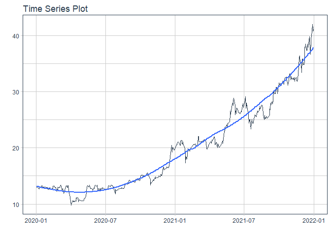

# Forecast tpb price

### Plot

``` r
readd(data_tpb) %>%
  plot_time_series(date, value, .interactive = interactive)
```

<!-- -->

### Divide data to train/ test

``` r
readd(splits_tpb) %>%
  tk_time_series_cv_plan() %>%
  plot_time_series_cv_plan(date, value, .interactive = FALSE)
```

<!-- -->

### Modeltime Table

``` r
readd(models_tbl_tpb)
#> # Modeltime Table
#> # A tibble: 4 x 3
#>   .model_id .model   .model_desc                   
#>       <int> <list>   <chr>                         
#> 1         1 <fit[+]> ARIMA(0,1,1)                  
#> 2         2 <fit[+]> ARIMA(0,1,1) W/ XGBOOST ERRORS
#> 3         3 <fit[+]> ETS(M,AD,M)                   
#> 4         4 <fit[+]> PROPHET
```

### Calibration

``` r
readd(calibration_tbl_tpb)
#> # Modeltime Table
#> # A tibble: 4 x 5
#>   .model_id .model   .model_desc                    .type .calibration_data
#>       <int> <list>   <chr>                          <chr> <list>           
#> 1         1 <fit[+]> ARIMA(0,1,1)                   Test  <tibble [65 x 4]>
#> 2         2 <fit[+]> ARIMA(0,1,1) W/ XGBOOST ERRORS Test  <tibble [65 x 4]>
#> 3         3 <fit[+]> ETS(M,AD,M)                    Test  <tibble [65 x 4]>
#> 4         4 <fit[+]> PROPHET                        Test  <tibble [65 x 4]>
```

### Forecast (Testing Set)

``` r
readd(forecast_tbl_tpb) %>% 
  plot_modeltime_forecast(.legend_max_width = 25, 
                           .interactive      = interactive)
#> Warning in max(ids, na.rm = TRUE): no non-missing arguments to max; returning -Inf
```

<!-- -->

### Accuracy table

``` r
readd(accuracy_tbl_tpb)$`_data`
#> # A tibble: 4 x 9
#>   .model_id .model_desc                    .type   mae  mape  mase smape  rmse   rsq
#>       <int> <chr>                          <chr> <dbl> <dbl> <dbl> <dbl> <dbl> <dbl>
#> 1         1 ARIMA(0,1,1)                   Test   4.96 14.2   8.23 15.8   6.22  NA  
#> 2         2 ARIMA(0,1,1) W/ XGBOOST ERRORS Test   4.6  13.1   7.63 14.6   5.87  NA  
#> 3         3 ETS(M,AD,M)                    Test   5    14.3   8.3  16     6.24   0  
#> 4         4 PROPHET                        Test   2.04  6.56  3.39  6.42  2.46   0.8
```

### Next week forecast

``` r
readd(two_week_fc_tpb)
#> # A tibble: 6 x 6
#>   .ticker .index     .value  .low .high .model_desc
#>   <chr>   <date>      <dbl> <dbl> <dbl> <chr>      
#> 1 tpb     2021-07-23   36.9  32.8  41.0 PROPHET    
#> 2 tpb     2021-07-26   37.1  33.0  41.1 PROPHET    
#> 3 tpb     2021-07-27   37.1  33.0  41.2 PROPHET    
#> 4 tpb     2021-07-28   37.2  33.1  41.2 PROPHET    
#> 5 tpb     2021-07-29   37.2  33.2  41.3 PROPHET    
#> 6 tpb     2021-07-30   37.3  33.3  41.4 PROPHET
```
