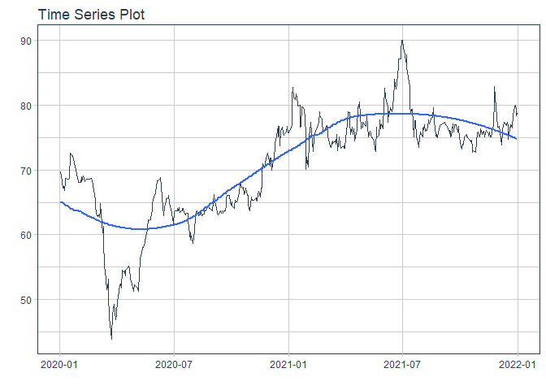
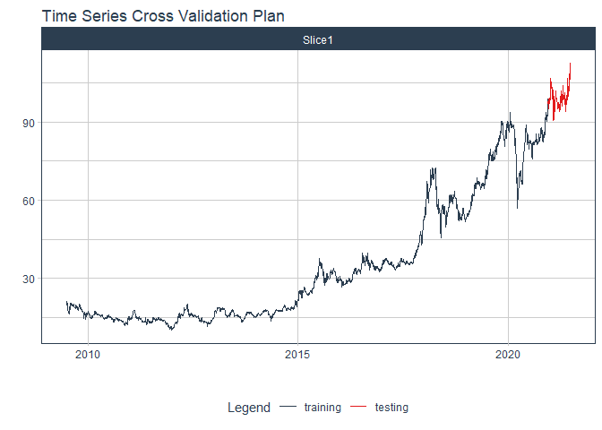
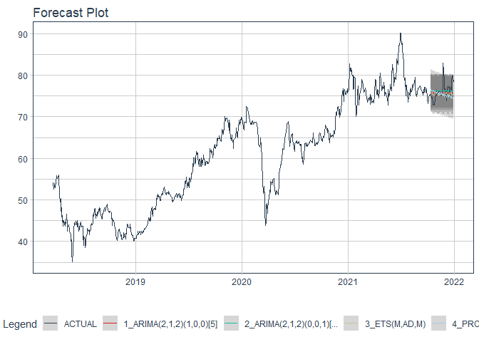

# Forecast vcb price

### Plot

``` r
readd(data_vcb) %>%
  plot_time_series(date, value, .interactive = interactive)
```

<!-- -->

### Divide data to train/ test

``` r
readd(splits_vcb) %>%
  tk_time_series_cv_plan() %>%
  plot_time_series_cv_plan(date, value, .interactive = FALSE)
```

<!-- -->

### Modeltime Table

``` r
readd(models_tbl_vcb)
#> # Modeltime Table
#> # A tibble: 5 x 3
#>   .model_id .model   .model_desc                                        
#>       <int> <list>   <chr>                                              
#> 1         1 <fit[+]> ARIMA(2,1,2)(2,0,0)[5] WITH DRIFT                  
#> 2         2 <fit[+]> ARIMA(2,1,2)(1,0,0)[5] WITH DRIFT W/ XGBOOST ERRORS
#> 3         3 <fit[+]> ETS(M,AD,M)                                        
#> 4         4 <fit[+]> PROPHET                                            
#> 5         5 <fit[+]> LM
```

### Calibration

``` r
readd(calibration_tbl_vcb)
#> # Modeltime Table
#> # A tibble: 5 x 5
#>   .model_id .model   .model_desc                                         .type .calibration_data 
#>       <int> <list>   <chr>                                               <chr> <list>            
#> 1         1 <fit[+]> ARIMA(2,1,2)(2,0,0)[5] WITH DRIFT                   Test  <tibble [130 x 4]>
#> 2         2 <fit[+]> ARIMA(2,1,2)(1,0,0)[5] WITH DRIFT W/ XGBOOST ERRORS Test  <tibble [130 x 4]>
#> 3         3 <fit[+]> ETS(M,AD,M)                                         Test  <tibble [130 x 4]>
#> 4         4 <fit[+]> PROPHET                                             Test  <tibble [130 x 4]>
#> 5         5 <fit[+]> LM                                                  Test  <tibble [130 x 4]>
```

### Forecast (Testing Set)

``` r
readd(forecast_tbl_vcb) %>% 
  plot_modeltime_forecast(.legend_max_width = 25, 
                           .interactive      = interactive)
#> Warning in max(ids, na.rm = TRUE): no non-missing arguments to max; returning -Inf
```

<!-- -->

### Accuracy table

``` r
readd(accuracy_tbl_vcb)$`_data`
#> # A tibble: 5 x 9
#>   .model_id .model_desc                                         .type   mae  mape  mase smape  rmse   rsq
#>       <int> <chr>                                               <chr> <dbl> <dbl> <dbl> <dbl> <dbl> <dbl>
#> 1         1 ARIMA(2,1,2)(2,0,0)[5] WITH DRIFT                   Test   3.5   3.55  2.33  3.5   4.16  0.08
#> 2         2 ARIMA(2,1,2)(1,0,0)[5] WITH DRIFT W/ XGBOOST ERRORS Test   3.77  3.84  2.51  3.77  4.43  0.08
#> 3         3 ETS(M,AD,M)                                         Test   3.17  3.18  2.11  3.17  3.93  0   
#> 4         4 PROPHET                                             Test   5.81  5.73  3.86  5.96  6.84  0.1 
#> 5         5 LM                                                  Test  27.4  27.4  18.2  31.8  27.6   0.1
```

### Next week forecast

``` r
readd(two_week_fc_vcb)
#> # A tibble: 16 x 6
#>    .ticker .index     .value  .low .high .model_desc
#>    <chr>   <date>      <dbl> <dbl> <dbl> <chr>      
#>  1 vcb     2021-07-03   112.  106.  119. ETS(M,AD,M)
#>  2 vcb     2021-07-04   113.  106.  119. ETS(M,AD,M)
#>  3 vcb     2021-07-05   113.  106.  119. ETS(M,AD,M)
#>  4 vcb     2021-07-06   113.  106.  119. ETS(M,AD,M)
#>  5 vcb     2021-07-07   113.  106.  119. ETS(M,AD,M)
#>  6 vcb     2021-07-08   113.  106.  119. ETS(M,AD,M)
#>  7 vcb     2021-07-09   113.  106.  119. ETS(M,AD,M)
#>  8 vcb     2021-07-10   113.  106.  119. ETS(M,AD,M)
#>  9 vcb     2021-07-11   113.  106.  119. ETS(M,AD,M)
#> 10 vcb     2021-07-12   113.  106.  119. ETS(M,AD,M)
#> 11 vcb     2021-07-13   113.  106.  119. ETS(M,AD,M)
#> 12 vcb     2021-07-14   113.  106.  119. ETS(M,AD,M)
#> 13 vcb     2021-07-15   112.  106.  119. ETS(M,AD,M)
#> 14 vcb     2021-07-16   113.  106.  119. ETS(M,AD,M)
#> 15 vcb     2021-07-17   113.  106.  119. ETS(M,AD,M)
#> 16 vcb     2021-07-18   113.  106.  119. ETS(M,AD,M)
```
