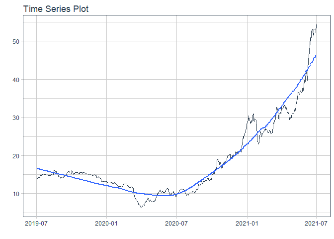
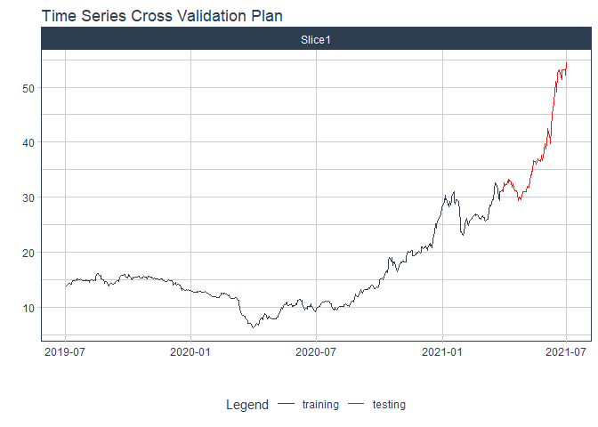
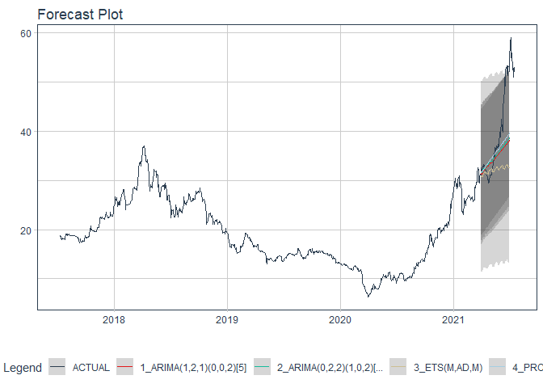

# Forecast vci price

### Plot

``` r
readd(data_vci) %>%
  plot_time_series(date, value, .interactive = interactive)
```

<!-- -->

### Divide data to train/ test

``` r
readd(splits_vci) %>%
  tk_time_series_cv_plan() %>%
  plot_time_series_cv_plan(date, value, .interactive = FALSE)
```

<!-- -->

### Modeltime Table

``` r
readd(models_tbl_vci)
#> # Modeltime Table
#> # A tibble: 4 x 3
#>   .model_id .model   .model_desc                             
#>       <int> <list>   <chr>                                   
#> 1         1 <fit[+]> ARIMA(1,2,1)(0,0,2)[5]                  
#> 2         2 <fit[+]> ARIMA(0,2,2)(1,0,2)[5] W/ XGBOOST ERRORS
#> 3         3 <fit[+]> ETS(M,AD,M)                             
#> 4         4 <fit[+]> PROPHET
```

### Calibration

``` r
readd(calibration_tbl_vci)
#> # Modeltime Table
#> # A tibble: 4 x 5
#>   .model_id .model   .model_desc                              .type .calibration_data
#>       <int> <list>   <chr>                                    <chr> <list>           
#> 1         1 <fit[+]> ARIMA(1,2,1)(0,0,2)[5]                   Test  <tibble [65 x 4]>
#> 2         2 <fit[+]> ARIMA(0,2,2)(1,0,2)[5] W/ XGBOOST ERRORS Test  <tibble [65 x 4]>
#> 3         3 <fit[+]> ETS(M,AD,M)                              Test  <tibble [65 x 4]>
#> 4         4 <fit[+]> PROPHET                                  Test  <tibble [65 x 4]>
```

### Forecast (Testing Set)

``` r
readd(forecast_tbl_vci) %>% 
  plot_modeltime_forecast(.legend_max_width = 25, 
                           .interactive      = interactive)
#> Warning in max(ids, na.rm = TRUE): no non-missing arguments to max; returning -Inf
```

<!-- -->

### Accuracy table

``` r
readd(accuracy_tbl_vci)$`_data`
#> # A tibble: 4 x 9
#>   .model_id .model_desc                              .type   mae  mape  mase smape  rmse   rsq
#>       <int> <chr>                                    <chr> <dbl> <dbl> <dbl> <dbl> <dbl> <dbl>
#> 1         1 ARIMA(1,2,1)(0,0,2)[5]                   Test   4.88 10.8   5.32  11.9  7.2   0.82
#> 2         2 ARIMA(0,2,2)(1,0,2)[5] W/ XGBOOST ERRORS Test   4.72 10.5   5.14  11.5  6.99  0.84
#> 3         3 ETS(M,AD,M)                              Test   6.82 15     7.43  17.4  9.84  0.51
#> 4         4 PROPHET                                  Test   4.34  9.72  4.74  10.5  6.51  0.81
```

### Next week forecast

``` r
readd(two_week_fc_vci)
#> # A tibble: 6 x 6
#>   .ticker .index     .value  .low .high .model_desc
#>   <chr>   <date>      <dbl> <dbl> <dbl> <chr>      
#> 1 vci     2021-07-23   47.5  36.7  58.2 PROPHET    
#> 2 vci     2021-07-26   47.8  37.0  58.5 PROPHET    
#> 3 vci     2021-07-27   47.8  37.1  58.6 PROPHET    
#> 4 vci     2021-07-28   48.0  37.3  58.7 PROPHET    
#> 5 vci     2021-07-29   48.2  37.4  58.9 PROPHET    
#> 6 vci     2021-07-30   48.3  37.6  59.1 PROPHET
```
