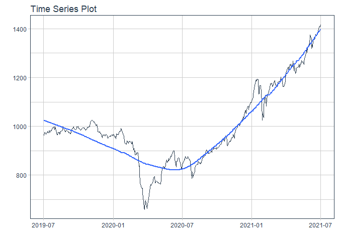
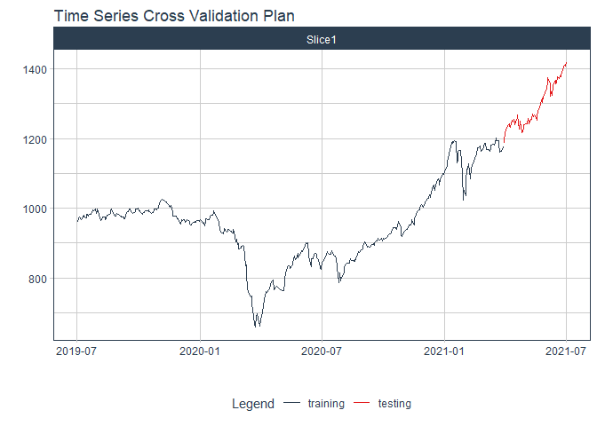
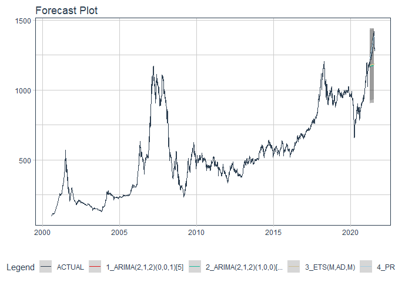

# Forecast vni price

### Plot

``` r
readd(data_vni) %>%
  plot_time_series(date, value, .interactive = interactive)
```

<!-- -->

### Divide data to train/ test

``` r
readd(splits_vni) %>%
  tk_time_series_cv_plan() %>%
  plot_time_series_cv_plan(date, value, .interactive = FALSE)
```

<!-- -->

### Modeltime Table

``` r
readd(models_tbl_vni)
#> # Modeltime Table
#> # A tibble: 4 x 3
#>   .model_id .model   .model_desc                             
#>       <int> <list>   <chr>                                   
#> 1         1 <fit[+]> ARIMA(2,1,2)(0,0,1)[5]                  
#> 2         2 <fit[+]> ARIMA(2,1,2)(1,0,0)[5] W/ XGBOOST ERRORS
#> 3         3 <fit[+]> ETS(M,AD,M)                             
#> 4         4 <fit[+]> PROPHET
```

### Calibration

``` r
readd(calibration_tbl_vni)
#> # Modeltime Table
#> # A tibble: 4 x 5
#>   .model_id .model   .model_desc                              .type .calibration_data
#>       <int> <list>   <chr>                                    <chr> <list>           
#> 1         1 <fit[+]> ARIMA(2,1,2)(0,0,1)[5]                   Test  <tibble [65 x 4]>
#> 2         2 <fit[+]> ARIMA(2,1,2)(1,0,0)[5] W/ XGBOOST ERRORS Test  <tibble [65 x 4]>
#> 3         3 <fit[+]> ETS(M,AD,M)                              Test  <tibble [65 x 4]>
#> 4         4 <fit[+]> PROPHET                                  Test  <tibble [65 x 4]>
```

### Forecast (Testing Set)

``` r
readd(forecast_tbl_vni) %>% 
  plot_modeltime_forecast(.legend_max_width = 25, 
                           .interactive      = interactive)
#> Warning in max(ids, na.rm = TRUE): no non-missing arguments to max; returning -Inf
```

<!-- -->

### Accuracy table

``` r
readd(accuracy_tbl_vni)$`_data`
#> # A tibble: 4 x 9
#>   .model_id .model_desc                              .type   mae  mape  mase smape  rmse   rsq
#>       <int> <chr>                                    <chr> <dbl> <dbl> <dbl> <dbl> <dbl> <dbl>
#> 1         1 ARIMA(2,1,2)(0,0,1)[5]                   Test  121.   9.12  10.8  9.66 136.   0.01
#> 2         2 ARIMA(2,1,2)(1,0,0)[5] W/ XGBOOST ERRORS Test  121.   9.14  10.9  9.69 136.   0.01
#> 3         3 ETS(M,AD,M)                              Test  114.   8.6   10.2  9.08 129.   0.59
#> 4         4 PROPHET                                  Test   21.2  1.66   1.9  1.64  26.2  0.88
```

### Next week forecast

``` r
readd(two_week_fc_vni)
#> # A tibble: 6 x 6
#>   .ticker .index     .value  .low .high .model_desc
#>   <chr>   <date>      <dbl> <dbl> <dbl> <chr>      
#> 1 vni     2021-07-23  1403. 1360. 1447. PROPHET    
#> 2 vni     2021-07-26  1405. 1362. 1449. PROPHET    
#> 3 vni     2021-07-27  1407. 1364. 1450. PROPHET    
#> 4 vni     2021-07-28  1409. 1366. 1453. PROPHET    
#> 5 vni     2021-07-29  1412. 1369. 1456. PROPHET    
#> 6 vni     2021-07-30  1415. 1371. 1458. PROPHET
```
